```mermaid
classDiagram
    class Group {
        +string GroupGuid
        +string Name
        +bool IsDeleted
        +string CreatedByPersonGuid
    }
    class SyncGroupCommand {
        +void SyncGroup(string username, SyncGroupModel SyncGroupModel)
        +void ValidateSyncGroupModel(syncGroupModel model)
    }
    class SyncGroupQuery {
        +Group GetGroupByGroupGuid(string GroupGuid)
    }
    class SyncGroupsCommand {
        +void SyncGroups(string username, List<SyncGroupModel> syncGroupModels)
    }
    Group <|-- SyncGroupCommand
    Group <|-- SyncGroupQuery
    Group <|-- SyncGroupsCommand

%% Swimm:
%% classDiagram
%%     class Group {
%%         +string <SwmToken path="WhoOwesWhat.Domain/Group/SyncGroupCommand.cs" pos="42:13:13" line-data="            var group = _groupQuery.GetGroupByGroupGuid(syncGroupModel.GroupGuid);">`GroupGuid`</SwmToken>
%%         +string Name
%%         +bool <SwmToken path="WhoOwesWhat.Domain/Group/SyncGroupCommand.cs" pos="43:14:14" line-data="            if (group != null &amp;&amp; syncGroupModel.IsDeleted)">`IsDeleted`</SwmToken>
%%         +string <SwmToken path="WhoOwesWhat.Domain/Group/SyncGroupCommand.cs" pos="100:12:12" line-data="            Guard.NotNull(() =&gt; model.CreatedByPersonGuid, model.CreatedByPersonGuid);">`CreatedByPersonGuid`</SwmToken>
%%     }
%%     class <SwmToken path="WhoOwesWhat.Domain/Group/SyncGroupCommand.cs" pos="10:5:5" line-data="    public class SyncGroupCommand : ISyncGroupCommand">`SyncGroupCommand`</SwmToken> {
%%         +void <SwmToken path="WhoOwesWhat.Domain/Group/SyncGroupCommand.cs" pos="30:5:7" line-data="        public void SyncGroup(string username, SyncGroupModel syncGroupModel)">`SyncGroup(string`</SwmToken> username, <SwmToken path="WhoOwesWhat.Domain/Group/SyncGroupCommand.cs" pos="30:12:12" line-data="        public void SyncGroup(string username, SyncGroupModel syncGroupModel)">`SyncGroupModel`</SwmToken> <SwmToken path="WhoOwesWhat.Domain/Group/SyncGroupCommand.cs" pos="30:12:12" line-data="        public void SyncGroup(string username, SyncGroupModel syncGroupModel)">`SyncGroupModel`</SwmToken>)
%%         +void <SwmToken path="WhoOwesWhat.Domain/Group/SyncGroupCommand.cs" pos="37:1:3" line-data="            ValidateSyncGroupModel(syncGroupModel);">`ValidateSyncGroupModel(syncGroupModel`</SwmToken> model)
%%     }
%%     class <SwmToken path="WhoOwesWhat.Domain/Group/SyncGroupQuery.cs" pos="10:5:5" line-data="    public class SyncGroupQuery : ISyncGroupQuery">`SyncGroupQuery`</SwmToken> {
%%         +Group GetGroupByGroupGuid(string <SwmToken path="WhoOwesWhat.Domain/Group/SyncGroupCommand.cs" pos="42:13:13" line-data="            var group = _groupQuery.GetGroupByGroupGuid(syncGroupModel.GroupGuid);">`GroupGuid`</SwmToken>)
%%     }
%%     class <SwmToken path="WhoOwesWhat.Domain/Group/SyncGroupsCommand.cs" pos="10:5:5" line-data="    public class SyncGroupsCommand : ISyncGroupsCommand">`SyncGroupsCommand`</SwmToken> {
%%         +void <SwmToken path="WhoOwesWhat.Domain/Group/SyncGroupsCommand.cs" pos="21:5:7" line-data="        public void SyncGroups(string username, List&lt;SyncGroupModel&gt; syncGroupModels)">`SyncGroups(string`</SwmToken> username, <SwmToken path="WhoOwesWhat.Domain/Group/SyncGroupsCommand.cs" pos="21:12:15" line-data="        public void SyncGroups(string username, List&lt;SyncGroupModel&gt; syncGroupModels)">`List<SyncGroupModel>`</SwmToken> <SwmToken path="WhoOwesWhat.Domain/Group/SyncGroupsCommand.cs" pos="21:17:17" line-data="        public void SyncGroups(string username, List&lt;SyncGroupModel&gt; syncGroupModels)">`syncGroupModels`</SwmToken>)
%%     }
%%     Group <|-- <SwmToken path="WhoOwesWhat.Domain/Group/SyncGroupCommand.cs" pos="10:5:5" line-data="    public class SyncGroupCommand : ISyncGroupCommand">`SyncGroupCommand`</SwmToken>
%%     Group <|-- <SwmToken path="WhoOwesWhat.Domain/Group/SyncGroupQuery.cs" pos="10:5:5" line-data="    public class SyncGroupQuery : ISyncGroupQuery">`SyncGroupQuery`</SwmToken>
%%     Group <|-- <SwmToken path="WhoOwesWhat.Domain/Group/SyncGroupsCommand.cs" pos="10:5:5" line-data="    public class SyncGroupsCommand : ISyncGroupsCommand">`SyncGroupsCommand`</SwmToken>
```

# Overview

Group management is a core concept in the system, representing a collection of users and transactions managed together. It allows users to share debts and credits within a defined set of people.

# <SwmToken path="WhoOwesWhat.Domain/Group/SyncGroupCommand.cs" pos="10:5:5" line-data="    public class SyncGroupCommand : ISyncGroupCommand">`SyncGroupCommand`</SwmToken> Class

The <SwmToken path="WhoOwesWhat.Domain/Group/SyncGroupCommand.cs" pos="10:5:5" line-data="    public class SyncGroupCommand : ISyncGroupCommand">`SyncGroupCommand`</SwmToken> class is responsible for creating or updating a Group. It ensures that the user has access to the Group and validates the Group's data before saving it.

<SwmSnippet path="/WhoOwesWhat.Domain/Group/SyncGroupCommand.cs" line="30">

---

The <SwmToken path="WhoOwesWhat.Domain/Group/SyncGroupCommand.cs" pos="30:5:5" line-data="        public void SyncGroup(string username, SyncGroupModel syncGroupModel)">`SyncGroup`</SwmToken> function in the <SwmToken path="WhoOwesWhat.Domain/Group/SyncGroupCommand.cs" pos="10:5:5" line-data="    public class SyncGroupCommand : ISyncGroupCommand">`SyncGroupCommand`</SwmToken> class handles the creation or updating of a Group. It checks for existing groups, handles deletion and undeletion logic, and saves the group data.

```c#
        public void SyncGroup(string username, SyncGroupModel syncGroupModel)
        {
            // Create or update Group
            // On Update: Check if username has access to Group

            Guard.NotNullOrEmpty(() => username, username);
            Guard.NotNull(() => syncGroupModel, syncGroupModel);
            ValidateSyncGroupModel(syncGroupModel);

            var userPerson = _userCredentialQuery.GetUserCredential(username);

            // check for existing Group
            var group = _groupQuery.GetGroupByGroupGuid(syncGroupModel.GroupGuid);
            if (group != null && syncGroupModel.IsDeleted)
            {
                // if group exist, but the group is deleted on the App
                if (group.IsDeleted == false)
                {
                    // if the group is in use on the server, then ignore the deletion from the App
                    if (!_groupQuery.IsGroupUsedInAnyPosts(group.GroupGuid))
                    {
```

---

</SwmSnippet>

# <SwmToken path="WhoOwesWhat.Domain/Group/SyncGroupQuery.cs" pos="10:5:5" line-data="    public class SyncGroupQuery : ISyncGroupQuery">`SyncGroupQuery`</SwmToken> Class

The <SwmToken path="WhoOwesWhat.Domain/Group/SyncGroupQuery.cs" pos="10:5:5" line-data="    public class SyncGroupQuery : ISyncGroupQuery">`SyncGroupQuery`</SwmToken> class handles the retrieval of Group data. It interacts with other queries like <SwmToken path="WhoOwesWhat.Domain/Group/SyncGroupQuery.cs" pos="13:5:5" line-data="        private readonly IUserCredentialQuery _userCredentialQuery;">`IUserCredentialQuery`</SwmToken> and <SwmToken path="WhoOwesWhat.Domain/Group/SyncGroupQuery.cs" pos="14:5:5" line-data="        private readonly ITransactionQuery _transactionQuery;">`ITransactionQuery`</SwmToken> to fetch necessary information.

<SwmSnippet path="/WhoOwesWhat.Domain/Group/SyncGroupQuery.cs" line="10">

---

The constructor of the <SwmToken path="WhoOwesWhat.Domain/Group/SyncGroupQuery.cs" pos="10:5:5" line-data="    public class SyncGroupQuery : ISyncGroupQuery">`SyncGroupQuery`</SwmToken> class initializes the necessary queries for retrieving Group data.

```c#
    public class SyncGroupQuery : ISyncGroupQuery
    {
        private readonly IGroupQuery _groupQuery;
        private readonly IUserCredentialQuery _userCredentialQuery;
        private readonly ITransactionQuery _transactionQuery;

        public SyncGroupQuery(
            IGroupQuery groupQuery
            , IUserCredentialQuery userCredentialQuery
            , ITransactionQuery transactionQuery
            )
        {
            _groupQuery = groupQuery;
            _userCredentialQuery = userCredentialQuery;
            _transactionQuery = transactionQuery;
        }
```

---

</SwmSnippet>

# <SwmToken path="WhoOwesWhat.Domain/Group/SyncGroupsCommand.cs" pos="10:5:5" line-data="    public class SyncGroupsCommand : ISyncGroupsCommand">`SyncGroupsCommand`</SwmToken> Class

The <SwmToken path="WhoOwesWhat.Domain/Group/SyncGroupsCommand.cs" pos="10:5:5" line-data="    public class SyncGroupsCommand : ISyncGroupsCommand">`SyncGroupsCommand`</SwmToken> class is used to synchronize multiple Groups, ensuring that the data is consistent across different parts of the system.

<SwmSnippet path="/WhoOwesWhat.Domain/Group/SyncGroupsCommand.cs" line="24">

---

The <SwmToken path="WhoOwesWhat.Domain/Group/SyncGroupsCommand.cs" pos="10:5:5" line-data="    public class SyncGroupsCommand : ISyncGroupsCommand">`SyncGroupsCommand`</SwmToken> class calls the <SwmToken path="WhoOwesWhat.Domain/Group/SyncGroupsCommand.cs" pos="25:3:3" line-data="                _syncGroupCommand.SyncGroup(username, syncGroupModel);">`SyncGroup`</SwmToken> function for each group in the list to ensure synchronization.

```c#
            {
                _syncGroupCommand.SyncGroup(username, syncGroupModel);
            }
```

---

</SwmSnippet>

# Main Functions

Several main functions are involved in Group management, including <SwmToken path="WhoOwesWhat.Domain/Group/SyncGroupCommand.cs" pos="30:5:5" line-data="        public void SyncGroup(string username, SyncGroupModel syncGroupModel)">`SyncGroup`</SwmToken> and <SwmToken path="WhoOwesWhat.Domain/Group/SyncGroupCommand.cs" pos="37:1:1" line-data="            ValidateSyncGroupModel(syncGroupModel);">`ValidateSyncGroupModel`</SwmToken>.

## <SwmToken path="WhoOwesWhat.Domain/Group/SyncGroupCommand.cs" pos="37:1:1" line-data="            ValidateSyncGroupModel(syncGroupModel);">`ValidateSyncGroupModel`</SwmToken>

The <SwmToken path="WhoOwesWhat.Domain/Group/SyncGroupCommand.cs" pos="37:1:1" line-data="            ValidateSyncGroupModel(syncGroupModel);">`ValidateSyncGroupModel`</SwmToken> function ensures that the <SwmToken path="WhoOwesWhat.Domain/Group/SyncGroupCommand.cs" pos="30:12:12" line-data="        public void SyncGroup(string username, SyncGroupModel syncGroupModel)">`SyncGroupModel`</SwmToken> contains all necessary data. It uses the <SwmToken path="WhoOwesWhat.Domain/Group/SyncGroupCommand.cs" pos="35:1:1" line-data="            Guard.NotNullOrEmpty(() =&gt; username, username);">`Guard`</SwmToken> class to check for null values and validates the <SwmToken path="WhoOwesWhat.Domain/Group/SyncGroupCommand.cs" pos="42:13:13" line-data="            var group = _groupQuery.GetGroupByGroupGuid(syncGroupModel.GroupGuid);">`GroupGuid`</SwmToken>.

<SwmSnippet path="/WhoOwesWhat.Domain/Group/SyncGroupCommand.cs" line="95">

---

The <SwmToken path="WhoOwesWhat.Domain/Group/SyncGroupCommand.cs" pos="95:5:5" line-data="        private void ValidateSyncGroupModel(SyncGroupModel model)">`ValidateSyncGroupModel`</SwmToken> function in the <SwmToken path="WhoOwesWhat.Domain/Group/SyncGroupCommand.cs" pos="10:5:5" line-data="    public class SyncGroupCommand : ISyncGroupCommand">`SyncGroupCommand`</SwmToken> class checks for null values and validates the <SwmToken path="WhoOwesWhat.Domain/Group/SyncGroupCommand.cs" pos="98:12:12" line-data="            Guard.NotNull(() =&gt; model.GroupGuid, model.GroupGuid);">`GroupGuid`</SwmToken>.

```c#
        private void ValidateSyncGroupModel(SyncGroupModel model)
        {
            Guard.NotNull(() => model.Name, model.Name);
            Guard.NotNull(() => model.GroupGuid, model.GroupGuid);
            Guard.NotNull(() => model.IsDeleted, model.IsDeleted);
            Guard.NotNull(() => model.CreatedByPersonGuid, model.CreatedByPersonGuid);
            Guard.IsValid(() => model.GroupGuid, model.GroupGuid, ValidatePersonGuid, "GroupGuid can not be empty");
        }
```

---

</SwmSnippet>

&nbsp;

*This is an auto-generated document by Swimm AI 🌊 and has not yet been verified by a human*

<SwmMeta version="3.0.0" repo-id="Z2l0aHViJTNBJTNBV2hvT3dlc1doYXQtTmV0NDglM0ElM0FTd2ltbS1EZW1v" repo-name="WhoOwesWhat-Net48"><sup>Powered by [Swimm](/)</sup></SwmMeta>
