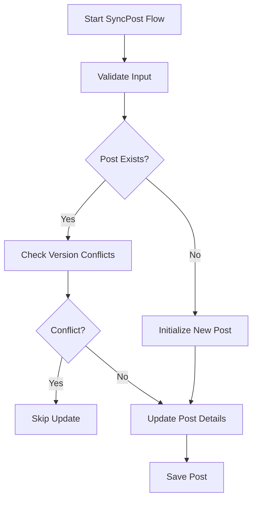

# Overview

Post refers to the data entity that represents a transaction or an entry in the system. It is used to manage and track debts and credits among users, ensuring that all transactions are recorded accurately.

# SyncPost Flow

The SyncPost flow includes several steps: validating the input, handling version conflicts, saving the post, and retrieving the post by GUID.

The `SyncPostCommand` class is responsible for synchronizing posts, ensuring that the user is authorized and that the post details are correctly saved.

The `SyncPostQuery` class handles the retrieval of post data, ensuring that the necessary queries are executed to fetch the correct information.

# Synchronizing an Existing Post

Synchronizing an existing post involves checking for the existence of the post, handling version conflicts, updating post details, and saving the post to the database.

# User Authorization During Post Synchronization

User authorization during post synchronization includes validating user credentials, checking post existence, and saving or updating the post.

&nbsp;

*This is an auto-generated document by Swimm AI 🌊 and has not yet been verified by a human*

<SwmMeta version="3.0.0" repo-id="Z2l0aHViJTNBJTNBV2hvT3dlc1doYXQtTmV0NDglM0ElM0FTd2ltbS1EZW1v" repo-name="WhoOwesWhat-Net48">Powered by [Swimm](/)</SwmMeta>
