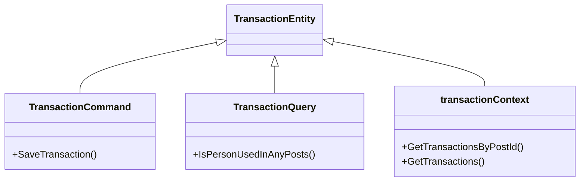

# Overview

The Transaction entity is a core component used to represent financial transactions between users. It is defined within the <SwmToken path="WhoOwesWhat.DataProvider/TransactionEntity/TransactionCommand.cs" pos="13:2:6" line-data="namespace WhoOwesWhat.DataProvider.TransactionEntity">`WhoOwesWhat.DataProvider.TransactionEntity`</SwmToken> namespace. The Transaction entity is utilized by various classes such as <SwmToken path="WhoOwesWhat.DataProvider/TransactionEntity/TransactionCommand.cs" pos="15:5:5" line-data="    public class TransactionCommand : ITransactionCommand">`TransactionCommand`</SwmToken>, <SwmToken path="WhoOwesWhat.DataProvider/TransactionEntity/TransactionQuery.cs" pos="20:3:3" line-data="        public TransactionQuery(">`TransactionQuery`</SwmToken>, and `TransactionDataProviderLogic` to handle transaction-related operations.

# <SwmToken path="WhoOwesWhat.DataProvider/TransactionEntity/TransactionCommand.cs" pos="15:5:5" line-data="    public class TransactionCommand : ITransactionCommand">`TransactionCommand`</SwmToken>

The <SwmToken path="WhoOwesWhat.DataProvider/TransactionEntity/TransactionCommand.cs" pos="15:5:5" line-data="    public class TransactionCommand : ITransactionCommand">`TransactionCommand`</SwmToken> class is responsible for executing commands related to transactions. One of its key methods is <SwmToken path="WhoOwesWhat.DataProvider/TransactionEntity/TransactionCommand.cs" pos="52:5:5" line-data="        public void SaveTransaction(Entity.Transaction transactionDb, Domain.DTO.Transaction transactionDto)">`SaveTransaction`</SwmToken>, which saves a transaction to the database. This method ensures that the person and post associated with the transaction are valid before saving the transaction details.

<SwmSnippet path="/WhoOwesWhat.DataProvider/TransactionEntity/TransactionCommand.cs" line="49">

---

The <SwmToken path="WhoOwesWhat.DataProvider/TransactionEntity/TransactionCommand.cs" pos="52:5:5" line-data="        public void SaveTransaction(Entity.Transaction transactionDb, Domain.DTO.Transaction transactionDto)">`SaveTransaction`</SwmToken> method in <SwmToken path="WhoOwesWhat.DataProvider/TransactionEntity/TransactionCommand.cs" pos="15:5:5" line-data="    public class TransactionCommand : ITransactionCommand">`TransactionCommand`</SwmToken> ensures that the transaction is associated with the correct person and post, and then saves the changes to the database.

```c#
        /// <summary>
        /// All Transactions to a post is Deleted before adding new ones
        /// </summary>
        public void SaveTransaction(Entity.Transaction transactionDb, Domain.DTO.Transaction transactionDto)
        {
            var person = _personContext.GetPersonByPersonGuid(transactionDto.PersonGuid);
            var post = _postContext.GetPostByPostGuid(transactionDto.PostGuid);

            Guard.NotNull(() => person, person);
            Guard.NotNull(() => post, post);

            _transactionContext.Add(transactionDb);

            transactionDb.Post = post;
            transactionDb.Person = person;
            transactionDb.Amount = transactionDto.AmountSetManually;
            transactionDb.IsAmountSetManually = transactionDto.IsAmountSetManually;

            _whoOwesWhatContext.SaveChanges();
        }
```

---

</SwmSnippet>

# <SwmToken path="WhoOwesWhat.DataProvider/TransactionEntity/TransactionQuery.cs" pos="20:3:3" line-data="        public TransactionQuery(">`TransactionQuery`</SwmToken>

The <SwmToken path="WhoOwesWhat.DataProvider/TransactionEntity/TransactionQuery.cs" pos="20:3:3" line-data="        public TransactionQuery(">`TransactionQuery`</SwmToken> class is used to query transaction data. It includes methods like <SwmToken path="WhoOwesWhat.DataProvider/TransactionEntity/TransactionQuery.cs" pos="29:5:5" line-data="        public bool IsPersonUsedInAnyPosts(Guid personGuid)">`IsPersonUsedInAnyPosts`</SwmToken> to check if a person is associated with any posts.

<SwmSnippet path="/WhoOwesWhat.DataProvider/TransactionEntity/TransactionQuery.cs" line="17">

---

The <SwmToken path="WhoOwesWhat.DataProvider/TransactionEntity/TransactionQuery.cs" pos="29:5:5" line-data="        public bool IsPersonUsedInAnyPosts(Guid personGuid)">`IsPersonUsedInAnyPosts`</SwmToken> method in <SwmToken path="WhoOwesWhat.DataProvider/TransactionEntity/TransactionQuery.cs" pos="20:3:3" line-data="        public TransactionQuery(">`TransactionQuery`</SwmToken> checks if a person is associated with any posts by querying the transaction data.

```c#
        private readonly ITransactionContext _transactionContext;
        private readonly IPostDataProviderLogic _postDataProviderLogic;

        public TransactionQuery(
            ITransactionContext transactionContext
            , IPostDataProviderLogic postDataProviderLogic
            )
        {
            _transactionContext = transactionContext;
            _postDataProviderLogic = postDataProviderLogic;
        }

        public bool IsPersonUsedInAnyPosts(Guid personGuid)
        {
```

---

</SwmSnippet>

# <SwmToken path="WhoOwesWhat.DataProvider/TransactionEntity/TransactionQuery.cs" pos="21:3:3" line-data="            ITransactionContext transactionContext">`transactionContext`</SwmToken>

The <SwmToken path="WhoOwesWhat.DataProvider/TransactionEntity/TransactionQuery.cs" pos="21:3:3" line-data="            ITransactionContext transactionContext">`transactionContext`</SwmToken> class provides the context for accessing transaction data. It includes methods like <SwmToken path="WhoOwesWhat.DataProvider/TransactionEntity/TransactionContext.cs" pos="27:8:8" line-data="        public IQueryable&lt;Transaction&gt; GetTransactionsByPostId(int postId)">`GetTransactionsByPostId`</SwmToken> to retrieve transactions associated with a specific post.

<SwmSnippet path="/WhoOwesWhat.DataProvider/TransactionEntity/TransactionContext.cs" line="19">

---

The <SwmToken path="WhoOwesWhat.DataProvider/TransactionEntity/TransactionContext.cs" pos="27:8:8" line-data="        public IQueryable&lt;Transaction&gt; GetTransactionsByPostId(int postId)">`GetTransactionsByPostId`</SwmToken> method in <SwmToken path="WhoOwesWhat.DataProvider/TransactionEntity/TransactionContext.cs" pos="22:3:3" line-data="        public TransactionContext(IWhoOwesWhatContext whoOwesWhatContext)">`TransactionContext`</SwmToken> retrieves transactions associated with a specific post.

```c#
    {
        private readonly IWhoOwesWhatContext _whoOwesWhatContext;

        public TransactionContext(IWhoOwesWhatContext whoOwesWhatContext)
        {
            _whoOwesWhatContext = whoOwesWhatContext;
        }

        public IQueryable<Transaction> GetTransactionsByPostId(int postId)
        {
```

---

</SwmSnippet>

# Main Functions

There are several main functions in this folder. Some of them are <SwmToken path="WhoOwesWhat.DataProvider/TransactionEntity/TransactionContext.cs" pos="31:8:8" line-data="        public IQueryable&lt;Transaction&gt; GetTransactions()">`GetTransactions`</SwmToken>, <SwmToken path="WhoOwesWhat.DataProvider/TransactionEntity/TransactionCommand.cs" pos="60:3:3" line-data="            _transactionContext.Add(transactionDb);">`Add`</SwmToken>, <SwmToken path="WhoOwesWhat.DataProvider/TransactionEntity/TransactionCommand.cs" pos="67:3:3" line-data="            _whoOwesWhatContext.SaveChanges();">`SaveChanges`</SwmToken>, <SwmToken path="WhoOwesWhat.DataProvider/TransactionEntity/TransactionCommand.cs" pos="76:3:3" line-data="                _transactionContext.Delete(transaction);">`Delete`</SwmToken>, and <SwmToken path="WhoOwesWhat.DataProvider/TransactionEntity/TransactionCommand.cs" pos="52:5:5" line-data="        public void SaveTransaction(Entity.Transaction transactionDb, Domain.DTO.Transaction transactionDto)">`SaveTransaction`</SwmToken>. We will dive a little into <SwmToken path="WhoOwesWhat.DataProvider/TransactionEntity/TransactionContext.cs" pos="31:8:8" line-data="        public IQueryable&lt;Transaction&gt; GetTransactions()">`GetTransactions`</SwmToken> and <SwmToken path="WhoOwesWhat.DataProvider/TransactionEntity/TransactionCommand.cs" pos="52:5:5" line-data="        public void SaveTransaction(Entity.Transaction transactionDb, Domain.DTO.Transaction transactionDto)">`SaveTransaction`</SwmToken>.

## <SwmToken path="WhoOwesWhat.DataProvider/TransactionEntity/TransactionContext.cs" pos="31:8:8" line-data="        public IQueryable&lt;Transaction&gt; GetTransactions()">`GetTransactions`</SwmToken>

The <SwmToken path="WhoOwesWhat.DataProvider/TransactionEntity/TransactionContext.cs" pos="31:8:8" line-data="        public IQueryable&lt;Transaction&gt; GetTransactions()">`GetTransactions`</SwmToken> function retrieves all transactions from the database. It is used in various parts of the codebase to fetch transaction data, such as in <SwmToken path="WhoOwesWhat.DataProvider/TransactionEntity/TransactionQuery.cs" pos="29:5:5" line-data="        public bool IsPersonUsedInAnyPosts(Guid personGuid)">`IsPersonUsedInAnyPosts`</SwmToken> and <SwmToken path="WhoOwesWhat.DataProvider/TransactionEntity/TransactionQuery.cs" pos="34:12:12" line-data="        public List&lt;Domain.DTO.Post&gt; GetPostsInUseByPersonGuid(Guid personGuid)">`GetPostsInUseByPersonGuid`</SwmToken>.

<SwmSnippet path="/WhoOwesWhat.DataProvider/TransactionEntity/TransactionContext.cs" line="31">

---

The <SwmToken path="WhoOwesWhat.DataProvider/TransactionEntity/TransactionContext.cs" pos="31:8:8" line-data="        public IQueryable&lt;Transaction&gt; GetTransactions()">`GetTransactions`</SwmToken> function in <SwmToken path="WhoOwesWhat.DataProvider/TransactionEntity/TransactionQuery.cs" pos="21:3:3" line-data="            ITransactionContext transactionContext">`transactionContext`</SwmToken> retrieves all transactions from the database.

```c#
        public IQueryable<Transaction> GetTransactions()
        {
            return _whoOwesWhatContext.GetTransactionSqlRepository().GetAll();
        }
```

---

</SwmSnippet>

## <SwmToken path="WhoOwesWhat.DataProvider/TransactionEntity/TransactionCommand.cs" pos="52:5:5" line-data="        public void SaveTransaction(Entity.Transaction transactionDb, Domain.DTO.Transaction transactionDto)">`SaveTransaction`</SwmToken>

The <SwmToken path="WhoOwesWhat.DataProvider/TransactionEntity/TransactionCommand.cs" pos="52:5:5" line-data="        public void SaveTransaction(Entity.Transaction transactionDb, Domain.DTO.Transaction transactionDto)">`SaveTransaction`</SwmToken> function saves a transaction to the database. It ensures that the transaction is associated with the correct person and post, and then saves the changes. This function is used in <SwmToken path="WhoOwesWhat.DataProvider/TransactionEntity/TransactionCommand.cs" pos="40:5:5" line-data="        public void SavePayerTransaction(Domain.DTO.PayerTransaction transactionDto)">`SavePayerTransaction`</SwmToken> and <SwmToken path="WhoOwesWhat.DataProvider/TransactionEntity/TransactionCommand.cs" pos="45:5:5" line-data="        public void SaveConsumerTransaction(Domain.DTO.ConsumerTransaction transactionDto)">`SaveConsumerTransaction`</SwmToken>.

&nbsp;

*This is an auto-generated document by Swimm AI 🌊 and has not yet been verified by a human*

<SwmMeta version="3.0.0" repo-id="Z2l0aHViJTNBJTNBV2hvT3dlc1doYXQtTmV0NDglM0ElM0FTd2ltbS1EZW1v" repo-name="WhoOwesWhat-Net48"><sup>Powered by [Swimm](/)</sup></SwmMeta>
