```mermaid
classDiagram
    class IWhoOwesWhatContext {
        +ISqlRepository<UserCredential> GetUserCredentialSqlRepository()
        +ISqlRepository<Person> GetPersonSqlRepository()
        +ISqlRepository<Friend> GetFriendSqlRepository()
        +ISqlRepository<Friendrequest> GetFriendrequestSqlRepository()
        +ISqlRepository<Error> GetErrorSqlRepository()
        +ISqlRepository<Post> GetPostSqlRepository()
        +ISqlRepository<Group> GetGroupSqlRepository()
        +ISqlRepository<Transaction> GetTransactionSqlRepository()
        +int SaveChanges()
        +void ResetDatabase()
        +void Sandbox()
        +DbEntityEntry Entry(object entity)
        +DbEntityEntry Entry<TEntity>(TEntity entity)
        +void LoadProperty<TEntity, TProperty>(TEntity friendDb, Expression<Func<TEntity, TProperty>> navigationProperty)
        +void LoadCollection<TEntity, TElement>(TEntity friendDb, Expression<Func<TEntity, ICollection<TElement>>> navigationProperty)
    }
    class WhoOwesWhatContext {
        +DbSet<Person> Persons
        +DbSet<UserCredential> UserCredentials
        +DbSet<Friend> Friends
        +DbSet<Friendrequest> Friendrequests
        +DbSet<Error> Errors
        +DbSet<Post> Posts
        +DbSet<Group> Groups
        +DbSet<Transaction> Transactions
        +WhoOwesWhatContext()
    }
    IWhoOwesWhatContext <|-- WhoOwesWhatContext
    WhoOwesWhatContext : +WhoOwesWhatContext()
    WhoOwesWhatContext : +GetUserCredentialSqlRepository()
    WhoOwesWhatContext : +GetPersonSqlRepository()
    WhoOwesWhatContext : +GetFriendSqlRepository()
    WhoOwesWhatContext : +GetTransactionSqlRepository()

%% Swimm:
%% classDiagram
%%     class <SwmToken path="WhoOwesWhat.DataProvider/WhoOwesWhatContext.cs" pos="17:5:5" line-data="    public interface IWhoOwesWhatContext : IDisposable, IObjectContextAdapter">`IWhoOwesWhatContext`</SwmToken> {
%%         +ISqlRepository<UserCredential> <SwmToken path="WhoOwesWhat.DataProvider/WhoOwesWhatContext.cs" pos="19:6:8" line-data="        ISqlRepository&lt;UserCredential&gt; GetUserCredentialSqlRepository();">`GetUserCredentialSqlRepository()`</SwmToken>
%%         +ISqlRepository<Person> <SwmToken path="WhoOwesWhat.DataProvider/WhoOwesWhatContext.cs" pos="20:6:8" line-data="        ISqlRepository&lt;Person&gt; GetPersonSqlRepository();">`GetPersonSqlRepository()`</SwmToken>
%%         +ISqlRepository<Friend> <SwmToken path="WhoOwesWhat.DataProvider/WhoOwesWhatContext.cs" pos="21:6:8" line-data="        ISqlRepository&lt;Friend&gt; GetFriendSqlRepository();">`GetFriendSqlRepository()`</SwmToken>
%%         +ISqlRepository<Friendrequest> <SwmToken path="WhoOwesWhat.DataProvider/WhoOwesWhatContext.cs" pos="22:6:8" line-data="        ISqlRepository&lt;Friendrequest&gt; GetFriendrequestSqlRepository();">`GetFriendrequestSqlRepository()`</SwmToken>
%%         +ISqlRepository<Error> <SwmToken path="WhoOwesWhat.DataProvider/WhoOwesWhatContext.cs" pos="23:6:8" line-data="        ISqlRepository&lt;Error&gt; GetErrorSqlRepository();">`GetErrorSqlRepository()`</SwmToken>
%%         +ISqlRepository<Post> <SwmToken path="WhoOwesWhat.DataProvider/WhoOwesWhatContext.cs" pos="24:6:8" line-data="        ISqlRepository&lt;Post&gt; GetPostSqlRepository();">`GetPostSqlRepository()`</SwmToken>
%%         +ISqlRepository<Group> <SwmToken path="WhoOwesWhat.DataProvider/WhoOwesWhatContext.cs" pos="25:6:8" line-data="        ISqlRepository&lt;Group&gt; GetGroupSqlRepository();">`GetGroupSqlRepository()`</SwmToken>
%%         +ISqlRepository<Transaction> <SwmToken path="WhoOwesWhat.DataProvider/WhoOwesWhatContext.cs" pos="26:6:8" line-data="        ISqlRepository&lt;Transaction&gt; GetTransactionSqlRepository();">`GetTransactionSqlRepository()`</SwmToken>
%%         +int <SwmToken path="WhoOwesWhat.DataProvider/WhoOwesWhatContext.cs" pos="27:3:5" line-data="        int SaveChanges();">`SaveChanges()`</SwmToken>
%%         +void <SwmToken path="WhoOwesWhat.DataProvider/WhoOwesWhatContext.cs" pos="28:3:5" line-data="        void ResetDatabase();">`ResetDatabase()`</SwmToken>
%%         +void Sandbox()
%%         +DbEntityEntry <SwmToken path="WhoOwesWhat.DataProvider/WhoOwesWhatContext.cs" pos="30:3:5" line-data="        DbEntityEntry Entry(object entity);">`Entry(object`</SwmToken> entity)
%%         +DbEntityEntry <SwmToken path="WhoOwesWhat.DataProvider/WhoOwesWhatContext.cs" pos="31:6:11" line-data="        DbEntityEntry&lt;TEntity&gt; Entry&lt;TEntity&gt;(TEntity entity) where TEntity : class;">`Entry<TEntity>(TEntity`</SwmToken> entity)
%%         +void <SwmToken path="WhoOwesWhat.DataProvider/WhoOwesWhatContext.cs" pos="33:3:5" line-data="        void LoadProperty&lt;TEntity, TProperty&gt;(TEntity friendDb,">`LoadProperty<TEntity`</SwmToken>, <SwmToken path="WhoOwesWhat.DataProvider/WhoOwesWhatContext.cs" pos="33:8:11" line-data="        void LoadProperty&lt;TEntity, TProperty&gt;(TEntity friendDb,">`TProperty>(TEntity`</SwmToken> <SwmToken path="WhoOwesWhat.DataProvider/WhoOwesWhatContext.cs" pos="33:13:13" line-data="        void LoadProperty&lt;TEntity, TProperty&gt;(TEntity friendDb,">`friendDb`</SwmToken>, <SwmToken path="WhoOwesWhat.DataProvider/WhoOwesWhatContext.cs" pos="34:1:5" line-data="            Expression&lt;Func&lt;TEntity, TProperty&gt;&gt; navigationProperty) where TEntity : class where TProperty : class;">`Expression<Func<TEntity`</SwmToken>, <SwmToken path="WhoOwesWhat.DataProvider/WhoOwesWhatContext.cs" pos="34:8:9" line-data="            Expression&lt;Func&lt;TEntity, TProperty&gt;&gt; navigationProperty) where TEntity : class where TProperty : class;">`TProperty>>`</SwmToken> <SwmToken path="WhoOwesWhat.DataProvider/WhoOwesWhatContext.cs" pos="34:11:11" line-data="            Expression&lt;Func&lt;TEntity, TProperty&gt;&gt; navigationProperty) where TEntity : class where TProperty : class;">`navigationProperty`</SwmToken>)
%%         +void <SwmToken path="WhoOwesWhat.DataProvider/WhoOwesWhatContext.cs" pos="36:3:5" line-data="        void LoadCollection&lt;TEntity, TElement&gt;(TEntity friendDb,">`LoadCollection<TEntity`</SwmToken>, <SwmToken path="WhoOwesWhat.DataProvider/WhoOwesWhatContext.cs" pos="36:8:11" line-data="        void LoadCollection&lt;TEntity, TElement&gt;(TEntity friendDb,">`TElement>(TEntity`</SwmToken> <SwmToken path="WhoOwesWhat.DataProvider/WhoOwesWhatContext.cs" pos="33:13:13" line-data="        void LoadProperty&lt;TEntity, TProperty&gt;(TEntity friendDb,">`friendDb`</SwmToken>, <SwmToken path="WhoOwesWhat.DataProvider/WhoOwesWhatContext.cs" pos="34:1:5" line-data="            Expression&lt;Func&lt;TEntity, TProperty&gt;&gt; navigationProperty) where TEntity : class where TProperty : class;">`Expression<Func<TEntity`</SwmToken>, <SwmToken path="WhoOwesWhat.DataProvider/WhoOwesWhatContext.cs" pos="37:8:11" line-data="            Expression&lt;Func&lt;TEntity, ICollection&lt;TElement&gt;&gt;&gt; navigationProperty)">`ICollection<TElement>>>`</SwmToken> <SwmToken path="WhoOwesWhat.DataProvider/WhoOwesWhatContext.cs" pos="34:11:11" line-data="            Expression&lt;Func&lt;TEntity, TProperty&gt;&gt; navigationProperty) where TEntity : class where TProperty : class;">`navigationProperty`</SwmToken>)
%%     }
%%     class <SwmToken path="WhoOwesWhat.DataProvider/WhoOwesWhatContext.cs" pos="44:5:5" line-data="    public class WhoOwesWhatContext : DbContext, IWhoOwesWhatContext">`WhoOwesWhatContext`</SwmToken> {
%%         +DbSet<Person> Persons
%%         +DbSet<UserCredential> <SwmToken path="WhoOwesWhat.DataProvider/WhoOwesWhatContext.cs" pos="62:8:8" line-data="        public DbSet&lt;UserCredential&gt; UserCredentials { get; set; }">`UserCredentials`</SwmToken>
%%         +DbSet<Friend> Friends
%%         +DbSet<Friendrequest> Friendrequests
%%         +DbSet<Error> Errors
%%         +DbSet<Post> Posts
%%         +DbSet<Group> Groups
%%         +DbSet<Transaction> Transactions
%%         +WhoOwesWhatContext()
%%     }
%%     <SwmToken path="WhoOwesWhat.DataProvider/WhoOwesWhatContext.cs" pos="17:5:5" line-data="    public interface IWhoOwesWhatContext : IDisposable, IObjectContextAdapter">`IWhoOwesWhatContext`</SwmToken> <|-- <SwmToken path="WhoOwesWhat.DataProvider/WhoOwesWhatContext.cs" pos="44:5:5" line-data="    public class WhoOwesWhatContext : DbContext, IWhoOwesWhatContext">`WhoOwesWhatContext`</SwmToken>
%%     <SwmToken path="WhoOwesWhat.DataProvider/WhoOwesWhatContext.cs" pos="44:5:5" line-data="    public class WhoOwesWhatContext : DbContext, IWhoOwesWhatContext">`WhoOwesWhatContext`</SwmToken> : +WhoOwesWhatContext()
%%     <SwmToken path="WhoOwesWhat.DataProvider/WhoOwesWhatContext.cs" pos="44:5:5" line-data="    public class WhoOwesWhatContext : DbContext, IWhoOwesWhatContext">`WhoOwesWhatContext`</SwmToken> : +GetUserCredentialSqlRepository()
%%     <SwmToken path="WhoOwesWhat.DataProvider/WhoOwesWhatContext.cs" pos="44:5:5" line-data="    public class WhoOwesWhatContext : DbContext, IWhoOwesWhatContext">`WhoOwesWhatContext`</SwmToken> : +GetPersonSqlRepository()
%%     <SwmToken path="WhoOwesWhat.DataProvider/WhoOwesWhatContext.cs" pos="44:5:5" line-data="    public class WhoOwesWhatContext : DbContext, IWhoOwesWhatContext">`WhoOwesWhatContext`</SwmToken> : +GetFriendSqlRepository()
%%     <SwmToken path="WhoOwesWhat.DataProvider/WhoOwesWhatContext.cs" pos="44:5:5" line-data="    public class WhoOwesWhatContext : DbContext, IWhoOwesWhatContext">`WhoOwesWhatContext`</SwmToken> : +GetTransactionSqlRepository()
```

# Overview

The <SwmToken path="WhoOwesWhat.DataProvider/WhoOwesWhatContext.cs" pos="44:5:5" line-data="    public class WhoOwesWhatContext : DbContext, IWhoOwesWhatContext">`WhoOwesWhatContext`</SwmToken> interface provides various repository methods for accessing different entities such as <SwmToken path="WhoOwesWhat.DataProvider/WhoOwesWhatContext.cs" pos="19:3:3" line-data="        ISqlRepository&lt;UserCredential&gt; GetUserCredentialSqlRepository();">`UserCredential`</SwmToken>, <SwmToken path="WhoOwesWhat.DataProvider/WhoOwesWhatContext.cs" pos="20:3:3" line-data="        ISqlRepository&lt;Person&gt; GetPersonSqlRepository();">`Person`</SwmToken>, <SwmToken path="WhoOwesWhat.DataProvider/WhoOwesWhatContext.cs" pos="21:3:3" line-data="        ISqlRepository&lt;Friend&gt; GetFriendSqlRepository();">`Friend`</SwmToken>, <SwmToken path="WhoOwesWhat.DataProvider/WhoOwesWhatContext.cs" pos="22:3:3" line-data="        ISqlRepository&lt;Friendrequest&gt; GetFriendrequestSqlRepository();">`Friendrequest`</SwmToken>, <SwmToken path="WhoOwesWhat.DataProvider/WhoOwesWhatContext.cs" pos="23:3:3" line-data="        ISqlRepository&lt;Error&gt; GetErrorSqlRepository();">`Error`</SwmToken>, <SwmToken path="WhoOwesWhat.DataProvider/WhoOwesWhatContext.cs" pos="24:3:3" line-data="        ISqlRepository&lt;Post&gt; GetPostSqlRepository();">`Post`</SwmToken>, <SwmToken path="WhoOwesWhat.DataProvider/WhoOwesWhatContext.cs" pos="25:3:3" line-data="        ISqlRepository&lt;Group&gt; GetGroupSqlRepository();">`Group`</SwmToken>, and <SwmToken path="WhoOwesWhat.DataProvider/WhoOwesWhatContext.cs" pos="26:3:3" line-data="        ISqlRepository&lt;Transaction&gt; GetTransactionSqlRepository();">`Transaction`</SwmToken>. It includes methods for saving changes, resetting the database, and sandboxing. The context also provides methods for loading properties and collections of entities.

# Initialization

The constructor `GroupContext` initializes the `_whoOwesWhatContext` field with the provided <SwmToken path="WhoOwesWhat.DataProvider/WhoOwesWhatContext.cs" pos="17:5:5" line-data="    public interface IWhoOwesWhatContext : IDisposable, IObjectContextAdapter">`IWhoOwesWhatContext`</SwmToken> instance.

# Interface Methods

The <SwmToken path="WhoOwesWhat.DataProvider/WhoOwesWhatContext.cs" pos="17:5:5" line-data="    public interface IWhoOwesWhatContext : IDisposable, IObjectContextAdapter">`IWhoOwesWhatContext`</SwmToken> interface defines various methods for accessing entity repositories, saving changes, resetting the database, and loading properties and collections.

<SwmSnippet path="/WhoOwesWhat.DataProvider/WhoOwesWhatContext.cs" line="17">

---

The <SwmToken path="WhoOwesWhat.DataProvider/WhoOwesWhatContext.cs" pos="17:5:5" line-data="    public interface IWhoOwesWhatContext : IDisposable, IObjectContextAdapter">`IWhoOwesWhatContext`</SwmToken> interface defines various methods for accessing entity repositories, saving changes, resetting the database, and loading properties and collections.

```c#
    public interface IWhoOwesWhatContext : IDisposable, IObjectContextAdapter
    {
        ISqlRepository<UserCredential> GetUserCredentialSqlRepository();
        ISqlRepository<Person> GetPersonSqlRepository();
        ISqlRepository<Friend> GetFriendSqlRepository();
        ISqlRepository<Friendrequest> GetFriendrequestSqlRepository();
        ISqlRepository<Error> GetErrorSqlRepository();
        ISqlRepository<Post> GetPostSqlRepository();
        ISqlRepository<Group> GetGroupSqlRepository();
        ISqlRepository<Transaction> GetTransactionSqlRepository();
        int SaveChanges();
        void ResetDatabase();
        void Sandbox();
        DbEntityEntry Entry(object entity);
        DbEntityEntry<TEntity> Entry<TEntity>(TEntity entity) where TEntity : class;

        void LoadProperty<TEntity, TProperty>(TEntity friendDb,
            Expression<Func<TEntity, TProperty>> navigationProperty) where TEntity : class where TProperty : class;

        void LoadCollection<TEntity, TElement>(TEntity friendDb,
            Expression<Func<TEntity, ICollection<TElement>>> navigationProperty)
```

---

</SwmSnippet>

<SwmSnippet path="/WhoOwesWhat.DataProvider/WhoOwesWhatContext.cs" line="44">

---

The <SwmToken path="WhoOwesWhat.DataProvider/WhoOwesWhatContext.cs" pos="44:5:5" line-data="    public class WhoOwesWhatContext : DbContext, IWhoOwesWhatContext">`WhoOwesWhatContext`</SwmToken> class implements the <SwmToken path="WhoOwesWhat.DataProvider/WhoOwesWhatContext.cs" pos="44:12:12" line-data="    public class WhoOwesWhatContext : DbContext, IWhoOwesWhatContext">`IWhoOwesWhatContext`</SwmToken> interface and extends <SwmToken path="WhoOwesWhat.DataProvider/WhoOwesWhatContext.cs" pos="44:9:9" line-data="    public class WhoOwesWhatContext : DbContext, IWhoOwesWhatContext">`DbContext`</SwmToken>, configuring database settings and initializing the database with the latest migration configurations.

```c#
    public class WhoOwesWhatContext : DbContext, IWhoOwesWhatContext
    {
        // ReSharper disable UnusedMember.Local
        //http://stackoverflow.com/questions/14695163/cant-find-system-data-entity-sqlserver-sqlproviderservices
        private static Type _hack = typeof(System.Data.Entity.SqlServer.SqlProviderServices);
        // ReSharper restore UnusedMember.Local

        public WhoOwesWhatContext()
            : base("DefaultConnection")
        {
            this.Configuration.LazyLoadingEnabled = false;
            this.Configuration.ProxyCreationEnabled = false;
            this.Database.Log = s => System.Diagnostics.Debug.WriteLine(s);
            Database.SetInitializer(new MigrateDatabaseToLatestVersion<WhoOwesWhatContext, MigrationConfigurations>());
```

---

</SwmSnippet>

# <SwmToken path="WhoOwesWhat.DataProvider/WhoOwesWhatContext.cs" pos="61:3:3" line-data="        public DbSet&lt;Person&gt; Persons { get; set; }">`DbSet`</SwmToken> Properties

The <SwmToken path="WhoOwesWhat.DataProvider/WhoOwesWhatContext.cs" pos="44:5:5" line-data="    public class WhoOwesWhatContext : DbContext, IWhoOwesWhatContext">`WhoOwesWhatContext`</SwmToken> class includes <SwmToken path="WhoOwesWhat.DataProvider/WhoOwesWhatContext.cs" pos="61:3:3" line-data="        public DbSet&lt;Person&gt; Persons { get; set; }">`DbSet`</SwmToken> properties for each entity type, allowing for CRUD operations on these entities.

<SwmSnippet path="/WhoOwesWhat.DataProvider/WhoOwesWhatContext.cs" line="61">

---

The <SwmToken path="WhoOwesWhat.DataProvider/WhoOwesWhatContext.cs" pos="44:5:5" line-data="    public class WhoOwesWhatContext : DbContext, IWhoOwesWhatContext">`WhoOwesWhatContext`</SwmToken> class includes <SwmToken path="WhoOwesWhat.DataProvider/WhoOwesWhatContext.cs" pos="61:3:3" line-data="        public DbSet&lt;Person&gt; Persons { get; set; }">`DbSet`</SwmToken> properties for each entity type, allowing for CRUD operations on these entities.

```c#
        public DbSet<Person> Persons { get; set; }
        public DbSet<UserCredential> UserCredentials { get; set; }
        public DbSet<Friend> Friends { get; set; }
        public DbSet<Friendrequest> Friendrequests { get; set; }
        public DbSet<Error> Errors { get; set; }
        public DbSet<Post> Posts { get; set; }
        public DbSet<Group> Groups { get; set; }
        public DbSet<Transaction> Transactions { get; set; }
```

---

</SwmSnippet>

# Main Functions

There are several main functions in this folder. Some of them are <SwmToken path="WhoOwesWhat.DataProvider/WhoOwesWhatContext.cs" pos="19:6:6" line-data="        ISqlRepository&lt;UserCredential&gt; GetUserCredentialSqlRepository();">`GetUserCredentialSqlRepository`</SwmToken>, <SwmToken path="WhoOwesWhat.DataProvider/WhoOwesWhatContext.cs" pos="20:6:6" line-data="        ISqlRepository&lt;Person&gt; GetPersonSqlRepository();">`GetPersonSqlRepository`</SwmToken>, <SwmToken path="WhoOwesWhat.DataProvider/WhoOwesWhatContext.cs" pos="21:6:6" line-data="        ISqlRepository&lt;Friend&gt; GetFriendSqlRepository();">`GetFriendSqlRepository`</SwmToken>, and <SwmToken path="WhoOwesWhat.DataProvider/WhoOwesWhatContext.cs" pos="26:6:6" line-data="        ISqlRepository&lt;Transaction&gt; GetTransactionSqlRepository();">`GetTransactionSqlRepository`</SwmToken>. We will dive a little into these functions.

## <SwmToken path="WhoOwesWhat.DataProvider/WhoOwesWhatContext.cs" pos="19:6:6" line-data="        ISqlRepository&lt;UserCredential&gt; GetUserCredentialSqlRepository();">`GetUserCredentialSqlRepository`</SwmToken>

The <SwmToken path="WhoOwesWhat.DataProvider/WhoOwesWhatContext.cs" pos="19:6:6" line-data="        ISqlRepository&lt;UserCredential&gt; GetUserCredentialSqlRepository();">`GetUserCredentialSqlRepository`</SwmToken> function returns a repository for accessing <SwmToken path="WhoOwesWhat.DataProvider/WhoOwesWhatContext.cs" pos="19:3:3" line-data="        ISqlRepository&lt;UserCredential&gt; GetUserCredentialSqlRepository();">`UserCredential`</SwmToken> entities. This allows for CRUD operations on user credentials.

<SwmSnippet path="/WhoOwesWhat.DataProvider/WhoOwesWhatContext.cs" line="117">

---

The <SwmToken path="WhoOwesWhat.DataProvider/WhoOwesWhatContext.cs" pos="117:8:8" line-data="        public ISqlRepository&lt;UserCredential&gt; GetUserCredentialSqlRepository()">`GetUserCredentialSqlRepository`</SwmToken> function returns a repository for accessing <SwmToken path="WhoOwesWhat.DataProvider/WhoOwesWhatContext.cs" pos="117:5:5" line-data="        public ISqlRepository&lt;UserCredential&gt; GetUserCredentialSqlRepository()">`UserCredential`</SwmToken> entities. This allows for CRUD operations on user credentials.

```c#
        public ISqlRepository<UserCredential> GetUserCredentialSqlRepository()
        {
            return new SqlRepository<UserCredential>(
                this,
                UserCredentials);
        }
```

---

</SwmSnippet>

## <SwmToken path="WhoOwesWhat.DataProvider/WhoOwesWhatContext.cs" pos="20:6:6" line-data="        ISqlRepository&lt;Person&gt; GetPersonSqlRepository();">`GetPersonSqlRepository`</SwmToken>

The <SwmToken path="WhoOwesWhat.DataProvider/WhoOwesWhatContext.cs" pos="20:6:6" line-data="        ISqlRepository&lt;Person&gt; GetPersonSqlRepository();">`GetPersonSqlRepository`</SwmToken> function returns a repository for accessing <SwmToken path="WhoOwesWhat.DataProvider/WhoOwesWhatContext.cs" pos="20:3:3" line-data="        ISqlRepository&lt;Person&gt; GetPersonSqlRepository();">`Person`</SwmToken> entities. This is used to perform operations like retrieving, adding, or updating person records.

<SwmSnippet path="/WhoOwesWhat.DataProvider/WhoOwesWhatContext.cs" line="124">

---

The <SwmToken path="WhoOwesWhat.DataProvider/WhoOwesWhatContext.cs" pos="124:8:8" line-data="        public ISqlRepository&lt;Person&gt; GetPersonSqlRepository()">`GetPersonSqlRepository`</SwmToken> function returns a repository for accessing <SwmToken path="WhoOwesWhat.DataProvider/WhoOwesWhatContext.cs" pos="124:5:5" line-data="        public ISqlRepository&lt;Person&gt; GetPersonSqlRepository()">`Person`</SwmToken> entities. This is used to perform operations like retrieving, adding, or updating person records.

```c#
        public ISqlRepository<Person> GetPersonSqlRepository()
        {
            return new SqlRepository<Person>(
                this,
                Persons);
        }        
```

---

</SwmSnippet>

## <SwmToken path="WhoOwesWhat.DataProvider/WhoOwesWhatContext.cs" pos="21:6:6" line-data="        ISqlRepository&lt;Friend&gt; GetFriendSqlRepository();">`GetFriendSqlRepository`</SwmToken>

The <SwmToken path="WhoOwesWhat.DataProvider/WhoOwesWhatContext.cs" pos="21:6:6" line-data="        ISqlRepository&lt;Friend&gt; GetFriendSqlRepository();">`GetFriendSqlRepository`</SwmToken> function provides a repository for <SwmToken path="WhoOwesWhat.DataProvider/WhoOwesWhatContext.cs" pos="21:3:3" line-data="        ISqlRepository&lt;Friend&gt; GetFriendSqlRepository();">`Friend`</SwmToken> entities. It facilitates operations such as fetching, adding, or modifying friend records.

<SwmSnippet path="/WhoOwesWhat.DataProvider/WhoOwesWhatContext.cs" line="131">

---

The <SwmToken path="WhoOwesWhat.DataProvider/WhoOwesWhatContext.cs" pos="131:8:8" line-data="        public ISqlRepository&lt;Friend&gt; GetFriendSqlRepository()">`GetFriendSqlRepository`</SwmToken> function provides a repository for <SwmToken path="WhoOwesWhat.DataProvider/WhoOwesWhatContext.cs" pos="131:5:5" line-data="        public ISqlRepository&lt;Friend&gt; GetFriendSqlRepository()">`Friend`</SwmToken> entities. It facilitates operations such as fetching, adding, or modifying friend records.

```c#
        public ISqlRepository<Friend> GetFriendSqlRepository()
        {
            return new SqlRepository<Friend>(
                this,
                Friends);
        }
```

---

</SwmSnippet>

## <SwmToken path="WhoOwesWhat.DataProvider/WhoOwesWhatContext.cs" pos="26:6:6" line-data="        ISqlRepository&lt;Transaction&gt; GetTransactionSqlRepository();">`GetTransactionSqlRepository`</SwmToken>

The <SwmToken path="WhoOwesWhat.DataProvider/WhoOwesWhatContext.cs" pos="26:6:6" line-data="        ISqlRepository&lt;Transaction&gt; GetTransactionSqlRepository();">`GetTransactionSqlRepository`</SwmToken> function returns a repository for <SwmToken path="WhoOwesWhat.DataProvider/WhoOwesWhatContext.cs" pos="26:3:3" line-data="        ISqlRepository&lt;Transaction&gt; GetTransactionSqlRepository();">`Transaction`</SwmToken> entities. This is essential for managing transaction records within the system.

<SwmSnippet path="/WhoOwesWhat.DataProvider/WhoOwesWhatContext.cs" line="167">

---

The <SwmToken path="WhoOwesWhat.DataProvider/WhoOwesWhatContext.cs" pos="167:8:8" line-data="        public ISqlRepository&lt;Transaction&gt; GetTransactionSqlRepository()">`GetTransactionSqlRepository`</SwmToken> function returns a repository for <SwmToken path="WhoOwesWhat.DataProvider/WhoOwesWhatContext.cs" pos="167:5:5" line-data="        public ISqlRepository&lt;Transaction&gt; GetTransactionSqlRepository()">`Transaction`</SwmToken> entities. This is essential for managing transaction records within the system.

```c#
        public ISqlRepository<Transaction> GetTransactionSqlRepository()
        {
            return new SqlRepository<Transaction>(
                this,
                Transactions);
        }
```

---

</SwmSnippet>

&nbsp;

*This is an auto-generated document by Swimm AI 🌊 and has not yet been verified by a human*

<SwmMeta version="3.0.0" repo-id="Z2l0aHViJTNBJTNBV2hvT3dlc1doYXQtTmV0NDglM0ElM0FTd2ltbS1EZW1v" repo-name="WhoOwesWhat-Net48"><sup>Powered by [Swimm](/)</sup></SwmMeta>
