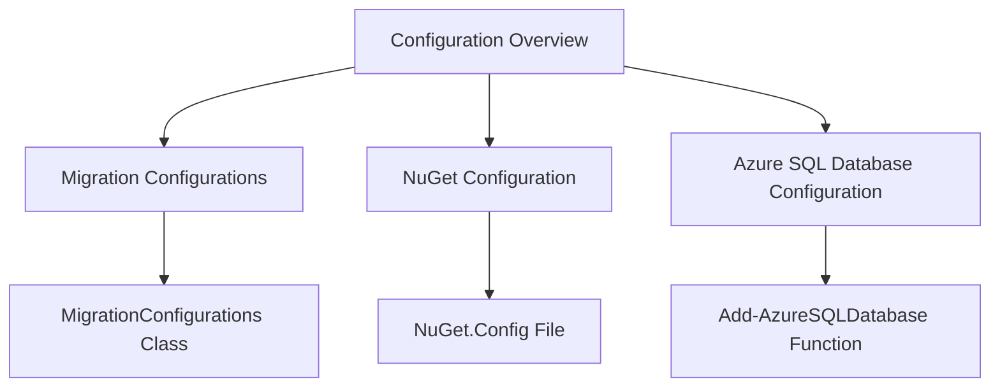

# Configuration Overview

Configuration refers to the setup and management of settings that control the behavior of the application. This document provides an overview of various configuration files and classes used in the project.

# Migration Configurations

The <SwmToken path="WhoOwesWhat.DataProvider/MigrationConfigurations.cs" pos="9:5:5" line-data="    public class MigrationConfigurations : DbMigrationsConfiguration&lt;WhoOwesWhatContext&gt;">`MigrationConfigurations`</SwmToken> class in <SwmToken path="WhoOwesWhat.DataProvider/MigrationConfigurations.cs" pos="5:2:4" line-data="using WhoOwesWhat.DataProvider.Entity;">`WhoOwesWhat.DataProvider`</SwmToken> is used to manage database migrations. It allows automatic migrations and data loss during migrations.

<SwmSnippet path="/WhoOwesWhat.DataProvider/MigrationConfigurations.cs" line="9">

---

The <SwmToken path="WhoOwesWhat.DataProvider/MigrationConfigurations.cs" pos="9:5:5" line-data="    public class MigrationConfigurations : DbMigrationsConfiguration&lt;WhoOwesWhatContext&gt;">`MigrationConfigurations`</SwmToken> class is defined here. It enables automatic migrations and allows data loss during migrations.

```c#
    public class MigrationConfigurations : DbMigrationsConfiguration<WhoOwesWhatContext>
    {
        public MigrationConfigurations()
        {
            // NICE! Sletter man et felt så forsvinner feltet!
            this.AutomaticMigrationDataLossAllowed = true;
            this.AutomaticMigrationsEnabled = true;
        }
```

---

</SwmSnippet>

# NuGet Configuration

The <SwmPath>[.nuget/NuGet.Config](.nuget/NuGet.Config)</SwmPath> file in the `.nuget` directory disables source control integration for NuGet packages.

<SwmSnippet path="/.nuget/NuGet.Config" line="1">

---

This configuration file disables source control integration for NuGet packages.

```config
<?xml version="1.0" encoding="utf-8"?>
<configuration>
  <solution>
    <add key="disableSourceControlIntegration" value="true" />
  </solution>
</configuration>
```

---

</SwmSnippet>

# Azure SQL Database Configuration

The <SwmToken path="PublishScripts/AzureWebAppPublishModule.psm1" pos="1990:2:4" line-data="function Add-AzureSQLDatabase">`Add-AzureSQLDatabase`</SwmToken> function reads and processes configuration settings for Azure SQL databases, ensuring that the correct database settings are applied during deployment.

<SwmSnippet path="/PublishScripts/AzureWebAppPublishModule.psm1" line="1990">

---

The <SwmToken path="PublishScripts/AzureWebAppPublishModule.psm1" pos="1990:2:4" line-data="function Add-AzureSQLDatabase">`Add-AzureSQLDatabase`</SwmToken> function is defined here. It ensures that the correct database settings are applied during deployment.

```powershell
function Add-AzureSQLDatabase
{
    [CmdletBinding()]
    param
    (
        [Parameter(Mandatory = $true)]
        [ValidateNotNull()]
        [Object]
        $DatabaseConfig
    )

    Write-VerboseWithTime 'Add-AzureSQLDatabase: Start'

    # Fail if the parameter value doesn't have the serverName property, or the serverName property value isn't populated.
    if (-not (Test-Member $DatabaseConfig 'serverName') -or -not $DatabaseConfig.serverName)
    {
        throw 'Add-AzureSQLDatabase: The database serverName (required) is missing from the DatabaseConfig value.'
    }

    # Fail if the parameter value doesn't have the databasename property, or the databasename property value isn't populated.
    if (-not (Test-Member $DatabaseConfig 'databaseName') -or -not $DatabaseConfig.databaseName)
```

---

</SwmSnippet>

&nbsp;

*This is an auto-generated document by Swimm AI 🌊 and has not yet been verified by a human*

<SwmMeta version="3.0.0" repo-id="Z2l0aHViJTNBJTNBV2hvT3dlc1doYXQtTmV0NDglM0ElM0FTd2ltbS1EZW1v" repo-name="WhoOwesWhat-Net48"><sup>Powered by [Swimm](https://app.swimm.io/)</sup></SwmMeta>
