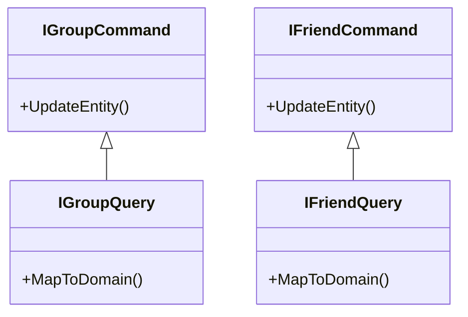

# Overview

Data Provider Interfaces define the contracts for data operations related to various entities such as groups, friends, persons, transactions, and posts. These interfaces ensure that the data operations are consistent and can be implemented by different classes without altering the core logic.

# Group Data Interfaces

The <SwmToken path="WhoOwesWhat.DataProvider.Interfaces/IGroupCommand.cs" pos="6:5:5" line-data="    public interface IGroupCommand">`IGroupCommand`</SwmToken> interface is used to handle commands related to group data. It ensures that any command operations on group data are consistent and follow the defined contract.

<SwmSnippet path="/WhoOwesWhat.DataProvider.Interfaces/IGroupCommand.cs" line="4">

---

The <SwmToken path="WhoOwesWhat.DataProvider.Interfaces/IGroupCommand.cs" pos="6:5:5" line-data="    public interface IGroupCommand">`IGroupCommand`</SwmToken> interface is defined in the <SwmToken path="WhoOwesWhat.DataProvider.Interfaces/IGroupCommand.cs" pos="4:2:6" line-data="namespace WhoOwesWhat.DataProvider.Interfaces">`WhoOwesWhat.DataProvider.Interfaces`</SwmToken> namespace.

```c#
namespace WhoOwesWhat.DataProvider.Interfaces
{
    public interface IGroupCommand
```

---

</SwmSnippet>

The <SwmToken path="WhoOwesWhat.DataProvider.Interfaces/IGroupQuery.cs" pos="10:5:5" line-data="    public interface IGroupQuery">`IGroupQuery`</SwmToken> interface is used to handle queries related to group data. It ensures that any query operations on group data are consistent and follow the defined contract.

<SwmSnippet path="/WhoOwesWhat.DataProvider.Interfaces/IGroupQuery.cs" line="8">

---

The <SwmToken path="WhoOwesWhat.DataProvider.Interfaces/IGroupQuery.cs" pos="10:5:5" line-data="    public interface IGroupQuery">`IGroupQuery`</SwmToken> interface is defined in the <SwmToken path="WhoOwesWhat.DataProvider.Interfaces/IGroupQuery.cs" pos="8:2:6" line-data="namespace WhoOwesWhat.DataProvider.Interfaces">`WhoOwesWhat.DataProvider.Interfaces`</SwmToken> namespace.

```c#
namespace WhoOwesWhat.DataProvider.Interfaces
{
    public interface IGroupQuery
```

---

</SwmSnippet>

<SwmSnippet path="/WhoOwesWhat.DataProvider.Interfaces/IFriendCommand.cs" line="4">

---

The <SwmToken path="WhoOwesWhat.DataProvider.Interfaces/IFriendCommand.cs" pos="6:5:5" line-data="    public interface IFriendCommand">`IFriendCommand`</SwmToken> interface is defined in the <SwmToken path="WhoOwesWhat.DataProvider.Interfaces/IFriendCommand.cs" pos="4:2:6" line-data="namespace WhoOwesWhat.DataProvider.Interfaces">`WhoOwesWhat.DataProvider.Interfaces`</SwmToken> namespace.

```c#
namespace WhoOwesWhat.DataProvider.Interfaces
{
    public interface IFriendCommand
```

---

</SwmSnippet>

The `IFriendQuery` interface is used to manage queries related to friend data. It ensures that any query operations on friend data are consistent and follow the defined contract.

# Main Functions

There are several main functions in this folder. Some of them are `UpdateEntity`, `MapToDomain`, and various command and query interfaces for entities like groups, friends, persons, transactions, and posts. We will dive a little into `UpdateEntity` and `MapToDomain`.

## UpdateEntity

The `UpdateEntity` function updates the Entity Framework object with changes before `SaveChanges()` is called. This ensures that any modifications made to the entity are persisted in the database when the changes are saved.

## MapToDomain

The `MapToDomain` function creates a new domain object from an entity object. This is essential for converting data from the database format to the domain format, which can then be used within the application logic.

&nbsp;

*This is an auto-generated document by Swimm AI 🌊 and has not yet been verified by a human*

<SwmMeta version="3.0.0" repo-id="Z2l0aHViJTNBJTNBV2hvT3dlc1doYXQtTmV0NDglM0ElM0FTd2ltbS1EZW1v" repo-name="WhoOwesWhat-Net48"><sup>Powered by [Swimm](/)</sup></SwmMeta>
