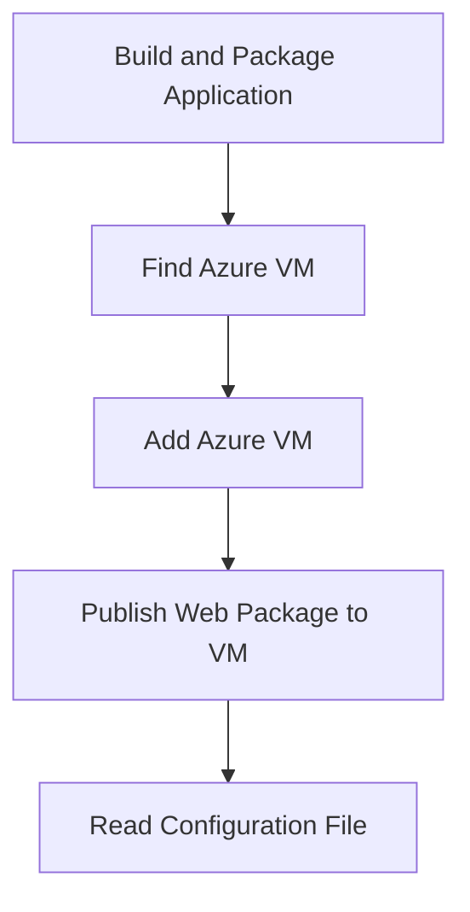

# Overview

Deployment scripts automate the process of deploying the application to various environments. They ensure that the deployment process is consistent, repeatable, and can be executed with minimal manual intervention.

# Directory Structure

The <SwmToken path="PublishScripts/Publish-WebApplication.ps1" pos="20:57:57" line-data="This Publish-WebApplication.ps1 script uses the JSON configuration file that Visual Studio generates when you create your web project. You can find the JSON file in the PublishScripts folder in your Visual Studio solution.">`PublishScripts`</SwmToken> directory contains several <SwmToken path="PublishScripts/Publish-WebApplication.ps1" pos="14:8:8" line-data="This script requires Windows PowerShell 3.0 or greater and Windows Azure PowerShell version 0.7.4 or greater. For information about installing Windows Azure PowerShell and its Azure module, see http://go.microsoft.com/fwlink/?LinkID=350552. To find the version of your Azure module, type: (Get-Module -Name Azure -ListAvailable).version To find the version of Windows PowerShell,type: $PSVersionTable.PSVersion">`PowerShell`</SwmToken> scripts and configurations that handle different aspects of the deployment process. These scripts include functions for building and packaging the web application, finding and managing Azure virtual machines, and publishing web packages to virtual machines.

# Main Functions

There are several main functions in this folder. Some of them are <SwmToken path="PublishScripts/Publish-WebApplication.ps1" pos="148:2:4" line-data="function New-WebDeployPackage">`New-WebDeployPackage`</SwmToken>, <SwmToken path="PublishScripts/AzureWebAppPublishModule.psm1" pos="1131:2:4" line-data="function Find-AzureVM">`Find-AzureVM`</SwmToken>, <SwmToken path="PublishScripts/AzureWebAppPublishModule.psm1" pos="909:2:4" line-data="function Add-AzureVM">`Add-AzureVM`</SwmToken>, <SwmToken path="PublishScripts/AzureWebAppPublishModule.psm1" pos="1703:2:4" line-data="function Publish-WebPackageToVM">`Publish-WebPackageToVM`</SwmToken>, and <SwmToken path="PublishScripts/AzureWebAppPublishModule.psm1" pos="674:2:4" line-data="function Read-ConfigFile">`Read-ConfigFile`</SwmToken>.

<SwmSnippet path="/PublishScripts/Publish-WebApplication.ps1" line="148">

---

## <SwmToken path="PublishScripts/Publish-WebApplication.ps1" pos="148:2:4" line-data="function New-WebDeployPackage">`New-WebDeployPackage`</SwmToken>

The <SwmToken path="PublishScripts/Publish-WebApplication.ps1" pos="148:2:4" line-data="function New-WebDeployPackage">`New-WebDeployPackage`</SwmToken> function is responsible for building and packaging the web application using <SwmToken path="PublishScripts/Publish-WebApplication.ps1" pos="152:15:15" line-data="    #To build your web application, use MsBuild.exe. For help, see MSBuild Command-Line Reference at: http://go.microsoft.com/fwlink/?LinkId=391339">`MsBuild`</SwmToken>. This function ensures that the application is compiled and packaged correctly before deployment.

```powershell
function New-WebDeployPackage
{
    #Write a function to build and package your web application

    #To build your web application, use MsBuild.exe. For help, see MSBuild Command-Line Reference at: http://go.microsoft.com/fwlink/?LinkId=391339
}
```

---

</SwmSnippet>

<SwmSnippet path="/PublishScripts/AzureWebAppPublishModule.psm1" line="1131">

---

## <SwmToken path="PublishScripts/AzureWebAppPublishModule.psm1" pos="1131:2:4" line-data="function Find-AzureVM">`Find-AzureVM`</SwmToken>

The <SwmToken path="PublishScripts/AzureWebAppPublishModule.psm1" pos="1131:2:4" line-data="function Find-AzureVM">`Find-AzureVM`</SwmToken> function is used to locate an existing Azure virtual machine by its service name and VM name. This function helps in identifying the target VM for deployment.

```powershell
function Find-AzureVM
{
    [CmdletBinding()]
    param
    (
        [Parameter(Mandatory = $true)]
        [String]
        $ServiceName,

        [Parameter(Mandatory = $true)]
        [String]
        $VMName
    )

    Write-VerboseWithTime 'Find-AzureVM: Start'
    $foundService = $false
    $vm = $null

    if (Test-AzureName -Service -Name $ServiceName)
    {
```

---

</SwmSnippet>

<SwmSnippet path="/PublishScripts/AzureWebAppPublishModule.psm1" line="909">

---

## <SwmToken path="PublishScripts/AzureWebAppPublishModule.psm1" pos="909:2:4" line-data="function Add-AzureVM">`Add-AzureVM`</SwmToken>

The <SwmToken path="PublishScripts/AzureWebAppPublishModule.psm1" pos="909:2:4" line-data="function Add-AzureVM">`Add-AzureVM`</SwmToken> function is used to create and configure a new Azure virtual machine. It sets up the VM with the necessary configurations, including user credentials, VM size, and optional endpoints.

```powershell
function Add-AzureVM
{
    [CmdletBinding()]
    param
    (
        [Parameter(Mandatory = $true)]
        [String]
        $UserName,

        [Parameter(Mandatory = $true)]
        [String]
        $UserPassword,

        [Parameter(Mandatory = $true)]
        [String]
        $VMName,

        [Parameter(Mandatory = $true)]
        [String]
        $VMSize,
```

---

</SwmSnippet>

<SwmSnippet path="/PublishScripts/AzureWebAppPublishModule.psm1" line="1703">

---

## <SwmToken path="PublishScripts/AzureWebAppPublishModule.psm1" pos="1703:2:4" line-data="function Publish-WebPackageToVM">`Publish-WebPackageToVM`</SwmToken>

The <SwmToken path="PublishScripts/AzureWebAppPublishModule.psm1" pos="1703:2:4" line-data="function Publish-WebPackageToVM">`Publish-WebPackageToVM`</SwmToken> function is responsible for deploying the web package to the specified Azure virtual machine. It uses the <SwmToken path="PublishScripts/Publish-WebApplication.ps1" pos="47:23:23" line-data="If you specify a valid web deployment package, this script uses MsDeploy.exe and the web deployment package to deploy the web site.">`MsDeploy`</SwmToken> tool to synchronize the web package with the target VM.

```powershell
function Publish-WebPackageToVM
{
    [CmdletBinding()]
    param
    (
        [Parameter(Mandatory = $true)]
        [ValidateNotNullOrEmpty()]
        [String]
        $VMDnsName,

        [Parameter(Mandatory = $true)]
        [ValidateNotNullOrEmpty()]
        [String]
        $IisWebApplicationName,

        [Parameter(Mandatory = $true)]
        [ValidateScript({Test-Path $_ -PathType Leaf})]
        [String]
        $WebDeployPackage,

        [Parameter(Mandatory = $true)]
```

---

</SwmSnippet>

<SwmSnippet path="/PublishScripts/AzureWebAppPublishModule.psm1" line="674">

---

## <SwmToken path="PublishScripts/AzureWebAppPublishModule.psm1" pos="674:2:4" line-data="function Read-ConfigFile">`Read-ConfigFile`</SwmToken>

The <SwmToken path="PublishScripts/AzureWebAppPublishModule.psm1" pos="674:2:4" line-data="function Read-ConfigFile">`Read-ConfigFile`</SwmToken> function reads and parses the configuration file, which contains environment-specific settings for the deployment. This function ensures that the deployment process uses the correct configurations for the target environment.

```powershell
function Read-ConfigFile
{
    [CmdletBinding()]
    param
    (
        [Parameter(Mandatory = $true)]
        [ValidateScript({Test-Path $_ -PathType Leaf})]
        [String]
        $ConfigurationFile,

        [Parameter(Mandatory = $true)]
        [Switch]
        $HasWebDeployPackage	    
    )

    Write-VerboseWithTime 'Read-ConfigFile: Start'

    # Get the contents of the JSON file (-raw ignores line breaks) and convert it to a PSCustomObject
    $config = Get-Content $ConfigurationFile -Raw | ConvertFrom-Json
```

---

</SwmSnippet>

# Additional Functions

There are additional functions that support the deployment process, such as <SwmToken path="PublishScripts/AzureWebAppPublishModule.psm1" pos="394:2:4" line-data="function Backup-Subscription">`Backup-Subscription`</SwmToken>, <SwmToken path="PublishScripts/AzureWebAppPublishModule.psm1" pos="92:2:4" line-data="function Write-ErrorWithTime">`Write-ErrorWithTime`</SwmToken>, and <SwmToken path="PublishScripts/AzureWebAppPublishModule.psm1" pos="135:2:4" line-data="function Write-VerboseWithTime">`Write-VerboseWithTime`</SwmToken>.

<SwmSnippet path="/PublishScripts/AzureWebAppPublishModule.psm1" line="394">

---

## <SwmToken path="PublishScripts/AzureWebAppPublishModule.psm1" pos="394:2:4" line-data="function Backup-Subscription">`Backup-Subscription`</SwmToken>

The <SwmToken path="PublishScripts/AzureWebAppPublishModule.psm1" pos="394:2:4" line-data="function Backup-Subscription">`Backup-Subscription`</SwmToken> function is used to back up the current Azure subscription details. It retrieves the current subscription and storage account information and stores it for later use.

```powershell
function Backup-Subscription
{
    [CmdletBinding()]
    param
    (
        [Parameter(Mandatory = $true)]
        [AllowEmptyString()]
        [string]
        $UserSpecifiedSubscription
    )

    Write-VerboseWithTime 'Backup-Subscription: Start'

    $Script:originalCurrentSubscription = Get-AzureSubscription -Current -ErrorAction SilentlyContinue
    if ($Script:originalCurrentSubscription)
    {
        Write-VerboseWithTime ('Backup-Subscription: Original subscription is ' + $Script:originalCurrentSubscription.SubscriptionName)
        $Script:originalCurrentStorageAccount = $Script:originalCurrentSubscription.CurrentStorageAccountName
    }
    
    $Script:userSpecifiedSubscription = $UserSpecifiedSubscription
```

---

</SwmSnippet>

<SwmSnippet path="/PublishScripts/AzureWebAppPublishModule.psm1" line="92">

---

## <SwmToken path="PublishScripts/AzureWebAppPublishModule.psm1" pos="92:2:4" line-data="function Write-ErrorWithTime">`Write-ErrorWithTime`</SwmToken>

The <SwmToken path="PublishScripts/AzureWebAppPublishModule.psm1" pos="92:2:4" line-data="function Write-ErrorWithTime">`Write-ErrorWithTime`</SwmToken> function writes an error message prefixed with the current time. It calls the <SwmToken path="PublishScripts/AzureWebAppPublishModule.psm1" pos="102:6:8" line-data="    $Message | Format-DevTestMessageWithTime | Write-Error">`Format-DevTestMessageWithTime`</SwmToken> function to prepend the time before writing the message to the Error stream. This helps in logging errors with a timestamp, making it easier to debug issues.

```powershell
function Write-ErrorWithTime
{
    [CmdletBinding()]
    param
    (
        [Parameter(Position=0, Mandatory = $true, ValueFromPipeline = $true)]
        [String]
        $Message
    )

    $Message | Format-DevTestMessageWithTime | Write-Error
}
```

---

</SwmSnippet>

<SwmSnippet path="/PublishScripts/AzureWebAppPublishModule.psm1" line="135">

---

## <SwmToken path="PublishScripts/AzureWebAppPublishModule.psm1" pos="135:2:4" line-data="function Write-VerboseWithTime">`Write-VerboseWithTime`</SwmToken>

The <SwmToken path="PublishScripts/AzureWebAppPublishModule.psm1" pos="135:2:4" line-data="function Write-VerboseWithTime">`Write-VerboseWithTime`</SwmToken> function writes a verbose message prefixed with the current time. It calls <SwmToken path="PublishScripts/AzureWebAppPublishModule.psm1" pos="145:12:14" line-data="    $Message | Format-DevTestMessageWithTime | Write-Verbose">`Write-Verbose`</SwmToken>, so the message displays only when the script runs with the Verbose parameter or when the <SwmToken path="PublishScripts/Publish-WebApplication.ps1" pos="318:9:9" line-data="    $originalVerbosePreference = $Global:VerbosePreference">`VerbosePreference`</SwmToken> preference is set to Continue. This is useful for detailed logging during script execution.

```powershell
function Write-VerboseWithTime
{
    [CmdletBinding()]
    param
    (
        [Parameter(Position=0, Mandatory = $true, ValueFromPipeline = $true)]
        [String]
        $Message
    )

    $Message | Format-DevTestMessageWithTime | Write-Verbose
}
```

---

</SwmSnippet>

&nbsp;

*This is an auto-generated document by Swimm AI 🌊 and has not yet been verified by a human*

<SwmMeta version="3.0.0" repo-id="Z2l0aHViJTNBJTNBV2hvT3dlc1doYXQtTmV0NDglM0ElM0FTd2ltbS1EZW1v" repo-name="WhoOwesWhat-Net48"><sup>Powered by [Swimm](/)</sup></SwmMeta>
