```mermaid
classDiagram
    class FriendRepository {
        +IPersonQuery _personQuery
        +IFriendCommand _friendCommand
        +IPersonCommand _personCommand
        +IUserCredentialQuery _credentialQuery
        +IFriendQuery _friendQuery
        +IFriendRepositoryLogic _friendRepositoryLogic
        +IDeleteFriendCommand _deleteFriend
        +ITransactionQuery _transactionQuery
        +SaveOfflineFriend(string username, Guid friendGuid, string displayname)
        +GetFriendsToApp(string username)
    }
    class DeleteFriendCommand {
        +DeleteOfflineFriend(string username, Guid friendGuid)
    }
    class IFriendQuery {
        +List<Friend> GetFriendsIncludeDeleted(Guid OwnerGuid)
    }
    FriendRepository --> IPersonQuery
    FriendRepository --> IFriendCommand
    FriendRepository --> IPersonCommand
    FriendRepository --> IUserCredentialQuery
    FriendRepository --> IFriendQuery
    FriendRepository --> IFriendRepositoryLogic
    FriendRepository --> IDeleteFriendCommand
    FriendRepository --> ITransactionQuery
    DeleteFriendCommand --> IPersonQuery
    DeleteFriendCommand --> IFriendQuery
    DeleteFriendCommand --> ITransactionQuery
    IFriendQuery --> Friend

%% Swimm:
%% classDiagram
%%     class <SwmToken path="WhoOwesWhat.Domain/Friend/FriendRepository.cs" pos="9:5:5" line-data="    public class FriendRepository : IFriendRepository">`FriendRepository`</SwmToken> {
%%         +IPersonQuery <SwmToken path="WhoOwesWhat.Domain/Friend/FriendRepository.cs" pos="11:7:7" line-data="        private readonly IPersonQuery _personQuery;">`_personQuery`</SwmToken>
%%         +IFriendCommand <SwmToken path="WhoOwesWhat.Domain/Friend/FriendRepository.cs" pos="12:7:7" line-data="        private readonly IFriendCommand _friendCommand;">`_friendCommand`</SwmToken>
%%         +IPersonCommand <SwmToken path="WhoOwesWhat.Domain/Friend/FriendRepository.cs" pos="13:7:7" line-data="        private readonly IPersonCommand _personCommand;">`_personCommand`</SwmToken>
%%         +IUserCredentialQuery <SwmToken path="WhoOwesWhat.Domain/Friend/FriendRepository.cs" pos="14:7:7" line-data="        private readonly IUserCredentialQuery _credentialQuery;">`_credentialQuery`</SwmToken>
%%         +IFriendQuery <SwmToken path="WhoOwesWhat.Domain/Friend/FriendRepository.cs" pos="15:7:7" line-data="        private readonly IFriendQuery _friendQuery;">`_friendQuery`</SwmToken>
%%         +IFriendRepositoryLogic <SwmToken path="WhoOwesWhat.Domain/Friend/FriendRepository.cs" pos="16:7:7" line-data="        private readonly IFriendRepositoryLogic _friendRepositoryLogic;">`_friendRepositoryLogic`</SwmToken>
%%         +IDeleteFriendCommand <SwmToken path="WhoOwesWhat.Domain/Friend/FriendRepository.cs" pos="17:7:7" line-data="        private readonly IDeleteFriendCommand _deleteFriend;">`_deleteFriend`</SwmToken>
%%         +ITransactionQuery <SwmToken path="WhoOwesWhat.Domain/Friend/FriendRepository.cs" pos="18:7:7" line-data="        private readonly ITransactionQuery _transactionQuery;">`_transactionQuery`</SwmToken>
%%         +SaveOfflineFriend(string username, Guid <SwmToken path="WhoOwesWhat.Domain/Friend/FriendRepository.cs" pos="41:14:14" line-data="        public void SaveOfflineFriend(string username, Guid friendGuid, string displayname)">`friendGuid`</SwmToken>, string displayname)
%%         +GetFriendsToApp(string username)
%%     }
%%     class <SwmToken path="WhoOwesWhat.Domain/Friend/DeleteFriendCommand.cs" pos="8:5:5" line-data="    public class DeleteFriendCommand : IDeleteFriendCommand">`DeleteFriendCommand`</SwmToken> {
%%         +DeleteOfflineFriend(string username, Guid <SwmToken path="WhoOwesWhat.Domain/Friend/FriendRepository.cs" pos="41:14:14" line-data="        public void SaveOfflineFriend(string username, Guid friendGuid, string displayname)">`friendGuid`</SwmToken>)
%%     }
%%     class <SwmToken path="WhoOwesWhat.Domain/Friend/FriendRepository.cs" pos="15:5:5" line-data="        private readonly IFriendQuery _friendQuery;">`IFriendQuery`</SwmToken> {
%%         +List<Friend> <SwmToken path="WhoOwesWhat.DataProvider.Interfaces/IFriendQuery.cs" pos="15:6:8" line-data="        List&lt;Friend&gt; GetFriendsIncludeDeleted(Guid ownerGuid);">`GetFriendsIncludeDeleted(Guid`</SwmToken> <SwmToken path="WhoOwesWhat.Domain/Friend/FriendRepository.cs" pos="100:3:3" line-data="                model.OwnerGuid = friend.OwnerGuid;">`OwnerGuid`</SwmToken>)
%%     }
%%     <SwmToken path="WhoOwesWhat.Domain/Friend/FriendRepository.cs" pos="9:5:5" line-data="    public class FriendRepository : IFriendRepository">`FriendRepository`</SwmToken> --> <SwmToken path="WhoOwesWhat.Domain/Friend/FriendRepository.cs" pos="11:5:5" line-data="        private readonly IPersonQuery _personQuery;">`IPersonQuery`</SwmToken>
%%     <SwmToken path="WhoOwesWhat.Domain/Friend/FriendRepository.cs" pos="9:5:5" line-data="    public class FriendRepository : IFriendRepository">`FriendRepository`</SwmToken> --> <SwmToken path="WhoOwesWhat.Domain/Friend/FriendRepository.cs" pos="12:5:5" line-data="        private readonly IFriendCommand _friendCommand;">`IFriendCommand`</SwmToken>
%%     <SwmToken path="WhoOwesWhat.Domain/Friend/FriendRepository.cs" pos="9:5:5" line-data="    public class FriendRepository : IFriendRepository">`FriendRepository`</SwmToken> --> <SwmToken path="WhoOwesWhat.Domain/Friend/FriendRepository.cs" pos="13:5:5" line-data="        private readonly IPersonCommand _personCommand;">`IPersonCommand`</SwmToken>
%%     <SwmToken path="WhoOwesWhat.Domain/Friend/FriendRepository.cs" pos="9:5:5" line-data="    public class FriendRepository : IFriendRepository">`FriendRepository`</SwmToken> --> <SwmToken path="WhoOwesWhat.Domain/Friend/FriendRepository.cs" pos="14:5:5" line-data="        private readonly IUserCredentialQuery _credentialQuery;">`IUserCredentialQuery`</SwmToken>
%%     <SwmToken path="WhoOwesWhat.Domain/Friend/FriendRepository.cs" pos="9:5:5" line-data="    public class FriendRepository : IFriendRepository">`FriendRepository`</SwmToken> --> <SwmToken path="WhoOwesWhat.Domain/Friend/FriendRepository.cs" pos="15:5:5" line-data="        private readonly IFriendQuery _friendQuery;">`IFriendQuery`</SwmToken>
%%     <SwmToken path="WhoOwesWhat.Domain/Friend/FriendRepository.cs" pos="9:5:5" line-data="    public class FriendRepository : IFriendRepository">`FriendRepository`</SwmToken> --> <SwmToken path="WhoOwesWhat.Domain/Friend/FriendRepository.cs" pos="16:5:5" line-data="        private readonly IFriendRepositoryLogic _friendRepositoryLogic;">`IFriendRepositoryLogic`</SwmToken>
%%     <SwmToken path="WhoOwesWhat.Domain/Friend/FriendRepository.cs" pos="9:5:5" line-data="    public class FriendRepository : IFriendRepository">`FriendRepository`</SwmToken> --> <SwmToken path="WhoOwesWhat.Domain/Friend/FriendRepository.cs" pos="17:5:5" line-data="        private readonly IDeleteFriendCommand _deleteFriend;">`IDeleteFriendCommand`</SwmToken>
%%     <SwmToken path="WhoOwesWhat.Domain/Friend/FriendRepository.cs" pos="9:5:5" line-data="    public class FriendRepository : IFriendRepository">`FriendRepository`</SwmToken> --> <SwmToken path="WhoOwesWhat.Domain/Friend/FriendRepository.cs" pos="18:5:5" line-data="        private readonly ITransactionQuery _transactionQuery;">`ITransactionQuery`</SwmToken>
%%     <SwmToken path="WhoOwesWhat.Domain/Friend/DeleteFriendCommand.cs" pos="8:5:5" line-data="    public class DeleteFriendCommand : IDeleteFriendCommand">`DeleteFriendCommand`</SwmToken> --> <SwmToken path="WhoOwesWhat.Domain/Friend/FriendRepository.cs" pos="11:5:5" line-data="        private readonly IPersonQuery _personQuery;">`IPersonQuery`</SwmToken>
%%     <SwmToken path="WhoOwesWhat.Domain/Friend/DeleteFriendCommand.cs" pos="8:5:5" line-data="    public class DeleteFriendCommand : IDeleteFriendCommand">`DeleteFriendCommand`</SwmToken> --> <SwmToken path="WhoOwesWhat.Domain/Friend/FriendRepository.cs" pos="15:5:5" line-data="        private readonly IFriendQuery _friendQuery;">`IFriendQuery`</SwmToken>
%%     <SwmToken path="WhoOwesWhat.Domain/Friend/DeleteFriendCommand.cs" pos="8:5:5" line-data="    public class DeleteFriendCommand : IDeleteFriendCommand">`DeleteFriendCommand`</SwmToken> --> <SwmToken path="WhoOwesWhat.Domain/Friend/FriendRepository.cs" pos="18:5:5" line-data="        private readonly ITransactionQuery _transactionQuery;">`ITransactionQuery`</SwmToken>
%%     <SwmToken path="WhoOwesWhat.Domain/Friend/FriendRepository.cs" pos="15:5:5" line-data="        private readonly IFriendQuery _friendQuery;">`IFriendQuery`</SwmToken> --> Friend
```

# Overview

Friend refers to an entity representing a person who is part of the debt and credit tracking system. Friend entities are managed through various repository and command classes, such as <SwmToken path="WhoOwesWhat.Domain/Friend/FriendRepository.cs" pos="9:5:5" line-data="    public class FriendRepository : IFriendRepository">`FriendRepository`</SwmToken> and <SwmToken path="WhoOwesWhat.Domain/Friend/DeleteFriendCommand.cs" pos="8:5:5" line-data="    public class DeleteFriendCommand : IDeleteFriendCommand">`DeleteFriendCommand`</SwmToken>.

<SwmSnippet path="/WhoOwesWhat.Domain/Friend/FriendRepository.cs" line="9">

---

# <SwmToken path="WhoOwesWhat.Domain/Friend/FriendRepository.cs" pos="9:5:5" line-data="    public class FriendRepository : IFriendRepository">`FriendRepository`</SwmToken> Class

The <SwmToken path="WhoOwesWhat.Domain/Friend/FriendRepository.cs" pos="9:5:5" line-data="    public class FriendRepository : IFriendRepository">`FriendRepository`</SwmToken> class handles operations related to retrieving and managing Friend data from the database. It utilizes various dependencies such as <SwmToken path="WhoOwesWhat.Domain/Friend/FriendRepository.cs" pos="11:5:5" line-data="        private readonly IPersonQuery _personQuery;">`IPersonQuery`</SwmToken>, <SwmToken path="WhoOwesWhat.Domain/Friend/FriendRepository.cs" pos="12:5:5" line-data="        private readonly IFriendCommand _friendCommand;">`IFriendCommand`</SwmToken>, <SwmToken path="WhoOwesWhat.Domain/Friend/FriendRepository.cs" pos="13:5:5" line-data="        private readonly IPersonCommand _personCommand;">`IPersonCommand`</SwmToken>, <SwmToken path="WhoOwesWhat.Domain/Friend/FriendRepository.cs" pos="14:5:5" line-data="        private readonly IUserCredentialQuery _credentialQuery;">`IUserCredentialQuery`</SwmToken>, <SwmToken path="WhoOwesWhat.Domain/Friend/FriendRepository.cs" pos="15:5:5" line-data="        private readonly IFriendQuery _friendQuery;">`IFriendQuery`</SwmToken>, <SwmToken path="WhoOwesWhat.Domain/Friend/FriendRepository.cs" pos="16:5:5" line-data="        private readonly IFriendRepositoryLogic _friendRepositoryLogic;">`IFriendRepositoryLogic`</SwmToken>, <SwmToken path="WhoOwesWhat.Domain/Friend/FriendRepository.cs" pos="17:5:5" line-data="        private readonly IDeleteFriendCommand _deleteFriend;">`IDeleteFriendCommand`</SwmToken>, and <SwmToken path="WhoOwesWhat.Domain/Friend/FriendRepository.cs" pos="18:5:5" line-data="        private readonly ITransactionQuery _transactionQuery;">`ITransactionQuery`</SwmToken>.

```c#
    public class FriendRepository : IFriendRepository
    {
        private readonly IPersonQuery _personQuery;
        private readonly IFriendCommand _friendCommand;
        private readonly IPersonCommand _personCommand;
        private readonly IUserCredentialQuery _credentialQuery;
        private readonly IFriendQuery _friendQuery;
        private readonly IFriendRepositoryLogic _friendRepositoryLogic;
        private readonly IDeleteFriendCommand _deleteFriend;
        private readonly ITransactionQuery _transactionQuery;

        public FriendRepository(IPersonQuery personQuery
            , IFriendCommand friendCommand
            , IPersonCommand personCommand
            , IUserCredentialQuery credentialQuery
            , IFriendQuery friendQuery
            , IFriendRepositoryLogic friendRepositoryLogic
            , IDeleteFriendCommand deleteFriend
            , ITransactionQuery transactionQuery)
        {
            _personQuery = personQuery;
```

---

</SwmSnippet>

<SwmSnippet path="/WhoOwesWhat.Domain/Friend/DeleteFriendCommand.cs" line="33">

---

# <SwmToken path="WhoOwesWhat.Domain/Friend/DeleteFriendCommand.cs" pos="8:5:5" line-data="    public class DeleteFriendCommand : IDeleteFriendCommand">`DeleteFriendCommand`</SwmToken> Class

The <SwmToken path="WhoOwesWhat.Domain/Friend/DeleteFriendCommand.cs" pos="8:5:5" line-data="    public class DeleteFriendCommand : IDeleteFriendCommand">`DeleteFriendCommand`</SwmToken> class is responsible for handling the logic to delete a Friend from the system. It ensures that the friend exists and is not involved in any transactions before deletion.

```c#
        public void DeleteOfflineFriend(string username, Guid friendGuid)
        {
            Guard.NotNullOrEmpty(() => username, username);
            Guard.NotNull(() => friendGuid, friendGuid);
            Guard.IsValid(() => friendGuid, friendGuid, ValidatePersonGuid, "PersonGuid can not be empty");
            Guard.IsValid(() => friendGuid, friendGuid, _credentialQuery.IsNotOnlinePerson, "Only OfflineFriends can be synchronized with this function");

            var ownerPerson = _personQuery.GetPersonByUsername(username);
            if (ownerPerson == null)
            {
                throw new Exception("Unable to GetPersonByUsername");
            }

            // check for existing Friend
            var friend = _friendQuery.GetFriend(friendGuid, ownerPerson.PersonGuid);
            if (friend == null)
            {
                throw new DeleteOfflineFriendLogicException("Could not find friend. Unable to delete OfflineFriend. ");
            }

            if (_transactionQuery.IsPersonUsedInAnyPosts(friendGuid))
```

---

</SwmSnippet>

<SwmSnippet path="/WhoOwesWhat.DataProvider.Interfaces/IFriendQuery.cs" line="15">

---

# <SwmToken path="WhoOwesWhat.Domain/Friend/FriendRepository.cs" pos="15:5:5" line-data="        private readonly IFriendQuery _friendQuery;">`IFriendQuery`</SwmToken> Interface

The <SwmToken path="WhoOwesWhat.Domain/Friend/FriendRepository.cs" pos="15:5:5" line-data="        private readonly IFriendQuery _friendQuery;">`IFriendQuery`</SwmToken> interface provides methods to retrieve Friend data, such as <SwmToken path="WhoOwesWhat.DataProvider.Interfaces/IFriendQuery.cs" pos="15:6:6" line-data="        List&lt;Friend&gt; GetFriendsIncludeDeleted(Guid ownerGuid);">`GetFriendsIncludeDeleted`</SwmToken>, which retrieves a list of friends for a given user, including deleted friends.

```c#
        List<Friend> GetFriendsIncludeDeleted(Guid ownerGuid);
```

---

</SwmSnippet>

# Main Functions

The main functions within the <SwmToken path="WhoOwesWhat.Domain/Friend/FriendRepository.cs" pos="9:5:5" line-data="    public class FriendRepository : IFriendRepository">`FriendRepository`</SwmToken> class include <SwmToken path="WhoOwesWhat.Domain/Friend/FriendRepository.cs" pos="41:5:5" line-data="        public void SaveOfflineFriend(string username, Guid friendGuid, string displayname)">`SaveOfflineFriend`</SwmToken> and <SwmToken path="WhoOwesWhat.Domain/Friend/FriendRepository.cs" pos="86:8:8" line-data="        public List&lt;GetFriendsToAppModel&gt; GetFriendsToApp(string username)">`GetFriendsToApp`</SwmToken>.

<SwmSnippet path="/WhoOwesWhat.Domain/Friend/FriendRepository.cs" line="41">

---

## <SwmToken path="WhoOwesWhat.Domain/Friend/FriendRepository.cs" pos="41:5:5" line-data="        public void SaveOfflineFriend(string username, Guid friendGuid, string displayname)">`SaveOfflineFriend`</SwmToken>

The <SwmToken path="WhoOwesWhat.Domain/Friend/FriendRepository.cs" pos="41:5:5" line-data="        public void SaveOfflineFriend(string username, Guid friendGuid, string displayname)">`SaveOfflineFriend`</SwmToken> function is used to save an offline friend to the database. It validates the input parameters, checks for the existence of the friend, and either updates the friend's display name or creates a new friend entry.

```c#
        public void SaveOfflineFriend(string username, Guid friendGuid, string displayname)
        {
            Guard.NotNullOrEmpty(() => username, username);
            Guard.NotNull(() => friendGuid, friendGuid);
            Guard.NotNullOrEmpty(() => displayname, displayname);
            Guard.IsValid(() => friendGuid, friendGuid, ValidatePersonGuid, "PersonGuid can not be empty");
            Guard.IsValid(() => friendGuid, friendGuid, _credentialQuery.IsNotOnlinePerson, "Only OfflineFriends can be synchronized with this function");

            var ownerPerson = _personQuery.GetPersonByUsername(username);
            if (ownerPerson == null)
            {
                throw new Exception("Unable to GetPersonByUsername");
            }

            // check for existing Friend
            var friend = _friendQuery.GetFriend(friendGuid, ownerPerson.PersonGuid);
            if (friend != null)
            {
                var friendPerson = _personQuery.GetPerson(friendGuid);
                if (friendPerson == null)
                {
```

---

</SwmSnippet>

<SwmSnippet path="/WhoOwesWhat.Domain/Friend/FriendRepository.cs" line="86">

---

## <SwmToken path="WhoOwesWhat.Domain/Friend/FriendRepository.cs" pos="86:8:8" line-data="        public List&lt;GetFriendsToAppModel&gt; GetFriendsToApp(string username)">`GetFriendsToApp`</SwmToken>

The <SwmToken path="WhoOwesWhat.Domain/Friend/FriendRepository.cs" pos="86:8:8" line-data="        public List&lt;GetFriendsToAppModel&gt; GetFriendsToApp(string username)">`GetFriendsToApp`</SwmToken> function retrieves a list of friends for a given user, including deleted friends. It constructs a list of <SwmToken path="WhoOwesWhat.Domain/Friend/FriendRepository.cs" pos="86:5:5" line-data="        public List&lt;GetFriendsToAppModel&gt; GetFriendsToApp(string username)">`GetFriendsToAppModel`</SwmToken> objects containing friend details and returns it.

```c#
        public List<GetFriendsToAppModel> GetFriendsToApp(string username)
        {
            List<GetFriendsToAppModel> modelList = new List<GetFriendsToAppModel>();

            var ownerPerson = _personQuery.GetPersonByUsername(username);

            var friends = _friendQuery.GetFriendsIncludeDeleted(ownerPerson.PersonGuid);

            foreach (var friend in friends)
            {

                var model = new GetFriendsToAppModel();

                model.FriendGuid = friend.FriendGuid;
                model.OwnerGuid = friend.OwnerGuid;
                model.IsFriendDeleted = friend.IsDeleted;

                var friendPerson = _personQuery.GetPerson(friend.FriendGuid);
                model.Displayname = friendPerson.Displayname;
                model.IsPersonDeleted = friendPerson.IsDeleted;
```

---

</SwmSnippet>

&nbsp;

*This is an auto-generated document by Swimm AI 🌊 and has not yet been verified by a human*

<SwmMeta version="3.0.0" repo-id="Z2l0aHViJTNBJTNBV2hvT3dlc1doYXQtTmV0NDglM0ElM0FTd2ltbS1EZW1v" repo-name="WhoOwesWhat-Net48"><sup>Powered by [Swimm](/)</sup></SwmMeta>
