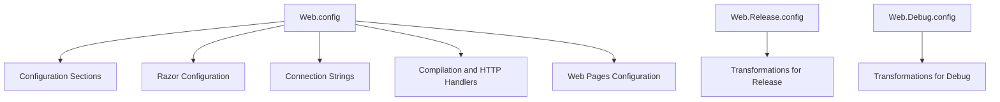

# Exploring Web Configuration in Configuration

Web Configuration refers to the setup and customization of web application settings through configuration files. These files ensure that the application behaves correctly in different environments by modifying settings such as connection strings and compilation options.

## Configuration Sections

Defines custom configuration sections for Razor views and other components.

<SwmSnippet path="/WhoOwesWhat.NancyServer/Web.config" line="7">

---

The <SwmToken path="WhoOwesWhat.NancyServer/Web.config" pos="7:2:2" line-data="  &lt;configSections&gt;">`configSections`</SwmToken> element in <SwmPath>[WhoOwesWhat.NancyServer/Web.config](WhoOwesWhat.NancyServer/Web.config)</SwmPath> defines custom configuration sections for Razor views and other components.

```config
  <configSections>
    <sectionGroup name="system.web.webPages.razor" type="System.Web.WebPages.Razor.Configuration.RazorWebSectionGroup, System.Web.WebPages.Razor, Version=2.0.0.0, Culture=neutral, PublicKeyToken=31BF3856AD364E35">
      <section name="pages" type="System.Web.WebPages.Razor.Configuration.RazorPagesSection, System.Web.WebPages.Razor, Version=2.0.0.0, Culture=neutral, PublicKeyToken=31BF3856AD364E35" requirePermission="false"/>
    </sectionGroup>
    <section name="razor" type="Nancy.ViewEngines.Razor.RazorConfigurationSection, Nancy.ViewEngines.Razor"/>
  </configSections>
```

---

</SwmSnippet>

## Razor Configuration

Specifies assemblies and namespaces for Razor views, ensuring they have access to the necessary components.

<SwmSnippet path="/WhoOwesWhat.NancyServer/Web.config" line="13">

---

The <SwmToken path="WhoOwesWhat.NancyServer/Web.config" pos="13:2:2" line-data="  &lt;razor disableAutoIncludeModelNamespace=&quot;false&quot;&gt;">`razor`</SwmToken> element in <SwmPath>[WhoOwesWhat.NancyServer/Web.config](WhoOwesWhat.NancyServer/Web.config)</SwmPath> specifies assemblies and namespaces for Razor views.

```config
  <razor disableAutoIncludeModelNamespace="false">
    <assemblies>
      <add assembly="WhoOwesWhat.NancyServer"/>
      <add assembly="WhoOwesWhat.Domain.DTO"/>
    </assemblies>
    <namespaces>
      <add namespace="WhoOwesWhat.Domain.DTO"/>
    </namespaces>
  </razor>
```

---

</SwmSnippet>

## Connection Strings

Defines the connection string for the application's database, allowing it to connect to the specified data source.

<SwmSnippet path="/WhoOwesWhat.NancyServer/Web.config" line="30">

---

The <SwmToken path="WhoOwesWhat.NancyServer/Web.config" pos="30:2:2" line-data="  &lt;connectionStrings&gt;">`connectionStrings`</SwmToken> element in <SwmPath>[WhoOwesWhat.NancyServer/Web.config](WhoOwesWhat.NancyServer/Web.config)</SwmPath> defines the connection string for the application's database.

```config
  <connectionStrings>
    <add name="DefaultConnection" connectionString="Data Source=.\SQLEXPRESS;Integrated Security=True;Database=WhoOwesWhat" providerName="System.Data.SqlClient"/>
  </connectionStrings>
```

---

</SwmSnippet>

## Compilation and HTTP Handlers

Sets compilation options and HTTP handlers, which are essential for processing requests and rendering views.

<SwmSnippet path="/WhoOwesWhat.NancyServer/Web.config" line="33">

---

The <SwmToken path="WhoOwesWhat.NancyServer/Web.config" pos="33:2:4" line-data="  &lt;system.web&gt;">`system.web`</SwmToken> element in <SwmPath>[WhoOwesWhat.NancyServer/Web.config](WhoOwesWhat.NancyServer/Web.config)</SwmPath> sets compilation options and HTTP handlers.

```config
  <system.web>
    <compilation debug="true" targetFramework="4.8">
      <buildProviders>
        <add extension=".cshtml" type="Nancy.ViewEngines.Razor.BuildProviders.NancyCSharpRazorBuildProvider, Nancy.ViewEngines.Razor.BuildProviders"/>
        <add extension=".vbhtml" type="Nancy.ViewEngines.Razor.BuildProviders.NancyVisualBasicRazorBuildProvider, Nancy.ViewEngines.Razor.BuildProviders"/>
      </buildProviders>
    </compilation>
    <httpHandlers>
      <add verb="*" type="Nancy.Hosting.Aspnet.NancyHttpRequestHandler" path="*"/>
    </httpHandlers>
    <pages controlRenderingCompatibilityVersion="4.0"/>
  </system.web>
```

---

</SwmSnippet>

## Web Pages Configuration

Configures the base type and namespaces for web pages, ensuring they are rendered correctly.

<SwmSnippet path="/WhoOwesWhat.NancyServer/Web.config" line="54">

---

The <SwmToken path="WhoOwesWhat.NancyServer/Web.config" pos="54:2:8" line-data="  &lt;system.web.webPages.razor&gt;">`system.web.webPages.razor`</SwmToken> element in <SwmPath>[WhoOwesWhat.NancyServer/Web.config](WhoOwesWhat.NancyServer/Web.config)</SwmPath> configures the base type and namespaces for web pages.

```config
  <system.web.webPages.razor>
    <pages pageBaseType="Nancy.ViewEngines.Razor.NancyRazorViewBase">
      <namespaces>
        <add namespace="Nancy.ViewEngines.Razor"/>
      </namespaces>
    </pages>
  </system.web.webPages.razor>
```

---

</SwmSnippet>

## <SwmPath>[WhoOwesWhat.NancyServer/Web.Release.config](WhoOwesWhat.NancyServer/Web.Release.config)</SwmPath>

The <SwmPath>[WhoOwesWhat.NancyServer/Web.Release.config](WhoOwesWhat.NancyServer/Web.Release.config)</SwmPath> file is used for transforming the <SwmPath>[WhoOwesWhat.NancyServer/Web.config](WhoOwesWhat.NancyServer/Web.config)</SwmPath> file during the build process for the release environment. It modifies settings such as connection strings and compilation options to suit the release environment.

<SwmSnippet path="/WhoOwesWhat.NancyServer/Web.Release.config" line="1">

---

The <SwmPath>[WhoOwesWhat.NancyServer/Web.Release.config](WhoOwesWhat.NancyServer/Web.Release.config)</SwmPath> file modifies settings for the release environment.

```config
<?xml version="1.0" encoding="utf-8"?>

<!-- For more information on using web.config transformation visit http://go.microsoft.com/fwlink/?LinkId=125889 -->

<configuration xmlns:xdt="http://schemas.microsoft.com/XML-Document-Transform">
  <!--
    In the example below, the "SetAttributes" transform will change the value of 
    "connectionString" to use "ReleaseSQLServer" only when the "Match" locator 
    finds an attribute "name" that has a value of "MyDB".
    
    <connectionStrings>
      <add name="MyDB" 
        connectionString="Data Source=ReleaseSQLServer;Initial Catalog=MyReleaseDB;Integrated Security=True" 
        xdt:Transform="SetAttributes" xdt:Locator="Match(name)"/>
    </connectionStrings>
  -->
  <system.web>
    <compilation xdt:Transform="RemoveAttributes(debug)" />
    <!--
      In the example below, the "Replace" transform will replace the entire 
      <customErrors> section of your web.config file.
```

---

</SwmSnippet>

## <SwmPath>[WhoOwesWhat.NancyServer/Web.Debug.config](WhoOwesWhat.NancyServer/Web.Debug.config)</SwmPath>

The <SwmPath>[WhoOwesWhat.NancyServer/Web.Debug.config](WhoOwesWhat.NancyServer/Web.Debug.config)</SwmPath> file is used for transforming the <SwmPath>[WhoOwesWhat.NancyServer/Web.config](WhoOwesWhat.NancyServer/Web.config)</SwmPath> file during the build process for the debug environment. It modifies settings to suit the debug environment, ensuring that the application behaves correctly during development.

<SwmSnippet path="/WhoOwesWhat.NancyServer/Web.Debug.config" line="1">

---

The <SwmPath>[WhoOwesWhat.NancyServer/Web.Debug.config](WhoOwesWhat.NancyServer/Web.Debug.config)</SwmPath> file modifies settings for the debug environment.

```config
<?xml version="1.0" encoding="utf-8"?>

<!-- For more information on using web.config transformation visit http://go.microsoft.com/fwlink/?LinkId=125889 -->

<configuration xmlns:xdt="http://schemas.microsoft.com/XML-Document-Transform">
  <!--
    In the example below, the "SetAttributes" transform will change the value of 
    "connectionString" to use "ReleaseSQLServer" only when the "Match" locator 
    finds an attribute "name" that has a value of "MyDB".
    
    <connectionStrings>
      <add name="MyDB" 
        connectionString="Data Source=ReleaseSQLServer;Initial Catalog=MyReleaseDB;Integrated Security=True" 
        xdt:Transform="SetAttributes" xdt:Locator="Match(name)"/>
    </connectionStrings>
  -->
  <system.web>
    <!--
      In the example below, the "Replace" transform will replace the entire 
      <customErrors> section of your web.config file.
      Note that because there is only one customErrors section under the 
```

---

</SwmSnippet>

&nbsp;

*This is an auto-generated document by Swimm AI 🌊 and has not yet been verified by a human*

<SwmMeta version="3.0.0" repo-id="Z2l0aHViJTNBJTNBV2hvT3dlc1doYXQtTmV0NDglM0ElM0FTd2ltbS1EZW1v" repo-name="WhoOwesWhat-Net48"><sup>Powered by [Swimm](/)</sup></SwmMeta>
