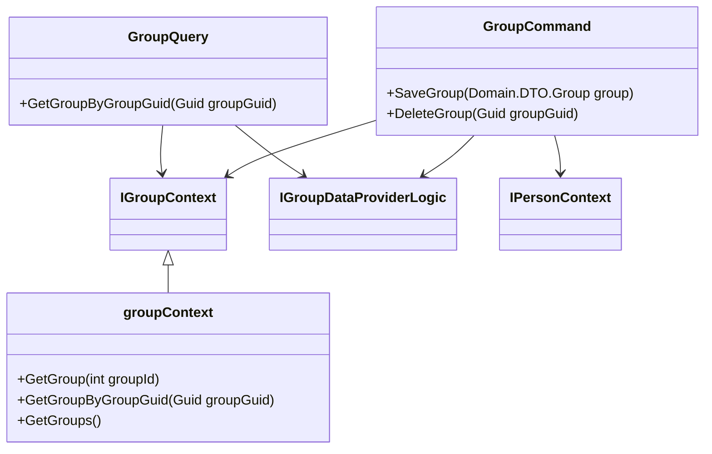

# Introduction

The Group entity is a core component responsible for managing group-related data and operations. It interacts with the database through the <SwmToken path="WhoOwesWhat.DataProvider/GroupEntity/GroupQuery.cs" pos="17:5:5" line-data="        private readonly IGroupContext _groupContext;">`IGroupContext`</SwmToken> interface, which provides methods for retrieving and manipulating group data.

# <SwmToken path="WhoOwesWhat.DataProvider/GroupEntity/GroupQuery.cs" pos="13:5:5" line-data="    public class GroupQuery : IGroupQuery">`GroupQuery`</SwmToken> Class

The <SwmToken path="WhoOwesWhat.DataProvider/GroupEntity/GroupQuery.cs" pos="13:5:5" line-data="    public class GroupQuery : IGroupQuery">`GroupQuery`</SwmToken> class is responsible for fetching group information from the database. It uses the <SwmToken path="WhoOwesWhat.DataProvider/GroupEntity/GroupQuery.cs" pos="17:5:5" line-data="        private readonly IGroupContext _groupContext;">`IGroupContext`</SwmToken> to access group data and the <SwmToken path="WhoOwesWhat.DataProvider/GroupEntity/GroupQuery.cs" pos="16:5:5" line-data="        private readonly IGroupDataProviderLogic _groupDataProviderLogic;">`IGroupDataProviderLogic`</SwmToken> to map database entities to domain models.

<SwmSnippet path="/WhoOwesWhat.DataProvider/GroupEntity/GroupQuery.cs" line="13">

---

The <SwmToken path="WhoOwesWhat.DataProvider/GroupEntity/GroupQuery.cs" pos="13:5:5" line-data="    public class GroupQuery : IGroupQuery">`GroupQuery`</SwmToken> class constructor initializes the necessary contexts and logic components for fetching group data.

```c#
    public class GroupQuery : IGroupQuery
    {
        private ILog _log;
        private readonly IGroupDataProviderLogic _groupDataProviderLogic;
        private readonly IGroupContext _groupContext;
        private readonly ITransactionContext _transactionContext;
        private readonly IPostContext _postContext;

        public GroupQuery(
            ILog log
            , IGroupDataProviderLogic groupDataProviderLogic
            , IGroupContext groupContext
            , ITransactionContext transactionContext
            , IPostContext postContext
            )
        {
            _log = log;
            _groupDataProviderLogic = groupDataProviderLogic;
            _groupContext = groupContext;
            _transactionContext = transactionContext;
            _postContext = postContext;
```

---

</SwmSnippet>

# <SwmToken path="WhoOwesWhat.DataProvider/GroupEntity/GroupCommand.cs" pos="11:5:5" line-data="    public class GroupCommand : IGroupCommand">`GroupCommand`</SwmToken> Class

The <SwmToken path="WhoOwesWhat.DataProvider/GroupEntity/GroupCommand.cs" pos="11:5:5" line-data="    public class GroupCommand : IGroupCommand">`GroupCommand`</SwmToken> class handles commands related to group creation and updates. It ensures that group data is correctly stored and maintained in the database.

<SwmSnippet path="/WhoOwesWhat.DataProvider/GroupEntity/GroupCommand.cs" line="9">

---

The <SwmToken path="WhoOwesWhat.DataProvider/GroupEntity/GroupCommand.cs" pos="11:5:5" line-data="    public class GroupCommand : IGroupCommand">`GroupCommand`</SwmToken> class constructor initializes the necessary contexts and logic components for handling group commands.

```c#
namespace WhoOwesWhat.DataProvider.GroupEntity
{
    public class GroupCommand : IGroupCommand
    {
        private readonly IWhoOwesWhatContext _whoOwesWhatContext;
        private ILog _log;
        private readonly IGroupDataProviderLogic _groupDataProviderLogic;
        private readonly IGroupContext _groupContext;
        private readonly IPersonContext _personContext;

        public GroupCommand(
            IWhoOwesWhatContext whoOwesWhatContext
            , ILog log
            , IGroupDataProviderLogic groupDataProviderLogic
            , IGroupContext groupContext
            , IPersonContext personContext
            )
        {
            _whoOwesWhatContext = whoOwesWhatContext;
            _log = log;
            _groupDataProviderLogic = groupDataProviderLogic;
```

---

</SwmSnippet>

# <SwmToken path="WhoOwesWhat.DataProvider/GroupEntity/GroupQuery.cs" pos="17:5:5" line-data="        private readonly IGroupContext _groupContext;">`IGroupContext`</SwmToken> Interface

The <SwmToken path="WhoOwesWhat.DataProvider/GroupEntity/GroupQuery.cs" pos="17:5:5" line-data="        private readonly IGroupContext _groupContext;">`IGroupContext`</SwmToken> interface provides methods for retrieving and manipulating group data. It is used by the <SwmToken path="WhoOwesWhat.DataProvider/GroupEntity/GroupQuery.cs" pos="13:5:5" line-data="    public class GroupQuery : IGroupQuery">`GroupQuery`</SwmToken> and <SwmToken path="WhoOwesWhat.DataProvider/GroupEntity/GroupCommand.cs" pos="11:5:5" line-data="    public class GroupCommand : IGroupCommand">`GroupCommand`</SwmToken> classes to interact with the database.

<SwmSnippet path="/WhoOwesWhat.DataProvider/GroupEntity/GroupContext.cs" line="8">

---

The <SwmToken path="WhoOwesWhat.DataProvider/GroupEntity/GroupContext.cs" pos="8:5:5" line-data="    public interface IGroupContext : IContextBase">`IGroupContext`</SwmToken> interface defines methods like <SwmToken path="WhoOwesWhat.DataProvider/GroupEntity/GroupContext.cs" pos="10:5:5" line-data="        Entity.Group GetGroup(int groupId);">`GetGroup`</SwmToken>, <SwmToken path="WhoOwesWhat.DataProvider/GroupEntity/GroupContext.cs" pos="11:5:5" line-data="        Entity.Group GetGroupByGroupGuid(Guid groupGuid);">`GetGroupByGroupGuid`</SwmToken>, and <SwmToken path="WhoOwesWhat.DataProvider/GroupEntity/GroupContext.cs" pos="12:6:6" line-data="        IQueryable&lt;Group&gt; GetGroups();">`GetGroups`</SwmToken> for interacting with group data.

```c#
    public interface IGroupContext : IContextBase
    {
        Entity.Group GetGroup(int groupId);
        Entity.Group GetGroupByGroupGuid(Guid groupGuid);
        IQueryable<Group> GetGroups();
    }
```

---

</SwmSnippet>

# <SwmToken path="WhoOwesWhat.DataProvider/GroupEntity/GroupQuery.cs" pos="36:5:5" line-data="        public Group GetGroupByGroupGuid(Guid groupGuid)">`GetGroupByGroupGuid`</SwmToken> Method

The <SwmToken path="WhoOwesWhat.DataProvider/GroupEntity/GroupQuery.cs" pos="36:5:5" line-data="        public Group GetGroupByGroupGuid(Guid groupGuid)">`GetGroupByGroupGuid`</SwmToken> method in the <SwmToken path="WhoOwesWhat.DataProvider/GroupEntity/GroupQuery.cs" pos="13:5:5" line-data="    public class GroupQuery : IGroupQuery">`GroupQuery`</SwmToken> class retrieves a group entity by its GUID. It uses the <SwmToken path="WhoOwesWhat.DataProvider/GroupEntity/GroupQuery.cs" pos="38:9:9" line-data="            var groupDb = _groupContext.GetGroups().SingleOrDefault(a =&gt; a.GroupGuid == groupGuid &amp;&amp; !a.IsDeleted);">`GetGroups`</SwmToken> method from the <SwmToken path="WhoOwesWhat.DataProvider/GroupEntity/GroupQuery.cs" pos="17:5:5" line-data="        private readonly IGroupContext _groupContext;">`IGroupContext`</SwmToken> interface and maps the result to a domain model using the <SwmToken path="WhoOwesWhat.DataProvider/GroupEntity/GroupQuery.cs" pos="23:5:5" line-data="            , IGroupDataProviderLogic groupDataProviderLogic">`groupDataProviderLogic`</SwmToken>.

<SwmSnippet path="/WhoOwesWhat.DataProvider/GroupEntity/GroupQuery.cs" line="36">

---

The <SwmToken path="WhoOwesWhat.DataProvider/GroupEntity/GroupQuery.cs" pos="36:5:5" line-data="        public Group GetGroupByGroupGuid(Guid groupGuid)">`GetGroupByGroupGuid`</SwmToken> method implementation in the <SwmToken path="WhoOwesWhat.DataProvider/GroupEntity/GroupQuery.cs" pos="13:5:5" line-data="    public class GroupQuery : IGroupQuery">`GroupQuery`</SwmToken> class.

```c#
        public Group GetGroupByGroupGuid(Guid groupGuid)
        {
            var groupDb = _groupContext.GetGroups().SingleOrDefault(a => a.GroupGuid == groupGuid && !a.IsDeleted);
            return groupDb == null ? null : _groupDataProviderLogic.MapToDomain(groupDb);
        }
```

---

</SwmSnippet>

# Main Functions

Main functions of the Group entity include <SwmToken path="WhoOwesWhat.DataProvider/GroupEntity/GroupContext.cs" pos="10:5:5" line-data="        Entity.Group GetGroup(int groupId);">`GetGroup`</SwmToken>, <SwmToken path="WhoOwesWhat.DataProvider/GroupEntity/GroupQuery.cs" pos="36:5:5" line-data="        public Group GetGroupByGroupGuid(Guid groupGuid)">`GetGroupByGroupGuid`</SwmToken>, <SwmToken path="WhoOwesWhat.DataProvider/GroupEntity/GroupCommand.cs" pos="38:5:5" line-data="        public void SaveGroup(Domain.DTO.Group group)">`SaveGroup`</SwmToken>, and <SwmToken path="WhoOwesWhat.DataProvider/GroupEntity/GroupCommand.cs" pos="58:5:5" line-data="        public void DeleteGroup(Guid groupGuid)">`DeleteGroup`</SwmToken>.

## <SwmToken path="WhoOwesWhat.DataProvider/GroupEntity/GroupContext.cs" pos="10:5:5" line-data="        Entity.Group GetGroup(int groupId);">`GetGroup`</SwmToken>

The <SwmToken path="WhoOwesWhat.DataProvider/GroupEntity/GroupContext.cs" pos="10:5:5" line-data="        Entity.Group GetGroup(int groupId);">`GetGroup`</SwmToken> function retrieves a group by its ID. It queries the database using the group ID and returns the corresponding group entity.

<SwmSnippet path="/WhoOwesWhat.DataProvider/GroupEntity/GroupContext.cs" line="24">

---

The <SwmToken path="WhoOwesWhat.DataProvider/GroupEntity/GroupContext.cs" pos="24:5:5" line-data="        public Group GetGroup(int groupId)">`GetGroup`</SwmToken> method implementation in the <SwmToken path="WhoOwesWhat.DataProvider/GroupEntity/GroupQuery.cs" pos="24:5:5" line-data="            , IGroupContext groupContext">`groupContext`</SwmToken> class.

```c#
        public Group GetGroup(int groupId)
        {
            return _whoOwesWhatContext.GetGroupSqlRepository().GetAll().SingleOrDefault(a => a.GroupId == groupId);
        }
```

---

</SwmSnippet>

<SwmSnippet path="/WhoOwesWhat.DataProvider/GroupEntity/GroupContext.cs" line="29">

---

The <SwmToken path="WhoOwesWhat.DataProvider/GroupEntity/GroupContext.cs" pos="29:5:5" line-data="        public Group GetGroupByGroupGuid(Guid groupGuid)">`GetGroupByGroupGuid`</SwmToken> method implementation in the <SwmToken path="WhoOwesWhat.DataProvider/GroupEntity/GroupQuery.cs" pos="24:5:5" line-data="            , IGroupContext groupContext">`groupContext`</SwmToken> class.

```c#
        public Group GetGroupByGroupGuid(Guid groupGuid)
        {
            return _whoOwesWhatContext.GetGroupSqlRepository().GetAll().SingleOrDefault(a => a.GroupGuid == groupGuid);
        }
```

---

</SwmSnippet>

## <SwmToken path="WhoOwesWhat.DataProvider/GroupEntity/GroupCommand.cs" pos="38:5:5" line-data="        public void SaveGroup(Domain.DTO.Group group)">`SaveGroup`</SwmToken>

The <SwmToken path="WhoOwesWhat.DataProvider/GroupEntity/GroupCommand.cs" pos="38:5:5" line-data="        public void SaveGroup(Domain.DTO.Group group)">`SaveGroup`</SwmToken> function either creates a new group or updates an existing one. It checks if the group exists by its GUID, and if not, it creates a new group entity. It then updates the group's properties and saves the changes to the database.

<SwmSnippet path="/WhoOwesWhat.DataProvider/GroupEntity/GroupCommand.cs" line="38">

---

The <SwmToken path="WhoOwesWhat.DataProvider/GroupEntity/GroupCommand.cs" pos="38:5:5" line-data="        public void SaveGroup(Domain.DTO.Group group)">`SaveGroup`</SwmToken> method implementation in the <SwmToken path="WhoOwesWhat.DataProvider/GroupEntity/GroupCommand.cs" pos="11:5:5" line-data="    public class GroupCommand : IGroupCommand">`GroupCommand`</SwmToken> class.

```c#
        public void SaveGroup(Domain.DTO.Group group)
        {
            var groupDb = _groupContext.GetGroupByGroupGuid(group.GroupGuid);

            if (groupDb == null)
            {
                groupDb = new Entity.Group();
                groupDb.CreatedBy = _personContext.GetPersonByPersonGuid(group.CreatedByPersonGuid);
                groupDb.GroupGuid = group.GroupGuid;

                _whoOwesWhatContext.GetGroupSqlRepository().Add(groupDb);
            }

            groupDb.VersionUpdated = DateTime.Now;
            groupDb.Name = group.Name;
            groupDb.IsDeleted = group.IsDeleted;

            _whoOwesWhatContext.SaveChanges();
```

---

</SwmSnippet>

## <SwmToken path="WhoOwesWhat.DataProvider/GroupEntity/GroupCommand.cs" pos="58:5:5" line-data="        public void DeleteGroup(Guid groupGuid)">`DeleteGroup`</SwmToken>

The <SwmToken path="WhoOwesWhat.DataProvider/GroupEntity/GroupCommand.cs" pos="58:5:5" line-data="        public void DeleteGroup(Guid groupGuid)">`DeleteGroup`</SwmToken> function marks a group as deleted by setting its <SwmToken path="WhoOwesWhat.DataProvider/GroupEntity/GroupQuery.cs" pos="38:32:32" line-data="            var groupDb = _groupContext.GetGroups().SingleOrDefault(a =&gt; a.GroupGuid == groupGuid &amp;&amp; !a.IsDeleted);">`IsDeleted`</SwmToken> property to true. It retrieves the group by its GUID and updates the <SwmToken path="WhoOwesWhat.DataProvider/GroupEntity/GroupQuery.cs" pos="38:32:32" line-data="            var groupDb = _groupContext.GetGroups().SingleOrDefault(a =&gt; a.GroupGuid == groupGuid &amp;&amp; !a.IsDeleted);">`IsDeleted`</SwmToken> property, then saves the changes to the database.

<SwmSnippet path="/WhoOwesWhat.DataProvider/GroupEntity/GroupCommand.cs" line="58">

---

The <SwmToken path="WhoOwesWhat.DataProvider/GroupEntity/GroupCommand.cs" pos="58:5:5" line-data="        public void DeleteGroup(Guid groupGuid)">`DeleteGroup`</SwmToken> method implementation in the <SwmToken path="WhoOwesWhat.DataProvider/GroupEntity/GroupCommand.cs" pos="11:5:5" line-data="    public class GroupCommand : IGroupCommand">`GroupCommand`</SwmToken> class.

```c#
        public void DeleteGroup(Guid groupGuid)
        {
            var groupDb = _groupContext.GetGroupByGroupGuid(groupGuid);

            if (groupDb == null)
            {
                throw new GroupCommandException("Unable to find the Group to delete");
            }

            groupDb.IsDeleted = true;


            _whoOwesWhatContext.SaveChanges();
```

---

</SwmSnippet>

&nbsp;

*This is an auto-generated document by Swimm AI 🌊 and has not yet been verified by a human*

<SwmMeta version="3.0.0" repo-id="Z2l0aHViJTNBJTNBV2hvT3dlc1doYXQtTmV0NDglM0ElM0FTd2ltbS1EZW1v" repo-name="WhoOwesWhat-Net48"><sup>Powered by [Swimm](/)</sup></SwmMeta>
