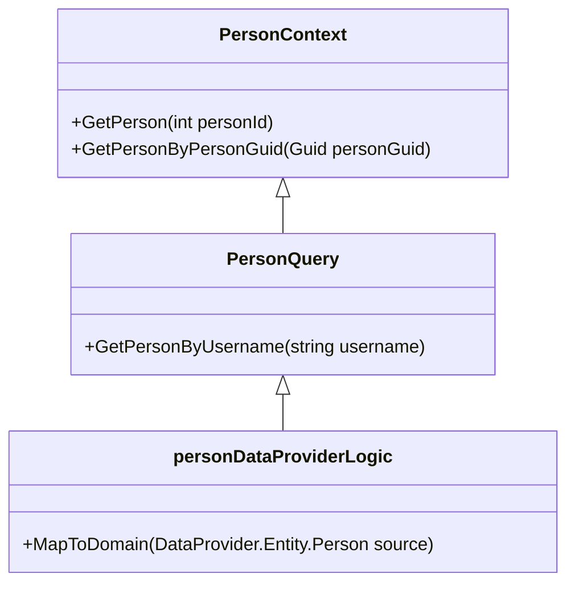

# Overview

The Person entity is a core component responsible for managing person-related data. It interacts with the database context to retrieve and manipulate person records. This document will guide you through the main classes and methods involved in handling the Person entity within the Data Provider.

# <SwmToken path="WhoOwesWhat.DataProvider/PersonEntity/PersonContext.cs" pos="13:5:5" line-data="    public class PersonContext : IPersonContext">`PersonContext`</SwmToken> Class

The <SwmToken path="WhoOwesWhat.DataProvider/PersonEntity/PersonContext.cs" pos="13:5:5" line-data="    public class PersonContext : IPersonContext">`PersonContext`</SwmToken> class provides methods to fetch person details based on different identifiers. It includes methods like <SwmToken path="WhoOwesWhat.DataProvider/PersonEntity/PersonContext.cs" pos="9:5:5" line-data="        Entity.Person GetPerson(int personId);">`GetPerson`</SwmToken> and <SwmToken path="WhoOwesWhat.DataProvider/PersonEntity/PersonContext.cs" pos="10:3:3" line-data="        Person GetPersonByPersonGuid(Guid personGuid);">`GetPersonByPersonGuid`</SwmToken>.

<SwmSnippet path="/WhoOwesWhat.DataProvider/PersonEntity/PersonContext.cs" line="7">

---

The <SwmToken path="WhoOwesWhat.DataProvider/PersonEntity/PersonContext.cs" pos="13:5:5" line-data="    public class PersonContext : IPersonContext">`PersonContext`</SwmToken> interface defines the methods for retrieving person details.

```c#
    public interface IPersonContext
    {
        Entity.Person GetPerson(int personId);
        Person GetPersonByPersonGuid(Guid personGuid);
    }
```

---

</SwmSnippet>

# <SwmToken path="WhoOwesWhat.DataProvider/PersonEntity/PersonQuery.cs" pos="10:5:5" line-data="    public class PersonQuery : IPersonQuery">`PersonQuery`</SwmToken> Class

The <SwmToken path="WhoOwesWhat.DataProvider/PersonEntity/PersonQuery.cs" pos="10:5:5" line-data="    public class PersonQuery : IPersonQuery">`PersonQuery`</SwmToken> class uses the <SwmToken path="WhoOwesWhat.DataProvider/PersonEntity/PersonContext.cs" pos="13:5:5" line-data="    public class PersonContext : IPersonContext">`PersonContext`</SwmToken> to execute queries and map database entities to domain objects using the <SwmToken path="WhoOwesWhat.DataProvider/PersonEntity/PersonQuery.cs" pos="16:17:17" line-data="        public PersonQuery(IWhoOwesWhatContext whoOwesWhatContext, ILog log, IPersonDataProviderLogic personDataProviderLogic)">`personDataProviderLogic`</SwmToken>.

<SwmSnippet path="/WhoOwesWhat.DataProvider/PersonEntity/PersonQuery.cs" line="8">

---

The <SwmToken path="WhoOwesWhat.DataProvider/PersonEntity/PersonQuery.cs" pos="10:5:5" line-data="    public class PersonQuery : IPersonQuery">`PersonQuery`</SwmToken> class implements the <SwmToken path="WhoOwesWhat.DataProvider/PersonEntity/PersonQuery.cs" pos="10:9:9" line-data="    public class PersonQuery : IPersonQuery">`IPersonQuery`</SwmToken> interface.

```c#
namespace WhoOwesWhat.DataProvider.PersonEntity
{
    public class PersonQuery : IPersonQuery
```

---

</SwmSnippet>

# <SwmToken path="WhoOwesWhat.DataProvider/PersonEntity/PersonQuery.cs" pos="16:17:17" line-data="        public PersonQuery(IWhoOwesWhatContext whoOwesWhatContext, ILog log, IPersonDataProviderLogic personDataProviderLogic)">`personDataProviderLogic`</SwmToken> Class

The <SwmToken path="WhoOwesWhat.DataProvider/PersonEntity/PersonQuery.cs" pos="16:17:17" line-data="        public PersonQuery(IWhoOwesWhatContext whoOwesWhatContext, ILog log, IPersonDataProviderLogic personDataProviderLogic)">`personDataProviderLogic`</SwmToken> class contains the <SwmToken path="WhoOwesWhat.DataProvider/PersonEntity/PersonDataProviderLogic.cs" pos="5:7:7" line-data="        Domain.DTO.Person MapToDomain(DataProvider.Entity.Person source);">`MapToDomain`</SwmToken> method, which converts database entities into domain-specific objects. This mapping ensures that the data retrieved from the database is transformed into a format suitable for the application's domain logic.

<SwmSnippet path="WhoOwesWhat.DataProvider/PersonEntity/PersonDataProviderLogic.cs" line="2">

---

The <SwmToken path="WhoOwesWhat.DataProvider/PersonEntity/PersonQuery.cs" pos="16:17:17" line-data="        public PersonQuery(IWhoOwesWhatContext whoOwesWhatContext, ILog log, IPersonDataProviderLogic personDataProviderLogic)">`personDataProviderLogic`</SwmToken> interface defines the <SwmToken path="WhoOwesWhat.DataProvider/PersonEntity/PersonDataProviderLogic.cs" pos="5:7:7" line-data="        Domain.DTO.Person MapToDomain(DataProvider.Entity.Person source);">`MapToDomain`</SwmToken> method.

```
{
    public interface IPersonDataProviderLogic
    {
        Domain.DTO.Person MapToDomain(DataProvider.Entity.Person source);
```

---

</SwmSnippet>

# Main Functions

The main functions of the Person entity include methods to retrieve, save, delete, and undelete person records.

<SwmSnippet path="/WhoOwesWhat.DataProvider/PersonEntity/PersonContext.cs" line="22">

---

The <SwmToken path="WhoOwesWhat.DataProvider/PersonEntity/PersonContext.cs" pos="22:5:5" line-data="        public Person GetPerson(int personId)">`GetPerson`</SwmToken> method in the <SwmToken path="WhoOwesWhat.DataProvider/PersonEntity/PersonContext.cs" pos="13:5:5" line-data="    public class PersonContext : IPersonContext">`PersonContext`</SwmToken> class retrieves a person record based on the <SwmToken path="WhoOwesWhat.DataProvider/PersonEntity/PersonContext.cs" pos="22:9:9" line-data="        public Person GetPerson(int personId)">`personId`</SwmToken>.

```c#
        public Person GetPerson(int personId)
        {
            return _whoOwesWhatContext.GetPersonSqlRepository().GetAll().SingleOrDefault(a => a.PersonId == personId);
        }
```

---

</SwmSnippet>

## <SwmToken path="WhoOwesWhat.DataProvider/PersonEntity/PersonContext.cs" pos="10:3:3" line-data="        Person GetPersonByPersonGuid(Guid personGuid);">`GetPersonByPersonGuid`</SwmToken>

The <SwmToken path="WhoOwesWhat.DataProvider/PersonEntity/PersonContext.cs" pos="10:3:3" line-data="        Person GetPersonByPersonGuid(Guid personGuid);">`GetPersonByPersonGuid`</SwmToken> function retrieves a person record from the database using the person's GUID. It ensures that the person details are fetched based on a unique identifier.

<SwmSnippet path="/WhoOwesWhat.DataProvider/PersonEntity/PersonContext.cs" line="27">

---

The <SwmToken path="WhoOwesWhat.DataProvider/PersonEntity/PersonContext.cs" pos="27:5:5" line-data="        public Person GetPersonByPersonGuid(Guid personGuid)">`GetPersonByPersonGuid`</SwmToken> method in the <SwmToken path="WhoOwesWhat.DataProvider/PersonEntity/PersonContext.cs" pos="13:5:5" line-data="    public class PersonContext : IPersonContext">`PersonContext`</SwmToken> class retrieves a person record based on the <SwmToken path="WhoOwesWhat.DataProvider/PersonEntity/PersonContext.cs" pos="27:9:9" line-data="        public Person GetPersonByPersonGuid(Guid personGuid)">`personGuid`</SwmToken>.

```c#
        public Person GetPersonByPersonGuid(Guid personGuid)
        {
            return _whoOwesWhatContext.GetPersonSqlRepository().GetAll().SingleOrDefault(a => a.PersonGuid == personGuid);
        }
```

---

</SwmSnippet>

## <SwmToken path="WhoOwesWhat.DataProvider/PersonEntity/PersonCommand.cs" pos="21:5:5" line-data="        public void  SavePerson(Domain.DTO.Person person)">`SavePerson`</SwmToken>

The <SwmToken path="WhoOwesWhat.DataProvider/PersonEntity/PersonCommand.cs" pos="21:5:5" line-data="        public void  SavePerson(Domain.DTO.Person person)">`SavePerson`</SwmToken> function saves or updates a person record in the database. It checks if the person already exists based on the GUID and either updates the existing record or creates a new one.

<SwmSnippet path="/WhoOwesWhat.DataProvider/PersonEntity/PersonCommand.cs" line="21">

---

The <SwmToken path="WhoOwesWhat.DataProvider/PersonEntity/PersonCommand.cs" pos="21:5:5" line-data="        public void  SavePerson(Domain.DTO.Person person)">`SavePerson`</SwmToken> method in the <SwmToken path="WhoOwesWhat.DataProvider/PersonEntity/PersonCommand.cs" pos="8:5:5" line-data="    public class PersonCommand : IPersonCommand">`PersonCommand`</SwmToken> class saves or updates a person record in the database.

```c#
        public void  SavePerson(Domain.DTO.Person person)
        {
            var personDb = _whoOwesWhatContext.GetPersonSqlRepository().GetAll().SingleOrDefault(a => a.PersonGuid == person.PersonGuid);
            if (personDb == null)
            {
                personDb = new Entity.Person();
                personDb.PersonGuid = person.PersonGuid;
                _whoOwesWhatContext.GetPersonSqlRepository().Add(personDb);
            }

            personDb.Displayname = person.Displayname;
            personDb.Mobile = person.Mobile;
            personDb.IsDeleted = person.IsDeleted;
            
            _whoOwesWhatContext.SaveChanges();
        }
```

---

</SwmSnippet>

## <SwmToken path="WhoOwesWhat.DataProvider/PersonEntity/PersonCommand.cs" pos="38:5:5" line-data="        public void DeletePerson(Guid personGuid)">`DeletePerson`</SwmToken>

The <SwmToken path="WhoOwesWhat.DataProvider/PersonEntity/PersonCommand.cs" pos="38:5:5" line-data="        public void DeletePerson(Guid personGuid)">`DeletePerson`</SwmToken> function marks a person record as deleted in the database. It sets the <SwmToken path="WhoOwesWhat.DataProvider/PersonEntity/PersonCommand.cs" pos="33:3:3" line-data="            personDb.IsDeleted = person.IsDeleted;">`IsDeleted`</SwmToken> flag to true for the specified person GUID.

<SwmSnippet path="/WhoOwesWhat.DataProvider/PersonEntity/PersonCommand.cs" line="38">

---

The <SwmToken path="WhoOwesWhat.DataProvider/PersonEntity/PersonCommand.cs" pos="38:5:5" line-data="        public void DeletePerson(Guid personGuid)">`DeletePerson`</SwmToken> method in the <SwmToken path="WhoOwesWhat.DataProvider/PersonEntity/PersonCommand.cs" pos="8:5:5" line-data="    public class PersonCommand : IPersonCommand">`PersonCommand`</SwmToken> class marks a person record as deleted.

```c#
        public void DeletePerson(Guid personGuid)
        {
            var personDb = _whoOwesWhatContext.GetPersonSqlRepository().GetAll().Single(a => a.PersonGuid == personGuid);
            if (personDb == null)
            {
                throw new PersonCommandException("Unable to find the Person to delete.");
            }

            personDb.IsDeleted = true;

            
            _whoOwesWhatContext.SaveChanges();

            
        }
```

---

</SwmSnippet>

## <SwmToken path="WhoOwesWhat.DataProvider/PersonEntity/PersonCommand.cs" pos="54:5:5" line-data="        public void UnDeletePerson(Guid personGuid)">`UnDeletePerson`</SwmToken>

The <SwmToken path="WhoOwesWhat.DataProvider/PersonEntity/PersonCommand.cs" pos="54:5:5" line-data="        public void UnDeletePerson(Guid personGuid)">`UnDeletePerson`</SwmToken> function reverts the deletion of a person record in the database. It sets the <SwmToken path="WhoOwesWhat.DataProvider/PersonEntity/PersonCommand.cs" pos="33:3:3" line-data="            personDb.IsDeleted = person.IsDeleted;">`IsDeleted`</SwmToken> flag to false for the specified person GUID.

<SwmSnippet path="/WhoOwesWhat.DataProvider/PersonEntity/PersonCommand.cs" line="54">

---

The <SwmToken path="WhoOwesWhat.DataProvider/PersonEntity/PersonCommand.cs" pos="54:5:5" line-data="        public void UnDeletePerson(Guid personGuid)">`UnDeletePerson`</SwmToken> method in the <SwmToken path="WhoOwesWhat.DataProvider/PersonEntity/PersonCommand.cs" pos="8:5:5" line-data="    public class PersonCommand : IPersonCommand">`PersonCommand`</SwmToken> class reverts the deletion of a person record.

```c#
        public void UnDeletePerson(Guid personGuid)
        {
            var personDb = _whoOwesWhatContext.GetPersonSqlRepository().GetAll().Single(a => a.PersonGuid == personGuid);
            if (personDb == null)
            {
                throw new PersonCommandException("Unable to find the Person to undelete.");
            }

            personDb.IsDeleted = false;


            _whoOwesWhatContext.SaveChanges();
        }
```

---

</SwmSnippet>

&nbsp;

*This is an auto-generated document by Swimm AI 🌊 and has not yet been verified by a human*

<SwmMeta version="3.0.0" repo-id="Z2l0aHViJTNBJTNBV2hvT3dlc1doYXQtTmV0NDglM0ElM0FTd2ltbS1EZW1v" repo-name="WhoOwesWhat-Net48"><sup>Powered by [Swimm](https://app.swimm.io/)</sup></SwmMeta>
