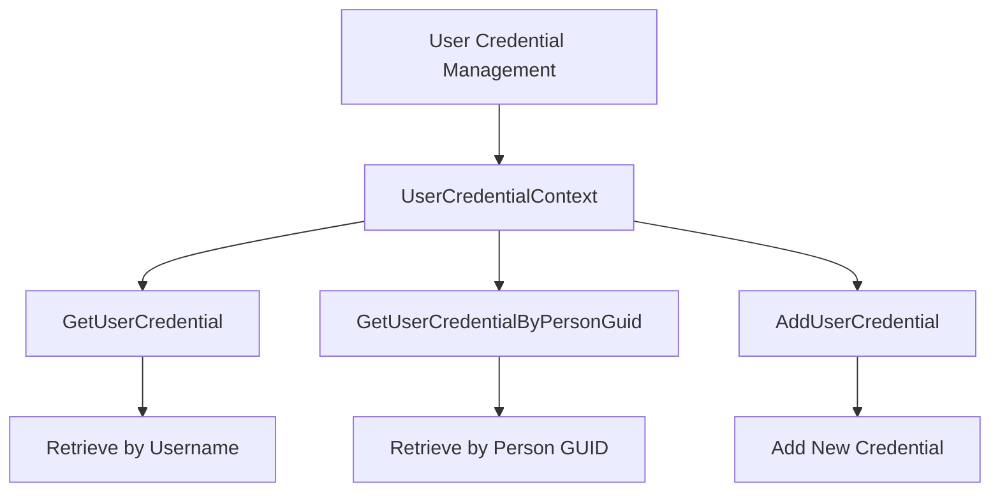

# Overview

User Credential Management is a critical component of the system, responsible for handling user credentials, including storing, retrieving, and validating them. This document will guide you through the main functions and methods involved in managing user credentials.

# User Credential Entity

The User Credential Entity is responsible for managing user credentials within the system. It interacts with the database context to retrieve and store user credential information.

# Validating User Credentials

The process of validating user credentials involves checking the provided username and password against the stored credentials in the database. This ensures that only authorized users can access the system.

<SwmSnippet path="/WhoOwesWhat.DataProvider/UserCredentialEntity/UserCredentialContext.cs" line="30">

---

The <SwmToken path="WhoOwesWhat.DataProvider/UserCredentialEntity/UserCredentialContext.cs" pos="30:7:7" line-data="        public Entity.UserCredential GetUserCredential(string username)">`GetUserCredential`</SwmToken> method retrieves a user's credentials based on their username by querying the database context and returning the result.

```c#
        public Entity.UserCredential GetUserCredential(string username)
        {
            var result =
                _whoOwesWhatContext.GetUserCredentialSqlRepository().GetAll().SingleOrDefault((a => a.Username == username));
            return result;

        }
```

---

</SwmSnippet>

<SwmSnippet path="/WhoOwesWhat.DataProvider/UserCredentialEntity/UserCredentialQuery.cs" line="32">

---

The <SwmToken path="WhoOwesWhat.DataProvider/UserCredentialEntity/UserCredentialQuery.cs" pos="32:5:5" line-data="        public UserCredential GetUserCredential(string username)">`GetUserCredential`</SwmToken> method in the <SwmToken path="WhoOwesWhat.DataProvider/UserCredentialEntity/UserCredentialQuery.cs" pos="10:5:5" line-data="    public class UserCredentialQuery : IUserCredentialQuery">`UserCredentialQuery`</SwmToken> class calls the <SwmToken path="WhoOwesWhat.DataProvider/UserCredentialEntity/UserCredentialQuery.cs" pos="32:5:5" line-data="        public UserCredential GetUserCredential(string username)">`GetUserCredential`</SwmToken> method from the context and maps the result to the domain format.

```c#
        public UserCredential GetUserCredential(string username)
        {
            var userCredential = _userCredentialContext.GetUserCredential(username);
            if (userCredential == null)
            {
                return null;
            }

            userCredential.Person = _personContext.GetPerson(userCredential.PersonId);
            return _userCredentialDataProviderLogic.MapToDomain(userCredential);
        }
```

---

</SwmSnippet>

<SwmSnippet path="/WhoOwesWhat.DataProvider/UserCredentialEntity/UserCredentialQuery.cs" line="44">

---

The <SwmToken path="WhoOwesWhat.DataProvider/UserCredentialEntity/UserCredentialQuery.cs" pos="44:5:5" line-data="        public UserCredential GetUserCredentialByPersonGuid(Guid personGuid)">`GetUserCredentialByPersonGuid`</SwmToken> method retrieves user credentials based on a person's GUID, ensuring that the correct user is identified and authenticated.

```c#
        public UserCredential GetUserCredentialByPersonGuid(Guid personGuid)
        {
            var userCredential = _userCredentialContext.GetUserCredentialByPersonGuid(personGuid);
            if (userCredential == null)
            {
                return null;
            }

            userCredential.Person = _personContext.GetPerson(userCredential.PersonId);
            return _userCredentialDataProviderLogic.MapToDomain(userCredential);
        }
```

---

</SwmSnippet>

# Main Functions

The main functions involved in user credential management include retrieving all user credentials, retrieving credentials by username, and adding new user credentials.

<SwmSnippet path="/WhoOwesWhat.DataProvider/UserCredentialEntity/UserCredentialQuery.cs" line="25">

---

## <SwmToken path="WhoOwesWhat.DataProvider/UserCredentialEntity/UserCredentialQuery.cs" pos="25:8:8" line-data="        public List&lt;UserCredential&gt; GetUserCredentials()">`GetUserCredentials`</SwmToken>

The <SwmToken path="WhoOwesWhat.DataProvider/UserCredentialEntity/UserCredentialQuery.cs" pos="25:8:8" line-data="        public List&lt;UserCredential&gt; GetUserCredentials()">`GetUserCredentials`</SwmToken> function retrieves all user credentials from the database and maps them to the domain model.

```c#
        public List<UserCredential> GetUserCredentials()
        {
            var result = _whoOwesWhatContext.GetUserCredentialSqlRepository().GetAll().Select(a => _userCredentialDataProviderLogic.MapToDomain(a)).ToList();
            return result;
            
        }
```

---

</SwmSnippet>

<SwmSnippet path="/WhoOwesWhat.DataProvider/UserCredentialEntity/UserCredentialQuery.cs" line="32">

---

## <SwmToken path="WhoOwesWhat.DataProvider/UserCredentialEntity/UserCredentialQuery.cs" pos="32:5:5" line-data="        public UserCredential GetUserCredential(string username)">`GetUserCredential`</SwmToken>

The <SwmToken path="WhoOwesWhat.DataProvider/UserCredentialEntity/UserCredentialQuery.cs" pos="32:5:5" line-data="        public UserCredential GetUserCredential(string username)">`GetUserCredential`</SwmToken> function retrieves a user's credentials based on their username, including associated person details.

```c#
        public UserCredential GetUserCredential(string username)
        {
            var userCredential = _userCredentialContext.GetUserCredential(username);
            if (userCredential == null)
            {
                return null;
            }

            userCredential.Person = _personContext.GetPerson(userCredential.PersonId);
            return _userCredentialDataProviderLogic.MapToDomain(userCredential);
        }
```

---

</SwmSnippet>

<SwmSnippet path="/WhoOwesWhat.DataProvider/UserCredentialEntity/UserCredentialCommand.cs" line="18">

---

## <SwmToken path="WhoOwesWhat.DataProvider/UserCredentialEntity/UserCredentialCommand.cs" pos="18:5:5" line-data="        public void AddUserCredential(AddUserCredentialModel userCredential)">`AddUserCredential`</SwmToken>

The <SwmToken path="WhoOwesWhat.DataProvider/UserCredentialEntity/UserCredentialCommand.cs" pos="18:5:5" line-data="        public void AddUserCredential(AddUserCredentialModel userCredential)">`AddUserCredential`</SwmToken> function adds a new user credential to the database, ensuring the associated person exists and updating the credential details.

```c#
        public void AddUserCredential(AddUserCredentialModel userCredential)
        {
            var credentialDb = _whoOwesWhatContext.GetUserCredentialSqlRepository().GetAll().SingleOrDefault(a => a.Username == userCredential.Username);
            if (credentialDb == null)
            {
                credentialDb = new Entity.UserCredential();

                var personDb = _whoOwesWhatContext.GetPersonSqlRepository().GetAll().SingleOrDefault(a => a.PersonGuid == userCredential.PersonGuid);
                if (personDb == null)
                {
                    throw new UserCredentialDataProviderException("PersonGuid not found. Can not add UserCredential.");
                }
                credentialDb.Person = personDb;

                _whoOwesWhatContext.GetUserCredentialSqlRepository().Add(credentialDb);
            }

            credentialDb.Email = userCredential.Email;
            credentialDb.Username = userCredential.Username;
            credentialDb.PasswordHash = userCredential.PasswordHash;
```

---

</SwmSnippet>

&nbsp;

*This is an auto-generated document by Swimm AI 🌊 and has not yet been verified by a human*

<SwmMeta version="3.0.0" repo-id="Z2l0aHViJTNBJTNBV2hvT3dlc1doYXQtTmV0NDglM0ElM0FTd2ltbS1EZW1v" repo-name="WhoOwesWhat-Net48"><sup>Powered by [Swimm](/)</sup></SwmMeta>
