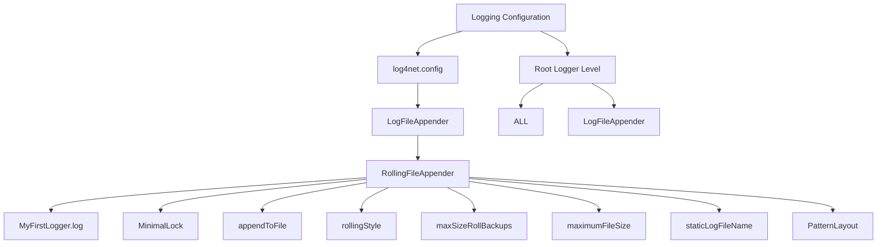

# Introduction to Logging Configuration

Logging configuration refers to the setup and management of log files for the application. This configuration is defined in the <SwmPath>[WhoOwesWhat.NancyServer/log4net.config](WhoOwesWhat.NancyServer/log4net.config)</SwmPath> file located in the `WhoOwesWhat.NancyServer` directory.

# Appender Configuration

The <SwmToken path="WhoOwesWhat.NancyServer/log4net.config" pos="2:13:13" line-data="  &lt;appender name=&quot;LogFileAppender&quot; type=&quot;log4net.Appender.RollingFileAppender&quot;&gt;">`log4net`</SwmToken> configuration specifies an appender named <SwmToken path="WhoOwesWhat.NancyServer/log4net.config" pos="2:7:7" line-data="  &lt;appender name=&quot;LogFileAppender&quot; type=&quot;log4net.Appender.RollingFileAppender&quot;&gt;">`LogFileAppender`</SwmToken> of type <SwmToken path="WhoOwesWhat.NancyServer/log4net.config" pos="2:13:17" line-data="  &lt;appender name=&quot;LogFileAppender&quot; type=&quot;log4net.Appender.RollingFileAppender&quot;&gt;">`log4net.Appender.RollingFileAppender`</SwmToken>. The appender writes log messages to a file named <SwmToken path="WhoOwesWhat.NancyServer/log4net.config" pos="3:13:15" line-data="    &lt;param name=&quot;File&quot; value=&quot;MyFirstLogger.log&quot;/&gt;">`MyFirstLogger.log`</SwmToken> and uses a minimal locking model to manage file access. The configuration ensures that log messages are appended to the file, and the file rolls over based on size, with a maximum of two backup files. The maximum file size for the log file is set to <SwmToken path="WhoOwesWhat.NancyServer/log4net.config" pos="8:7:7" line-data="    &lt;maximumFileSize value=&quot;1MB&quot; /&gt;">`1MB`</SwmToken>, and the log file name remains static.

<SwmSnippet path="/WhoOwesWhat.NancyServer/log4net.config" line="2">

---

The appender named <SwmToken path="WhoOwesWhat.NancyServer/log4net.config" pos="2:7:7" line-data="  &lt;appender name=&quot;LogFileAppender&quot; type=&quot;log4net.Appender.RollingFileAppender&quot;&gt;">`LogFileAppender`</SwmToken> is configured to write log messages to <SwmToken path="WhoOwesWhat.NancyServer/log4net.config" pos="3:13:15" line-data="    &lt;param name=&quot;File&quot; value=&quot;MyFirstLogger.log&quot;/&gt;">`MyFirstLogger.log`</SwmToken> using a rolling file appender. It specifies the locking model, file append mode, rolling style, maximum backups, and file size.

```config
  <appender name="LogFileAppender" type="log4net.Appender.RollingFileAppender">
    <param name="File" value="MyFirstLogger.log"/>
    <lockingModel type="log4net.Appender.FileAppender+MinimalLock" />
    <appendToFile value="true" />
    <rollingStyle value="Size" />
    <maxSizeRollBackups value="2" />
    <maximumFileSize value="1MB" />
    <staticLogFileName value="true" />
    <layout type="log4net.Layout.PatternLayout">
      <param name="ConversionPattern" value="%d [%t] %-5p %c %m%n"/>
    </layout>
  </appender>
```

---

</SwmSnippet>

# Log Message Layout

The layout of the log messages is defined using a pattern layout, which specifies the format of each log entry.

# Root Logger Level

The root logger level is set to <SwmToken path="WhoOwesWhat.NancyServer/log4net.config" pos="16:7:7" line-data="    &lt;level value=&quot;ALL&quot; /&gt;">`ALL`</SwmToken>, meaning all log messages will be captured. It references the <SwmToken path="WhoOwesWhat.NancyServer/log4net.config" pos="2:7:7" line-data="  &lt;appender name=&quot;LogFileAppender&quot; type=&quot;log4net.Appender.RollingFileAppender&quot;&gt;">`LogFileAppender`</SwmToken> to ensure that all messages are logged to the specified file.

<SwmSnippet path="/WhoOwesWhat.NancyServer/log4net.config" line="15">

---

The root logger level is configured to capture all log messages and reference the <SwmToken path="WhoOwesWhat.NancyServer/log4net.config" pos="17:9:9" line-data="    &lt;appender-ref ref=&quot;LogFileAppender&quot; /&gt;">`LogFileAppender`</SwmToken>.

```config
  <root>
    <level value="ALL" />
    <appender-ref ref="LogFileAppender" />
  </root>
```

---

</SwmSnippet>

&nbsp;

*This is an auto-generated document by Swimm AI 🌊 and has not yet been verified by a human*

<SwmMeta version="3.0.0" repo-id="Z2l0aHViJTNBJTNBV2hvT3dlc1doYXQtTmV0NDglM0ElM0FTd2ltbS1EZW1v" repo-name="WhoOwesWhat-Net48"><sup>Powered by [Swimm](/)</sup></SwmMeta>
