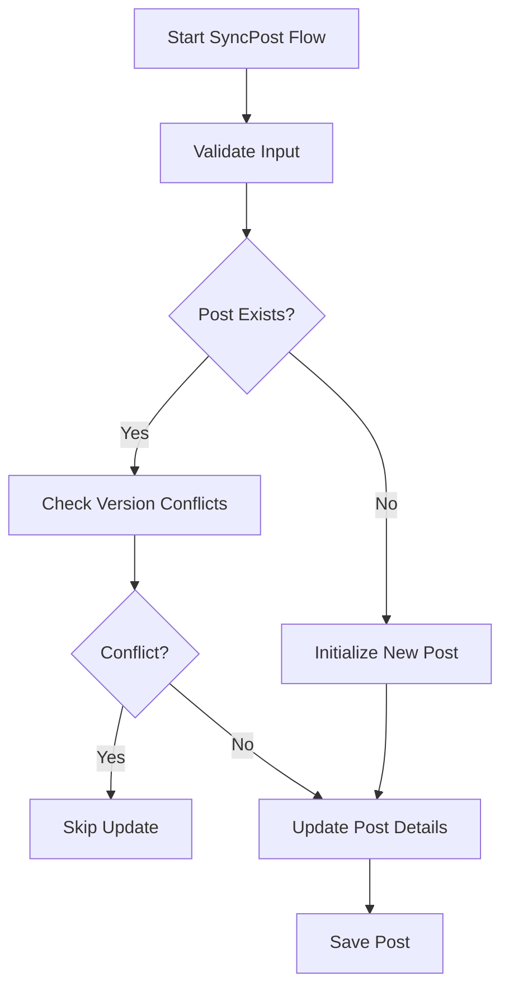

# Overview

The Post entity is a core component responsible for representing posts within the system. It includes various properties such as <SwmToken path="WhoOwesWhat.DataProvider/PostEntity/PostCommand.cs" pos="56:13:13" line-data="            Post postDb = _postContext.GetPostByPostGuid(post.PostGuid);">`PostGuid`</SwmToken>, Description, <SwmToken path="WhoOwesWhat.DataProvider/PostEntity/PostCommand.cs" pos="87:12:12" line-data="            Guard.NotNull(() =&gt; post.PurchaseDate, post.PurchaseDate);">`PurchaseDate`</SwmToken>, <SwmToken path="WhoOwesWhat.DataProvider/PostEntity/PostCommand.cs" pos="89:12:12" line-data="            Guard.NotNull(() =&gt; post.TotalCost, post.TotalCost);">`TotalCost`</SwmToken>, <SwmToken path="WhoOwesWhat.DataProvider/PostEntity/PostCommand.cs" pos="90:12:12" line-data="            Guard.NotNull(() =&gt; post.Iso4217CurrencyCode, post.Iso4217CurrencyCode);">`Iso4217CurrencyCode`</SwmToken>, Version, <SwmToken path="WhoOwesWhat.DataProvider/PostEntity/PostCommand.cs" pos="93:12:12" line-data="            Guard.NotNull(() =&gt; post.IsDeleted, post.IsDeleted);">`IsDeleted`</SwmToken>, Comment, and timestamps for creation and updates. The Post entity interacts with other components such as transactions, where it maps payer and consumer transactions to their respective domain formats.

# Validating the Post Entity

The <SwmToken path="WhoOwesWhat.DataProvider/PostEntity/PostCommand.cs" pos="84:5:5" line-data="        private void ValidatePostEntity(Post post)">`ValidatePostEntity`</SwmToken> method ensures that all required fields of the Post entity are not null, which is essential for maintaining data integrity.

<SwmSnippet path="/WhoOwesWhat.DataProvider/PostEntity/PostCommand.cs" line="84">

---

The <SwmToken path="WhoOwesWhat.DataProvider/PostEntity/PostCommand.cs" pos="84:5:5" line-data="        private void ValidatePostEntity(Post post)">`ValidatePostEntity`</SwmToken> method checks that all required fields of the Post entity are not null. This validation is crucial for maintaining data integrity.

```c#
        private void ValidatePostEntity(Post post)
        {
            Guard.NotNull(() => post.PostGuid, post.PostGuid);
            Guard.NotNull(() => post.PurchaseDate, post.PurchaseDate);
            Guard.NotNull(() => post.Description, post.Description);
            Guard.NotNull(() => post.TotalCost, post.TotalCost);
            Guard.NotNull(() => post.Iso4217CurrencyCode, post.Iso4217CurrencyCode);
            Guard.NotNull(() => post.Version, post.Version);
            Guard.NotNull(() => post.VersionUpdated, post.VersionUpdated);
            Guard.NotNull(() => post.IsDeleted, post.IsDeleted);
            if (post.Group != null)
            {
                Guard.NotNull(() => post.Group.GroupGuid, post.Group.GroupGuid);    
            }
            
            Guard.NotNull(() => post.LastUpdatedBy, post.LastUpdatedBy);
            Guard.NotNull(() => post.LastUpdated, post.LastUpdated);
            Guard.NotNull(() => post.Created, post.Created);
            Guard.NotNull(() => post.CreatedBy, post.CreatedBy);
        }
```

---

</SwmSnippet>

# Retrieving a Post by GUID

The <SwmToken path="WhoOwesWhat.DataProvider/PostEntity/PostCommand.cs" pos="56:9:9" line-data="            Post postDb = _postContext.GetPostByPostGuid(post.PostGuid);">`GetPostByPostGuid`</SwmToken> method retrieves a Post entity using its unique identifier, allowing for operations such as updates and synchronization.

<SwmSnippet path="/WhoOwesWhat.DataProvider/PostEntity/PostContext.cs" line="10">

---

The <SwmToken path="WhoOwesWhat.DataProvider/PostEntity/PostContext.cs" pos="11:5:5" line-data="        Entity.Post GetPostByPostGuid(Guid postGuid);">`GetPostByPostGuid`</SwmToken> method retrieves a Post entity using its unique identifier.

```c#
        Entity.Post GetPost(int postId);
        Entity.Post GetPostByPostGuid(Guid postGuid);
```

---

</SwmSnippet>

# Adding and Saving a Post

The <SwmToken path="WhoOwesWhat.DataProvider/PostEntity/PostContext.cs" pos="12:3:3" line-data="        void Add(Post postDb);">`Add`</SwmToken> and <SwmToken path="WhoOwesWhat.DataProvider/PostEntity/PostCommand.cs" pos="117:3:3" line-data="            _whoOwesWhatContext.SaveChanges();">`SaveChanges`</SwmToken> methods are used to add a new Post entity to the database and save any changes made to it.

<SwmSnippet path="/WhoOwesWhat.DataProvider/PostEntity/PostContext.cs" line="12">

---

The <SwmToken path="WhoOwesWhat.DataProvider/PostEntity/PostContext.cs" pos="12:3:3" line-data="        void Add(Post postDb);">`Add`</SwmToken> method adds a new Post entity to the database, and the <SwmToken path="WhoOwesWhat.DataProvider/PostEntity/PostContext.cs" pos="13:3:3" line-data="        void SaveChanges();">`SaveChanges`</SwmToken> method commits all changes made to the repository.

```c#
        void Add(Post postDb);
        void SaveChanges();
```

---

</SwmSnippet>

# Mapping to Domain

The <SwmToken path="WhoOwesWhat.DataProvider/PostEntity/PostQuery.cs" pos="45:17:17" line-data="            return postDb == null ? null : _postDataProviderLogic.MapToDomain(postDb);">`MapToDomain`</SwmToken> method converts the Post entity from the data provider format to the domain format, making it suitable for business logic operations.

<SwmSnippet path="/WhoOwesWhat.DataProvider/PostEntity/PostQuery.cs" line="45">

---

The <SwmToken path="WhoOwesWhat.DataProvider/PostEntity/PostQuery.cs" pos="45:17:17" line-data="            return postDb == null ? null : _postDataProviderLogic.MapToDomain(postDb);">`MapToDomain`</SwmToken> method converts the Post entity from the data provider format to the domain format.

```c#
            return postDb == null ? null : _postDataProviderLogic.MapToDomain(postDb);
        }
```

---

</SwmSnippet>

# Main Functions

There are several main functions in this folder. Some of them are <SwmToken path="WhoOwesWhat.DataProvider/PostEntity/PostContext.cs" pos="10:5:5" line-data="        Entity.Post GetPost(int postId);">`GetPost`</SwmToken>, <SwmToken path="WhoOwesWhat.DataProvider/PostEntity/PostCommand.cs" pos="56:9:9" line-data="            Post postDb = _postContext.GetPostByPostGuid(post.PostGuid);">`GetPostByPostGuid`</SwmToken>, Add, <SwmToken path="WhoOwesWhat.DataProvider/PostEntity/PostCommand.cs" pos="117:3:3" line-data="            _whoOwesWhatContext.SaveChanges();">`SaveChanges`</SwmToken>, <SwmToken path="WhoOwesWhat.DataProvider/PostEntity/PostContext.cs" pos="48:8:8" line-data="        public IQueryable&lt;Post&gt; GetPosts()">`GetPosts`</SwmToken>, <SwmToken path="WhoOwesWhat.DataProvider/PostEntity/PostCommand.cs" pos="42:5:5" line-data="        public void SavePost(Domain.DTO.Post post)">`SavePost`</SwmToken>, <SwmToken path="WhoOwesWhat.DataProvider/PostEntity/PostCommand.cs" pos="105:5:5" line-data="        public void DeletePost(Guid postGuid)">`DeletePost`</SwmToken>, <SwmToken path="WhoOwesWhat.DataProvider/PostEntity/PostCommand.cs" pos="122:5:5" line-data="        public void UnDeletePost(Guid postGuid)">`UnDeletePost`</SwmToken>, <SwmToken path="WhoOwesWhat.DataProvider/PostEntity/PostCommand.cs" pos="84:5:5" line-data="        private void ValidatePostEntity(Post post)">`ValidatePostEntity`</SwmToken>, and <SwmToken path="WhoOwesWhat.DataProvider/PostEntity/PostQuery.cs" pos="45:17:17" line-data="            return postDb == null ? null : _postDataProviderLogic.MapToDomain(postDb);">`MapToDomain`</SwmToken>. We will dive a little into each of these functions.

### <SwmToken path="WhoOwesWhat.DataProvider/PostEntity/PostContext.cs" pos="10:5:5" line-data="        Entity.Post GetPost(int postId);">`GetPost`</SwmToken>

The <SwmToken path="WhoOwesWhat.DataProvider/PostEntity/PostContext.cs" pos="10:5:5" line-data="        Entity.Post GetPost(int postId);">`GetPost`</SwmToken> function retrieves a post by its ID. It queries the repository to find the post with the specified ID.

<SwmSnippet path="/WhoOwesWhat.DataProvider/PostEntity/PostContext.cs" line="27">

---

The <SwmToken path="WhoOwesWhat.DataProvider/PostEntity/PostContext.cs" pos="27:5:5" line-data="        public Post GetPost(int postId)">`GetPost`</SwmToken> function retrieves a post by its ID.

```c#
        public Post GetPost(int postId)
        {
            return _whoOwesWhatContext.GetPostSqlRepository().GetAll().SingleOrDefault(a => a.PostId == postId);
        }
```

---

</SwmSnippet>

### <SwmToken path="WhoOwesWhat.DataProvider/PostEntity/PostCommand.cs" pos="56:9:9" line-data="            Post postDb = _postContext.GetPostByPostGuid(post.PostGuid);">`GetPostByPostGuid`</SwmToken>

The <SwmToken path="WhoOwesWhat.DataProvider/PostEntity/PostCommand.cs" pos="56:9:9" line-data="            Post postDb = _postContext.GetPostByPostGuid(post.PostGuid);">`GetPostByPostGuid`</SwmToken> function retrieves a post by its GUID. It queries the repository to find the post with the specified GUID.

<SwmSnippet path="/WhoOwesWhat.DataProvider/PostEntity/PostContext.cs" line="33">

---

The <SwmToken path="WhoOwesWhat.DataProvider/PostEntity/PostContext.cs" pos="33:5:5" line-data="        public Post GetPostByPostGuid(Guid postGuid)">`GetPostByPostGuid`</SwmToken> function retrieves a post by its GUID.

```c#
        public Post GetPostByPostGuid(Guid postGuid)
        {
            return _whoOwesWhatContext.GetPostSqlRepository().GetAll().SingleOrDefault(a => a.PostGuid == postGuid);
        }
```

---

</SwmSnippet>

### Add

The <SwmToken path="WhoOwesWhat.DataProvider/PostEntity/PostContext.cs" pos="12:3:3" line-data="        void Add(Post postDb);">`Add`</SwmToken> function adds a new post to the repository. It takes a post entity and adds it to the repository.

<SwmSnippet path="/WhoOwesWhat.DataProvider/PostEntity/PostContext.cs" line="38">

---

The <SwmToken path="WhoOwesWhat.DataProvider/PostEntity/PostContext.cs" pos="38:5:5" line-data="        public void Add(Post postDb)">`Add`</SwmToken> function adds a new post to the repository.

```c#
        public void Add(Post postDb)
        {
            _whoOwesWhatContext.GetPostSqlRepository().Add(postDb);
        }
```

---

</SwmSnippet>

### <SwmToken path="WhoOwesWhat.DataProvider/PostEntity/PostCommand.cs" pos="117:3:3" line-data="            _whoOwesWhatContext.SaveChanges();">`SaveChanges`</SwmToken>

The <SwmToken path="WhoOwesWhat.DataProvider/PostEntity/PostCommand.cs" pos="117:3:3" line-data="            _whoOwesWhatContext.SaveChanges();">`SaveChanges`</SwmToken> function commits all changes made to the repository. It ensures that all modifications are saved.

<SwmSnippet path="/WhoOwesWhat.DataProvider/PostEntity/PostContext.cs" line="43">

---

The <SwmToken path="WhoOwesWhat.DataProvider/PostEntity/PostContext.cs" pos="43:5:5" line-data="        public void SaveChanges()">`SaveChanges`</SwmToken> function commits all changes made to the repository.

```c#
        public void SaveChanges()
        {
            _whoOwesWhatContext.SaveChanges();
```

---

</SwmSnippet>

### <SwmToken path="WhoOwesWhat.DataProvider/PostEntity/PostContext.cs" pos="48:8:8" line-data="        public IQueryable&lt;Post&gt; GetPosts()">`GetPosts`</SwmToken>

The <SwmToken path="WhoOwesWhat.DataProvider/PostEntity/PostContext.cs" pos="48:8:8" line-data="        public IQueryable&lt;Post&gt; GetPosts()">`GetPosts`</SwmToken> function retrieves all posts from the repository. It loads related transactions for each post.

<SwmSnippet path="/WhoOwesWhat.DataProvider/PostEntity/PostContext.cs" line="48">

---

The <SwmToken path="WhoOwesWhat.DataProvider/PostEntity/PostContext.cs" pos="48:8:8" line-data="        public IQueryable&lt;Post&gt; GetPosts()">`GetPosts`</SwmToken> function retrieves all posts from the repository and loads related transactions for each post.

```c#
        public IQueryable<Post> GetPosts()
        {
            var result = _whoOwesWhatContext.GetPostSqlRepository().GetAll();
            foreach (var post in result)
            {
                _whoOwesWhatContext.LoadCollection(post, a => a.Transactions);
            }
            return result;
```

---

</SwmSnippet>

### <SwmToken path="WhoOwesWhat.DataProvider/PostEntity/PostCommand.cs" pos="42:5:5" line-data="        public void SavePost(Domain.DTO.Post post)">`SavePost`</SwmToken>

The <SwmToken path="WhoOwesWhat.DataProvider/PostEntity/PostCommand.cs" pos="42:5:5" line-data="        public void SavePost(Domain.DTO.Post post)">`SavePost`</SwmToken> function either creates a new post or undeletes an existing post. It validates the post entity and saves changes to the repository.

<SwmSnippet path="/WhoOwesWhat.DataProvider/PostEntity/PostCommand.cs" line="38">

---

The <SwmToken path="WhoOwesWhat.DataProvider/PostEntity/PostCommand.cs" pos="42:5:5" line-data="        public void SavePost(Domain.DTO.Post post)">`SavePost`</SwmToken> function either creates a new post or undeletes an existing post.

```c#
        /// <summary>
        /// Will either create a new Post or Undelete an existing post
        /// </summary>
        /// <param name="post"></param>
        public void SavePost(Domain.DTO.Post post)
        {
            var createdByPerson = _personContext.GetPersonByPersonGuid(post.CreatedByPersonGuid);
            var lastUpdatedByPerson = _personContext.GetPersonByPersonGuid(post.LastUpdatedByPersonGuid);
            Guard.NotNull(() => createdByPerson, createdByPerson);
            Guard.NotNull(() => lastUpdatedByPerson, lastUpdatedByPerson);

            Group group = null;
            if (post.GroupGuid.HasValue)
            {
                group = _groupContext.GetGroupByGroupGuid(post.GroupGuid.Value);
                Guard.NotNull(() => group, group);
            }

            Post postDb = _postContext.GetPostByPostGuid(post.PostGuid);
            if (postDb == null)
```

---

</SwmSnippet>

### <SwmToken path="WhoOwesWhat.DataProvider/PostEntity/PostCommand.cs" pos="105:5:5" line-data="        public void DeletePost(Guid postGuid)">`DeletePost`</SwmToken>

The <SwmToken path="WhoOwesWhat.DataProvider/PostEntity/PostCommand.cs" pos="105:5:5" line-data="        public void DeletePost(Guid postGuid)">`DeletePost`</SwmToken> function marks a post as deleted. It sets the <SwmToken path="WhoOwesWhat.DataProvider/PostEntity/PostCommand.cs" pos="93:12:12" line-data="            Guard.NotNull(() =&gt; post.IsDeleted, post.IsDeleted);">`IsDeleted`</SwmToken> flag to true and saves changes to the repository.

<SwmSnippet path="/WhoOwesWhat.DataProvider/PostEntity/PostCommand.cs" line="105">

---

The <SwmToken path="WhoOwesWhat.DataProvider/PostEntity/PostCommand.cs" pos="105:5:5" line-data="        public void DeletePost(Guid postGuid)">`DeletePost`</SwmToken> function marks a post as deleted.

```c#
        public void DeletePost(Guid postGuid)
        {
            var postDb = _whoOwesWhatContext.GetPostSqlRepository().GetAll().FirstOrDefault(a => a.PostGuid == postGuid);

            if (postDb == null)
            {
                throw new PostCommandException("Unable to find the Post to delete");
            }

            postDb.IsDeleted = true;


            _whoOwesWhatContext.SaveChanges();


        }
```

---

</SwmSnippet>

### <SwmToken path="WhoOwesWhat.DataProvider/PostEntity/PostCommand.cs" pos="122:5:5" line-data="        public void UnDeletePost(Guid postGuid)">`UnDeletePost`</SwmToken>

The <SwmToken path="WhoOwesWhat.DataProvider/PostEntity/PostCommand.cs" pos="122:5:5" line-data="        public void UnDeletePost(Guid postGuid)">`UnDeletePost`</SwmToken> function marks a post as not deleted. It sets the <SwmToken path="WhoOwesWhat.DataProvider/PostEntity/PostCommand.cs" pos="93:12:12" line-data="            Guard.NotNull(() =&gt; post.IsDeleted, post.IsDeleted);">`IsDeleted`</SwmToken> flag to false and saves changes to the repository.

<SwmSnippet path="/WhoOwesWhat.DataProvider/PostEntity/PostCommand.cs" line="122">

---

The <SwmToken path="WhoOwesWhat.DataProvider/PostEntity/PostCommand.cs" pos="122:5:5" line-data="        public void UnDeletePost(Guid postGuid)">`UnDeletePost`</SwmToken> function marks a post as not deleted.

```c#
        public void UnDeletePost(Guid postGuid)
        {
            var postDb = _whoOwesWhatContext.GetPostSqlRepository().GetAll().FirstOrDefault(a => a.PostGuid == postGuid);

            if (postDb == null)
            {
                throw new PostCommandException("Unable to find the Post to undelete");
            }

            postDb.IsDeleted = false;


            _whoOwesWhatContext.SaveChanges();
        }
```

---

</SwmSnippet>

<SwmSnippet path="/WhoOwesWhat.DataProvider/PostEntity/PostCommand.cs" line="84">

---

The <SwmToken path="WhoOwesWhat.DataProvider/PostEntity/PostCommand.cs" pos="84:5:5" line-data="        private void ValidatePostEntity(Post post)">`ValidatePostEntity`</SwmToken> function ensures that all required fields of a post entity are not null.

```c#
        private void ValidatePostEntity(Post post)
        {
            Guard.NotNull(() => post.PostGuid, post.PostGuid);
            Guard.NotNull(() => post.PurchaseDate, post.PurchaseDate);
            Guard.NotNull(() => post.Description, post.Description);
            Guard.NotNull(() => post.TotalCost, post.TotalCost);
            Guard.NotNull(() => post.Iso4217CurrencyCode, post.Iso4217CurrencyCode);
            Guard.NotNull(() => post.Version, post.Version);
            Guard.NotNull(() => post.VersionUpdated, post.VersionUpdated);
            Guard.NotNull(() => post.IsDeleted, post.IsDeleted);
            if (post.Group != null)
            {
                Guard.NotNull(() => post.Group.GroupGuid, post.Group.GroupGuid);    
            }
            
            Guard.NotNull(() => post.LastUpdatedBy, post.LastUpdatedBy);
            Guard.NotNull(() => post.LastUpdated, post.LastUpdated);
            Guard.NotNull(() => post.Created, post.Created);
            Guard.NotNull(() => post.CreatedBy, post.CreatedBy);
        }
```

---

</SwmSnippet>

### <SwmToken path="WhoOwesWhat.DataProvider/PostEntity/PostQuery.cs" pos="45:17:17" line-data="            return postDb == null ? null : _postDataProviderLogic.MapToDomain(postDb);">`MapToDomain`</SwmToken>

The <SwmToken path="WhoOwesWhat.DataProvider/PostEntity/PostQuery.cs" pos="45:17:17" line-data="            return postDb == null ? null : _postDataProviderLogic.MapToDomain(postDb);">`MapToDomain`</SwmToken> function converts a post entity from the data provider format to the domain format. It maps all relevant fields and related transactions.

<SwmSnippet path="/WhoOwesWhat.DataProvider/PostEntity/PostDataProviderLogic.cs" line="25">

---

The <SwmToken path="WhoOwesWhat.DataProvider/PostEntity/PostDataProviderLogic.cs" pos="25:9:9" line-data="        public Domain.DTO.Post MapToDomain(DataProvider.Entity.Post source)">`MapToDomain`</SwmToken> function converts a post entity from the data provider format to the domain format.

```c#
        public Domain.DTO.Post MapToDomain(DataProvider.Entity.Post source)
        {
            Guard.NotNull(() => source, source);

            var targetDomain = new Domain.DTO.Post();
            targetDomain.PostGuid = source.PostGuid;
            targetDomain.Description = source.Description;
            targetDomain.PurchaseDate = source.PurchaseDate;
            targetDomain.TotalCost = source.TotalCost;
            targetDomain.Iso4217CurrencyCode = source.Iso4217CurrencyCode;
            targetDomain.Version = source.Version;
            targetDomain.IsDeleted = source.IsDeleted;
            targetDomain.Comment = source.Comment;
            if (source.Group != null)
            {
                targetDomain.GroupGuid = source.Group.GroupGuid;
            }

            targetDomain.LastUpdatedByPersonGuid = source.LastUpdatedBy.PersonGuid;
            targetDomain.LastUpdated = source.LastUpdated;
            targetDomain.CreatedByPersonGuid = source.CreatedBy.PersonGuid;
```

---

</SwmSnippet>

&nbsp;

*This is an auto-generated document by Swimm AI 🌊 and has not yet been verified by a human*

<SwmMeta version="3.0.0" repo-id="Z2l0aHViJTNBJTNBV2hvT3dlc1doYXQtTmV0NDglM0ElM0FTd2ltbS1EZW1v" repo-name="WhoOwesWhat-Net48"><sup>Powered by [Swimm](/)</sup></SwmMeta>
