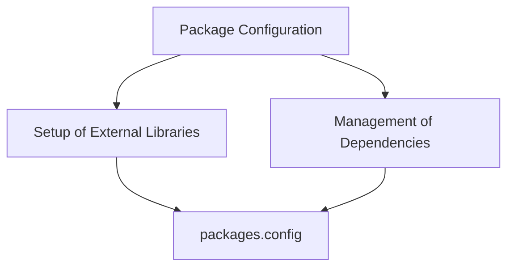

# Understanding Package Configuration

Package Configuration refers to the setup and management of external libraries and dependencies required by the application. It is defined in an XML file named <SwmPath>[WhoOwesWhat.NancyServer/packages.config](WhoOwesWhat.NancyServer/packages.config)</SwmPath> located in the `WhoOwesWhat.NancyServer` directory.

# Package Configuration File

The <SwmPath>[WhoOwesWhat.NancyServer/packages.config](WhoOwesWhat.NancyServer/packages.config)</SwmPath> file lists all the packages along with their specific versions and the target framework they are compatible with. Each package entry includes an ID, version number, and target framework, ensuring that the correct versions of dependencies are used.

<SwmSnippet path="WhoOwesWhat.NancyServer/packages.config" line="2">

---

The <SwmPath>[WhoOwesWhat.NancyServer/packages.config](WhoOwesWhat.NancyServer/packages.config)</SwmPath> file contains entries for each package required by the application. This ensures that the correct versions of dependencies are used.

```
<packages>
  <package id="Bower" version="1.3.11" targetFramework="net45" />
  <package id="log4net" version="2.0.3" targetFramework="net45" />
  <package id="Nancy" version="0.21.1" targetFramework="net40" />
  <package id="Nancy.Hosting.Aspnet" version="0.21.1" targetFramework="net40" />
  <package id="Nancy.Viewengines.Razor" version="0.21.1" targetFramework="net40" />
  <package id="Node.js" version="0.10.28" targetFramework="net45" />
  <package id="NoGit" version="0.0.8" targetFramework="net45" />
  <package id="System.Web.Razor.Unofficial" version="2.0.2" targetFramework="net40" />
</packages>
```

---

</SwmSnippet>

<SwmSnippet path="WhoOwesWhat.NancyServer/packages.config" line="2">

---

The <SwmPath>[WhoOwesWhat.NancyServer/packages.config](WhoOwesWhat.NancyServer/packages.config)</SwmPath> file is crucial for setting up external libraries. It lists all the packages along with their specific versions and the target framework they are compatible with.

```
<packages>
  <package id="Bower" version="1.3.11" targetFramework="net45" />
  <package id="log4net" version="2.0.3" targetFramework="net45" />
  <package id="Nancy" version="0.21.1" targetFramework="net40" />
  <package id="Nancy.Hosting.Aspnet" version="0.21.1" targetFramework="net40" />
  <package id="Nancy.Viewengines.Razor" version="0.21.1" targetFramework="net40" />
  <package id="Node.js" version="0.10.28" targetFramework="net45" />
  <package id="NoGit" version="0.0.8" targetFramework="net45" />
  <package id="System.Web.Razor.Unofficial" version="2.0.2" targetFramework="net40" />
</packages>
```

---

</SwmSnippet>

<SwmSnippet path="WhoOwesWhat.NancyServer/packages.config" line="2">

---

The <SwmPath>[WhoOwesWhat.NancyServer/packages.config](WhoOwesWhat.NancyServer/packages.config)</SwmPath> file is essential for managing dependencies. It ensures that the correct versions of dependencies are used across different development environments.

```
<packages>
  <package id="Bower" version="1.3.11" targetFramework="net45" />
  <package id="log4net" version="2.0.3" targetFramework="net45" />
  <package id="Nancy" version="0.21.1" targetFramework="net40" />
  <package id="Nancy.Hosting.Aspnet" version="0.21.1" targetFramework="net40" />
  <package id="Nancy.Viewengines.Razor" version="0.21.1" targetFramework="net40" />
  <package id="Node.js" version="0.10.28" targetFramework="net45" />
  <package id="NoGit" version="0.0.8" targetFramework="net45" />
  <package id="System.Web.Razor.Unofficial" version="2.0.2" targetFramework="net40" />
</packages>
```

---

</SwmSnippet>

&nbsp;

*This is an auto-generated document by Swimm AI 🌊 and has not yet been verified by a human*

<SwmMeta version="3.0.0" repo-id="Z2l0aHViJTNBJTNBV2hvT3dlc1doYXQtTmV0NDglM0ElM0FTd2ltbS1EZW1v" repo-name="WhoOwesWhat-Net48"><sup>Powered by [Swimm](https://app.swimm.io/)</sup></SwmMeta>
