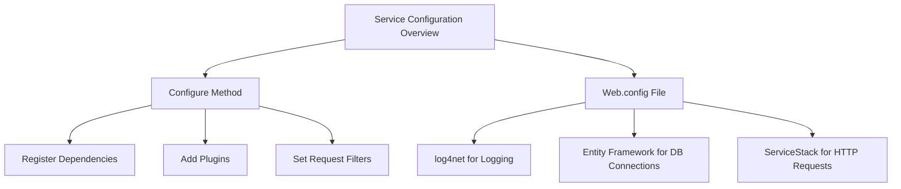

# Service Configuration Overview

Service Configuration refers to the setup and management of settings and parameters that control the behavior of the services within the application. This includes configuring dependencies, logging, database connections, and other environment-specific settings to ensure the services run correctly in different environments.

# Configure Method

The <SwmToken path="WhoOwesWhat.Service/Global.asax.cs" pos="24:7:7" line-data="            public override void Configure(Funq.Container container)">`Configure`</SwmToken> method in <SwmPath>[WhoOwesWhat.Service/Global.asax.cs](WhoOwesWhat.Service/Global.asax.cs)</SwmPath> is used to set up these configurations, including registering dependencies, adding plugins, and setting up request filters. Proper service configuration ensures that the application can be easily maintained and updated, and that it behaves consistently across different environments.

<SwmSnippet path="/WhoOwesWhat.Service/Global.asax.cs" line="24">

---

The <SwmToken path="WhoOwesWhat.Service/Global.asax.cs" pos="24:7:7" line-data="            public override void Configure(Funq.Container container)">`Configure`</SwmToken> method sets up configurations such as registering dependencies, adding plugins, and setting up request filters. This ensures that the application behaves consistently across different environments.

```c#
            public override void Configure(Funq.Container container)
            {
                JsConfig.DateHandler = JsonDateHandler.ISO8601; 

                //Register any dependencies your services use here.
                NinjectKernel.Load(container);

                Plugins.Add(new CorsFeature());

                SetConfig(new EndpointHostConfig
                {
                    DefaultContentType = ContentType.Json
                });

                RequestFilters.Add((httpReq, httpRes, requestDto) =>
                {
                    if (httpReq.HttpMethod == "OPTIONS")
                    {
                        httpRes.AddHeader("Access-Control-Allow-Origin", "*");
                        httpRes.AddHeader("Access-Control-Allow-Methods", "POST, GET, OPTIONS");
                        httpRes.AddHeader("Access-Control-Allow-Headers", "X-Requested-With, Content-Type");
```

---

</SwmSnippet>

# <SwmPath>[WhoOwesWhat.Service/Web.config](WhoOwesWhat.Service/Web.config)</SwmPath> File

The <SwmPath>[WhoOwesWhat.Service/Web.config](WhoOwesWhat.Service/Web.config)</SwmPath> file defines various configurations such as <SwmToken path="WhoOwesWhat.Service/Web.config" pos="14:7:7" line-data="        &lt;assemblyIdentity name=&quot;log4net&quot; publicKeyToken=&quot;669e0ddf0bb1aa2a&quot; culture=&quot;neutral&quot; /&gt;">`log4net`</SwmToken> for logging, <SwmToken path="WhoOwesWhat.Service/Web.config" pos="22:11:13" line-data="    &lt;!-- For more information on Entity Framework configuration, visit http://go.microsoft.com/fwlink/?LinkID=237468 --&gt;">`Entity Framework`</SwmToken> for database connections, and <SwmToken path="WhoOwesWhat.Service/Global.asax.cs" pos="2:2:2" line-data="using ServiceStack.Common.Web;">`ServiceStack`</SwmToken> for handling HTTP requests.

<SwmSnippet path="WhoOwesWhat.Service/Web.config" line="2">

---

The <SwmPath>[WhoOwesWhat.Service/Web.config](WhoOwesWhat.Service/Web.config)</SwmPath> file includes configurations for logging, database connections, and handling HTTP requests. This ensures that the application runs correctly in different environments.

```
<!--
  For more information on how to configure your ASP.NET application, please visit
  http://go.microsoft.com/fwlink/?LinkId=169433
  -->
<!--<configuration>
  <system.web>
    <compilation debug="true" targetFramework="4.5" />
    <httpRuntime targetFramework="4.5" />
  </system.web>
  <runtime>
    <assemblyBinding xmlns="urn:schemas-microsoft-com:asm.v1">
      <dependentAssembly>
        <assemblyIdentity name="log4net" publicKeyToken="669e0ddf0bb1aa2a" culture="neutral" />
        <bindingRedirect oldVersion="0.0.0.0-1.2.13.0" newVersion="1.2.13.0" />
      </dependentAssembly>
    </assemblyBinding>
  </runtime>
</configuration>-->
<configuration>
  <configSections>
```

---

</SwmSnippet>

&nbsp;

*This is an auto-generated document by Swimm AI 🌊 and has not yet been verified by a human*

<SwmMeta version="3.0.0" repo-id="Z2l0aHViJTNBJTNBV2hvT3dlc1doYXQtTmV0NDglM0ElM0FTd2ltbS1EZW1v" repo-name="WhoOwesWhat-Net48"><sup>Powered by [Swimm](https://app.swimm.io/)</sup></SwmMeta>
