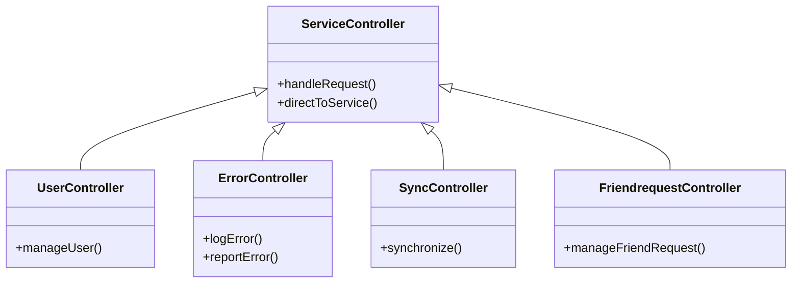

# Overview

Service Controllers are responsible for handling incoming requests and directing them to the appropriate service operations. They act as intermediaries between the client and the service layer, ensuring that the correct logic is executed based on the request.

# Functionality

Each controller typically corresponds to a specific area of functionality, such as user management, error handling, synchronization, and friend requests. This separation of concerns promotes modularity and makes the system easier to maintain.

# User Management

The <SwmToken path="WhoOwesWhat.Service.Controller/UserController.cs" pos="19:5:5" line-data="    public class UserController : IUserController">`UserController`</SwmToken> handles operations related to user management. It ensures that user-related requests are processed correctly and efficiently.

<SwmSnippet path="/WhoOwesWhat.Service.Controller/UserController.cs" line="10">

---

The <SwmToken path="WhoOwesWhat.Service.Controller/UserController.cs" pos="19:5:5" line-data="    public class UserController : IUserController">`UserController`</SwmToken> interface is defined in the <SwmToken path="WhoOwesWhat.Service.Controller/UserController.cs" pos="10:2:6" line-data="namespace WhoOwesWhat.Service.Controller">`WhoOwesWhat.Service.Controller`</SwmToken> namespace, allowing for flexibility and easier testing by enabling the use of mock implementations.

```c#
namespace WhoOwesWhat.Service.Controller
{
    public interface IUserController
```

---

</SwmSnippet>

# Error Handling

The `ErrorController` deals with error logging and reporting. It ensures that any errors encountered are properly logged and reported for further analysis.

# Synchronization

The `SyncController` is responsible for synchronization operations. It ensures that data is synchronized correctly across different parts of the system.

# Friend Requests

The `FriendrequestController` manages friend request operations. It handles the logic for sending, receiving, and managing friend requests.

&nbsp;

*This is an auto-generated document by Swimm AI 🌊 and has not yet been verified by a human*

<SwmMeta version="3.0.0" repo-id="Z2l0aHViJTNBJTNBV2hvT3dlc1doYXQtTmV0NDglM0ElM0FTd2ltbS1EZW1v" repo-name="WhoOwesWhat-Net48"><sup>Powered by [Swimm](/)</sup></SwmMeta>
