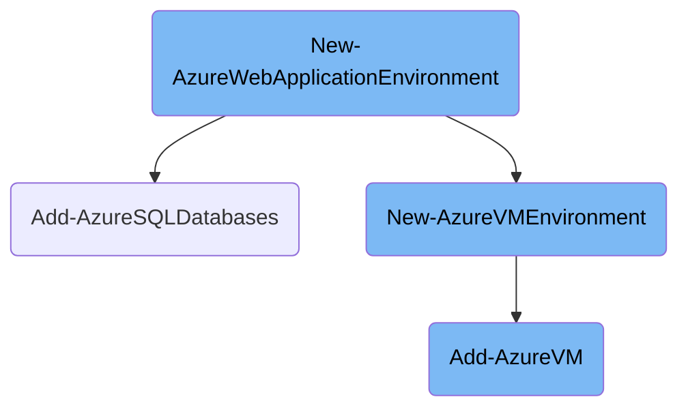

This document explains the process of setting up an Azure web application environment. The process involves creating the Azure web application, adding SQL databases, and setting up a virtual machine environment if needed.

The flow starts by checking if the configuration specifies an Azure website. If it does, the system creates the website and the necessary SQL databases. If not, it proceeds to create a virtual machine environment. This involves validating the configuration, determining the appropriate storage account, and creating the virtual machine with the specified settings. If a virtual machine with the same name already exists, it uses the existing one.

# Flow drill down



<SwmSnippet path="/PublishScripts/Publish-WebApplication.ps1" line="162">

---

## Creating the Azure Web Application Environment

The <SwmToken path="PublishScripts/Publish-WebApplication.ps1" pos="162:2:4" line-data="function New-AzureWebApplicationEnvironment">`New-AzureWebApplicationEnvironment`</SwmToken> function is responsible for setting up the Azure web application environment. It first checks if the configuration specifies an Azure website. If so, it creates the website and associated SQL databases. If not, it proceeds to create a virtual machine environment.

```powershell
function New-AzureWebApplicationEnvironment
{
    [CmdletBinding()]
    param
    (
        [Parameter(Mandatory = $true)]
        [Object]
        $Config,

        [Parameter (Mandatory = $false)]
        [AllowNull()]
        [Hashtable]
        $VMPassword,

        [Parameter (Mandatory = $false)]
        [AllowNull()]
        [Hashtable[]]
        $DatabaseServerPassword
    )
   
    $VMInfo = $null
```

---

</SwmSnippet>

<SwmSnippet path="/PublishScripts/AzureWebAppPublishModule.psm1" line="1882">

---

## Adding Azure SQL Databases

The <SwmToken path="PublishScripts/AzureWebAppPublishModule.psm1" pos="1882:2:4" line-data="function Add-AzureSQLDatabases">`Add-AzureSQLDatabases`</SwmToken> function creates SQL databases based on the provided configuration. It ensures that each database is created with the correct settings and retrieves the connection string for each database, which is then used for deployment.

```powershell
function Add-AzureSQLDatabases
{
    [CmdletBinding()]
    param
    (
        [Parameter(Mandatory = $true, ValueFromPipeline = $true)]
        [PSCustomObject]
        $DatabaseConfig,

        [Parameter(Mandatory = $false)]
        [AllowNull()]
        [Hashtable[]]
        $DatabaseServerPassword,

        [Parameter(Mandatory = $false)]
        [Switch]
        $CreateDatabase = $true
    )

    begin
    {
```

---

</SwmSnippet>

<SwmSnippet path="/PublishScripts/AzureWebAppPublishModule.psm1" line="1206">

---

## Creating the Azure VM Environment

The <SwmToken path="PublishScripts/AzureWebAppPublishModule.psm1" pos="1206:2:4" line-data="function New-AzureVMEnvironment">`New-AzureVMEnvironment`</SwmToken> function sets up a new virtual machine environment. It validates the configuration, determines the appropriate storage account, and creates the virtual machine with the specified settings. If a virtual machine with the same name already exists, it uses the existing one.

```powershell
function New-AzureVMEnvironment
{
    [CmdletBinding()]
    param
    (
        [Parameter(Mandatory = $true)]
        [Object]
        $CloudServiceConfiguration,

        [Parameter(Mandatory = $false)]
        [AllowNull()]
        [Hashtable]
        $VMPassword
    )

    Write-VerboseWithTime ('New-AzureVMEnvironment: Start')

    if ($CloudServiceConfiguration.location -and $CloudServiceConfiguration.affinityGroup)
    {
        throw 'New-AzureVMEnvironment: Malformed configuration file. Has both location and affinityGroup'
    }
```

---

</SwmSnippet>

<SwmSnippet path="/PublishScripts/AzureWebAppPublishModule.psm1" line="909">

---

## Adding Azure Virtual Machines

The <SwmToken path="PublishScripts/AzureWebAppPublishModule.psm1" pos="909:2:4" line-data="function Add-AzureVM">`Add-AzureVM`</SwmToken> function creates a new Azure virtual machine with the specified configuration. It sets up the VM configuration, including the size, image, and endpoints, and optionally adds the <SwmToken path="PublishScripts/Publish-WebApplication.ps1" pos="34:4:4" line-data="View the WebDeploy license terms:  http://go.microsoft.com/fwlink/?LinkID=389744 ">`WebDeploy`</SwmToken> extension. The function then creates the VM and returns its URL.

```powershell
function Add-AzureVM
{
    [CmdletBinding()]
    param
    (
        [Parameter(Mandatory = $true)]
        [String]
        $UserName,

        [Parameter(Mandatory = $true)]
        [String]
        $UserPassword,

        [Parameter(Mandatory = $true)]
        [String]
        $VMName,

        [Parameter(Mandatory = $true)]
        [String]
        $VMSize,

```

---

</SwmSnippet>

&nbsp;

*This is an auto-generated document by Swimm AI 🌊 and has not yet been verified by a human*

<SwmMeta version="3.0.0" repo-id="Z2l0aHViJTNBJTNBV2hvT3dlc1doYXQtTmV0NDglM0ElM0FTd2ltbS1EZW1v" repo-name="WhoOwesWhat-Net48"><sup>Powered by [Swimm](/)</sup></SwmMeta>
