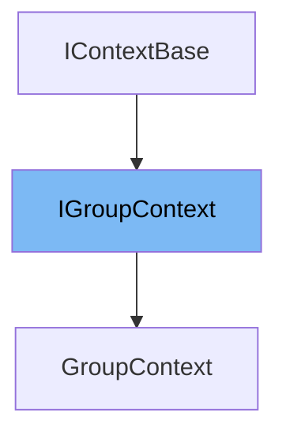

This document will cover the <SwmToken path="WhoOwesWhat.DataProvider/GroupEntity/GroupContext.cs" pos="15:9:9" line-data="    public class GroupContext : IGroupContext">`IGroupContext`</SwmToken> interface in the <SwmPath>[WhoOwesWhat.DataProvider/GroupEntity/GroupContext.cs](WhoOwesWhat.DataProvider/GroupEntity/GroupContext.cs)</SwmPath> file. We will discuss:

1. What is <SwmToken path="WhoOwesWhat.DataProvider/GroupEntity/GroupContext.cs" pos="15:9:9" line-data="    public class GroupContext : IGroupContext">`IGroupContext`</SwmToken>
2. Variables and functions
3. Usage example



# What is <SwmToken path="WhoOwesWhat.DataProvider/GroupEntity/GroupContext.cs" pos="15:9:9" line-data="    public class GroupContext : IGroupContext">`IGroupContext`</SwmToken>

<SwmToken path="WhoOwesWhat.DataProvider/GroupEntity/GroupContext.cs" pos="15:9:9" line-data="    public class GroupContext : IGroupContext">`IGroupContext`</SwmToken> is an interface defined in the <SwmPath>[WhoOwesWhat.DataProvider/GroupEntity/GroupContext.cs](WhoOwesWhat.DataProvider/GroupEntity/GroupContext.cs)</SwmPath> file. It is used to provide a contract for accessing group-related data in the application. The interface defines methods for retrieving group information by group ID, group GUID, and for retrieving all groups.

<SwmSnippet path="/WhoOwesWhat.DataProvider/GroupEntity/GroupContext.cs" line="10">

---

# Variables and functions

The function <SwmToken path="WhoOwesWhat.DataProvider/GroupEntity/GroupContext.cs" pos="10:5:5" line-data="        Entity.Group GetGroup(int groupId);">`GetGroup`</SwmToken> retrieves a group entity by its group ID.

```c#
        Entity.Group GetGroup(int groupId);
        Entity.Group GetGroupByGroupGuid(Guid groupGuid);
        IQueryable<Group> GetGroups();
```

---

</SwmSnippet>

<SwmSnippet path="/WhoOwesWhat.DataProvider/GroupEntity/GroupContext.cs" line="11">

---

The function <SwmToken path="WhoOwesWhat.DataProvider/GroupEntity/GroupContext.cs" pos="11:5:5" line-data="        Entity.Group GetGroupByGroupGuid(Guid groupGuid);">`GetGroupByGroupGuid`</SwmToken> retrieves a group entity by its group GUID.

```c#
        Entity.Group GetGroupByGroupGuid(Guid groupGuid);
        IQueryable<Group> GetGroups();
```

---

</SwmSnippet>

<SwmSnippet path="/WhoOwesWhat.DataProvider/GroupEntity/GroupContext.cs" line="12">

---

The function <SwmToken path="WhoOwesWhat.DataProvider/GroupEntity/GroupContext.cs" pos="12:6:6" line-data="        IQueryable&lt;Group&gt; GetGroups();">`GetGroups`</SwmToken> retrieves all group entities.

```c#
        IQueryable<Group> GetGroups();
    }
```

---

</SwmSnippet>

<SwmSnippet path="/WhoOwesWhat.DataProvider/GroupEntity/GroupContext.cs" line="24">

---

The function <SwmToken path="WhoOwesWhat.DataProvider/GroupEntity/GroupContext.cs" pos="24:5:5" line-data="        public Group GetGroup(int groupId)">`GetGroup`</SwmToken> in the <SwmToken path="WhoOwesWhat.DataProvider/GroupEntity/GroupContext.cs" pos="15:5:5" line-data="    public class GroupContext : IGroupContext">`GroupContext`</SwmToken> class retrieves a group entity by its group ID using the <SwmToken path="WhoOwesWhat.DataProvider/GroupEntity/GroupContext.cs" pos="26:3:3" line-data="            return _whoOwesWhatContext.GetGroupSqlRepository().GetAll().SingleOrDefault(a =&gt; a.GroupId == groupId);">`_whoOwesWhatContext`</SwmToken>.

```c#
        public Group GetGroup(int groupId)
        {
            return _whoOwesWhatContext.GetGroupSqlRepository().GetAll().SingleOrDefault(a => a.GroupId == groupId);
        }
```

---

</SwmSnippet>

<SwmSnippet path="/WhoOwesWhat.DataProvider/GroupEntity/GroupContext.cs" line="29">

---

The function <SwmToken path="WhoOwesWhat.DataProvider/GroupEntity/GroupContext.cs" pos="29:5:5" line-data="        public Group GetGroupByGroupGuid(Guid groupGuid)">`GetGroupByGroupGuid`</SwmToken> in the <SwmToken path="WhoOwesWhat.DataProvider/GroupEntity/GroupContext.cs" pos="15:5:5" line-data="    public class GroupContext : IGroupContext">`GroupContext`</SwmToken> class retrieves a group entity by its group GUID using the <SwmToken path="WhoOwesWhat.DataProvider/GroupEntity/GroupContext.cs" pos="31:3:3" line-data="            return _whoOwesWhatContext.GetGroupSqlRepository().GetAll().SingleOrDefault(a =&gt; a.GroupGuid == groupGuid);">`_whoOwesWhatContext`</SwmToken>.

```c#
        public Group GetGroupByGroupGuid(Guid groupGuid)
        {
            return _whoOwesWhatContext.GetGroupSqlRepository().GetAll().SingleOrDefault(a => a.GroupGuid == groupGuid);
        }
```

---

</SwmSnippet>

<SwmSnippet path="/WhoOwesWhat.DataProvider/GroupEntity/GroupContext.cs" line="34">

---

The function <SwmToken path="WhoOwesWhat.DataProvider/GroupEntity/GroupContext.cs" pos="34:8:8" line-data="        public IQueryable&lt;Group&gt; GetGroups()">`GetGroups`</SwmToken> in the <SwmToken path="WhoOwesWhat.DataProvider/GroupEntity/GroupContext.cs" pos="15:5:5" line-data="    public class GroupContext : IGroupContext">`GroupContext`</SwmToken> class retrieves all group entities using the <SwmToken path="WhoOwesWhat.DataProvider/GroupEntity/GroupContext.cs" pos="36:3:3" line-data="            return _whoOwesWhatContext.GetGroupSqlRepository().GetAll();">`_whoOwesWhatContext`</SwmToken>.

```c#
        public IQueryable<Group> GetGroups()
        {
            return _whoOwesWhatContext.GetGroupSqlRepository().GetAll();
        }
```

---

</SwmSnippet>

<SwmSnippet path="/WhoOwesWhat.DataProvider/GroupEntity/GroupContext.cs" line="19">

---

The constructor <SwmToken path="WhoOwesWhat.DataProvider/GroupEntity/GroupContext.cs" pos="19:3:3" line-data="        public GroupContext(IWhoOwesWhatContext whoOwesWhatContext)">`GroupContext`</SwmToken> initializes the <SwmToken path="WhoOwesWhat.DataProvider/GroupEntity/GroupContext.cs" pos="21:1:1" line-data="            _whoOwesWhatContext = whoOwesWhatContext;">`_whoOwesWhatContext`</SwmToken> field with the provided <SwmToken path="WhoOwesWhat.DataProvider/GroupEntity/GroupContext.cs" pos="19:5:5" line-data="        public GroupContext(IWhoOwesWhatContext whoOwesWhatContext)">`IWhoOwesWhatContext`</SwmToken> instance.

```c#
        public GroupContext(IWhoOwesWhatContext whoOwesWhatContext)
        {
            _whoOwesWhatContext = whoOwesWhatContext;
        }
```

---

</SwmSnippet>

# Usage example

Here is an example of how to use <SwmToken path="WhoOwesWhat.DataProvider/GroupEntity/GroupContext.cs" pos="15:9:9" line-data="    public class GroupContext : IGroupContext">`IGroupContext`</SwmToken> in <SwmToken path="WhoOwesWhat.DataProvider/GroupEntity/GroupContext.cs" pos="15:5:5" line-data="    public class GroupContext : IGroupContext">`GroupContext`</SwmToken>.

<SwmSnippet path="/WhoOwesWhat.DataProvider/GroupEntity/GroupContext.cs" line="15">

---

The <SwmToken path="WhoOwesWhat.DataProvider/GroupEntity/GroupContext.cs" pos="15:5:5" line-data="    public class GroupContext : IGroupContext">`GroupContext`</SwmToken> class implements the <SwmToken path="WhoOwesWhat.DataProvider/GroupEntity/GroupContext.cs" pos="15:9:9" line-data="    public class GroupContext : IGroupContext">`IGroupContext`</SwmToken> interface and provides concrete implementations for the methods defined in the interface.

```c#
    public class GroupContext : IGroupContext
    {
        private readonly IWhoOwesWhatContext _whoOwesWhatContext;

        public GroupContext(IWhoOwesWhatContext whoOwesWhatContext)
        {
            _whoOwesWhatContext = whoOwesWhatContext;
        }

        public Group GetGroup(int groupId)
        {
            return _whoOwesWhatContext.GetGroupSqlRepository().GetAll().SingleOrDefault(a => a.GroupId == groupId);
        }

        public Group GetGroupByGroupGuid(Guid groupGuid)
        {
            return _whoOwesWhatContext.GetGroupSqlRepository().GetAll().SingleOrDefault(a => a.GroupGuid == groupGuid);
        }

        public IQueryable<Group> GetGroups()
        {
```

---

</SwmSnippet>

&nbsp;

*This is an auto-generated document by Swimm AI 🌊 and has not yet been verified by a human*

<SwmMeta version="3.0.0" repo-id="Z2l0aHViJTNBJTNBV2hvT3dlc1doYXQtTmV0NDglM0ElM0FTd2ltbS1EZW1v" repo-name="WhoOwesWhat-Net48"><sup>Powered by [Swimm](/)</sup></SwmMeta>
